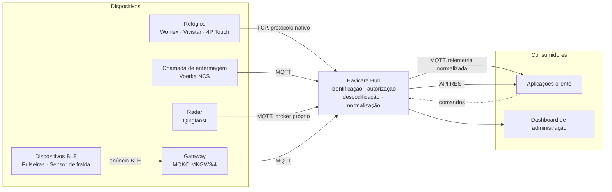

# Havicare Hub

Plataforma de integração de dispositivos de saúde. Recebe dados de aparelhos de
seis tipos e sete fornecedores, cada um com o seu protocolo nativo, e expõe-os
às aplicações clientes através de um único formato normalizado.

## Contexto

Os fabricantes de dispositivos de saúde não partilham protocolos. Um mesmo
indicador clínico chega ao hub em formatos, transportes e codificações
distintos:

| Fornecedor | Transporte              | Formato                                                                        |
| ---------- | ----------------------- | ------------------------------------------------------------------------------ |
| Wonlex     | TCP                     | Trama binária iniciada em `0xFCAF`, com JSON no corpo                          |
| Vivistar   | TCP                     | Texto delimitado por `#`                                                       |
| 4P Touch   | TCP                     | Texto delimitado por parênteses retos, com identificador próprio de 10 dígitos |
| Voerka     | MQTT                    | JSON                                                                           |
| Qinglanst  | MQTT _(broker próprio)_ | JSON com corpo binário em base64                                               |
| MOKO       | MQTT                    | JSON (MKGW3) ou binário tipo-comprimento-valor (MKGW4)                         |
| MONIT      | BLE via gateway         | Anúncio de 20 bytes com campos de 6 bits                                       |

Sem uma camada de integração, cada aplicação cliente teria de implementar os dez
protocolos. O hub implementa-os uma vez e publica o resultado num envelope
único:

```json
{
    "schemaVersion": 2,
    "type": "heart_rate",
    "occurredAt": "2026-09-01T10:35:10Z",
    "device": {
        "id": "861265061009822",
        "supplier": "Wonlex",
        "model": "HW20PRO"
    },
    "data": { "bpm": 74 }
}
```

O campo `data.bpm` é produzido a partir de sete designações distintas conforme o
firmware de origem — `heartRate`, `hr`, `bpm`, `pulse`, `value`, `data` e
`date`.

## Arquitetura



O âmbito do hub termina na normalização. A plataforma não interpreta os valores
clínicos, não gera alarmes derivados e não correlaciona histórico: reproduz
fielmente o que os dispositivos reportam e garante a continuidade e a
consistência dos dados. A deteção de eventos clínicos é responsabilidade das
aplicações que integram.

## Dispositivos suportados

| Tipo                  | Transporte              | Fornecedores               | Dados reportados                                                                                                                                                                       |
| --------------------- | ----------------------- | -------------------------- | -------------------------------------------------------------------------------------------------------------------------------------------------------------------------------------- |
| Relógio               | TCP                     | Wonlex, Vivistar, 4P Touch | Frequência cardíaca, pressão arterial, oxigénio no sangue, glicemia, temperatura, frequência respiratória, ECG, VFC, PPG, intervalo RR, sono, atividade, bateria, localização, alarmes |
| Chamada de enfermagem | MQTT                    | Voerka W812                | Chamadas de ajuda e estado de ligação                                                                                                                                                  |
| Radar                 | MQTT _(broker próprio)_ | Qinglanst                  | Presença e posição sem câmara, frequência cardíaca e respiratória, estado de sono, deteção de queda                                                                                    |
| Gateway               | MQTT                    | MOKO MKGW3, MKGW4          | Conectividade, bateria, localização; retransmite os anúncios BLE que recebe                                                                                                            |
| Pulseira              | BLE via gateway         | MOKO W6, W6B               | Botão de ajuda, movimento, bateria                                                                                                                                                     |
| Sensor de fralda      | BLE via gateway         | MONIT MECS-PRO             | Humidade por canal, índice de humidade, estado, bateria                                                                                                                                |

## Interfaces de integração

**MQTT.** Telemetria normalizada publicada por dispositivo, em tempo real.

```text
havicare-hub/{empresa}/{licenca}/{tipo}/{dispositivo}/telemetry
```

O primeiro segmento é o prefixo de tópicos da instância — `havicare-hub` em
produção e `havicare-hub-dev` em desenvolvimento — e não o nome da plataforma.
O segmento `{empresa}` identifica o cliente a que o dispositivo pertence;
`havicare` e `hitcare` são dois desses clientes, distintos da plataforma que os
serve.

**API REST.** Consulta de dispositivos, pedido de medições e alteração de
configurações. Especificada em OpenAPI 3.1 e disponível em `/api/docs`.

**Dashboard.** Registo de dispositivos, atribuição a clientes, visualização em
tempo real e configuração.

## Ambiente de desenvolvimento local

A pilha completa — hub, broker MQTT, base de dados e Redis — arranca em Docker,
sem hardware:

```bash
cp .env.example .env
docker compose up -d
make simulate-vivistar-tcp IMEI=861265061009822
```

O IMEI tem de constar da base de dados de exemplo: o hub encerra a ligação de
qualquer dispositivo não registado. O valor acima corresponde a um Vivistar
L08 Pro atribuído à empresa-cliente `havicare`, licença `1`.

A dashboard fica disponível em <http://localhost:8081/dashboard> e a ingestão TCP
na porta `9000`. A telemetria publicada pode ser observada no broker local:

```bash
docker compose exec mosquitto mosquitto_sub -t '#' -v
```

## Documentação

A documentação técnica está em **[`docs/README.md`](docs/README.md)**, organizada
por camada e por funcionalidade.

As instruções operacionais — instâncias, fluxo de publicação e regras de
segurança — estão em [`CLAUDE.md`](CLAUDE.md).
