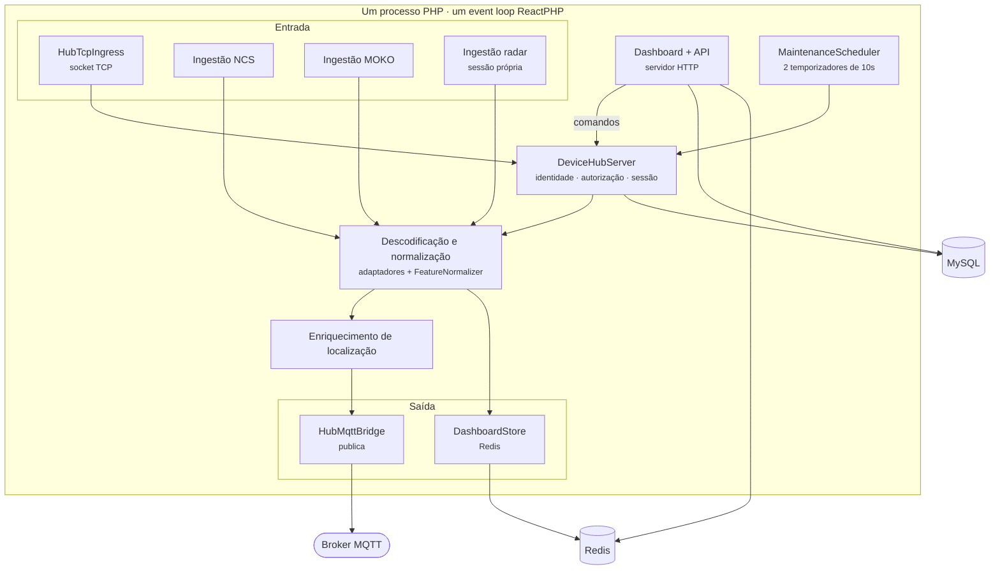
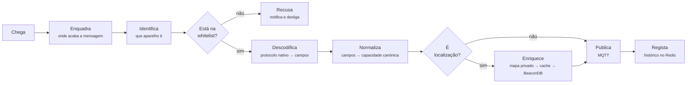

# 01 — Visão geral

## Âmbito

O hub serve simultaneamente um socket TCP de ligações persistentes, três
clientes MQTT em dois brokers distintos e um servidor HTTP para a dashboard e a
API. Toda esta atividade decorre **num único processo**, sobre **um único event
loop** ReactPHP.

Não existem filas de trabalho, processos de apoio nem processos filhos. O
bloqueio de qualquer componente bloqueia o processo inteiro, pelo que
praticamente nenhuma operação de entrada/saída no código é síncrona.

## Composição

As ingestões MQTT não passam pelo `DeviceHubServer`: resolvem a identidade na
[whitelist](07-multi-inquilino.md) autonomamente e publicam através do
`HubMqttBridge`. O `DeviceHubServer` é responsável pelas ligações abertas, que
existem apenas na ingestão TCP.

## Ciclo de vida de uma mensagem

O percurso é comum a todas as origens, tanto para um
[relógio ligado por TCP](02-ingestao-tcp-relogios.md) como para um
[anúncio BLE recebido através de um gateway](05-gateways-ble.md). A conversão do
protocolo nativo para a capacidade canónica é a
[normalização](06-normalizacao.md), e o que sai no fim segue o
[contrato MQTT](08-contrato-mqtt.md):

Dois aspetos do fluxo:

- **A recusa é registada.** Um dispositivo desconhecido é inscrito nas
  notificações da [dashboard](13-dashboard.md), recebe um `status` de erro
  publicado no [espaço sem dono](07-multi-inquilino.md), e a ligação é encerrada.
- **O enriquecimento é assíncrono e não bloqueia.** Se a
  [resolução de localização](12-localizacao-sem-gps.md) falhar, o evento é
  publicado sem coordenadas, formato que os consumidores existentes ignoram em
  segurança.

## Sequência de arranque

Implementada em `bin/server-hub.php`, por esta ordem:

| # | Operação | Falha |
|---|---|---|
| 1 | Leitura do `.env` e carregamento e **validação** da configuração | fatal |
| 2 | Ligação ao broker MQTT do hub | fatal |
| 3 | `HubServices::boot()` — MySQL, Redis, whitelist, ponte MQTT, fila de downlink | fatal |
| 4 | `CrashWatch::attach()` — um marcador persistente indica terminação anómala da execução anterior e gera notificação na dashboard; regista também os sinais `SIGTERM` e `SIGINT` para terminação controlada | continua |
| 5 | `MqttIngressFactory::build()` — monta as ingestões que a configuração liga: [NCS](03-ingestao-mqtt-ncs.md) (`NCS_ENABLED`), [MOKO e Veepoo](05-gateways-ble.md) (ambas em `GATEWAY_ENABLED`, porque partilham o espaço de tópicos dos gateways), e [Qinglanst](04-ingestao-mqtt-radar.md) (`QINGLANST_ENABLED`, em sessão própria) | — |
| 6 | Abertura do [socket TCP](02-ingestao-tcp-relogios.md) | — |
| 7 | Abertura do servidor HTTP da [dashboard](13-dashboard.md) e da [API](09-api.md) | — |
| 8 | Início das subscrições MQTT | **fatal** |
| 9 | Agendamento dos ciclos MQTT, a cada 0,05 s, e da entrega das filas, a cada 1 s | — |
| 10 | Agendamento da manutenção, a cada 10 s | — |
| 11 | Registo do resumo de arranque e entrada no event loop | — |

O passo 8 é fatal por decisão: um processo em execução sem subscrições ativas
apresenta-se operacional sem receber dados.

A ingestão do Qinglanst abre **sessão** própria e não fala com outro servidor: o
`QINGLANST_MQTT_HOST` e o `MQTT_HOST` apontam para o mesmo broker, e o que as
separa são os tópicos, as credenciais e o identificador de cliente.

O passo 9 entrega o que estiver na
[fila de downlink](11-comandos-e-downlink.md) para quem declarar a interface
`DispatchesQueued` — hoje só as pulseiras Veepoo, cujo comando não pode esperar
pelo anúncio de sessão seguinte.

### Manutenção periódica

O `MaintenanceScheduler` mantém dois temporizadores de 10 segundos:

- **[Comandos](11-comandos-e-downlink.md)** — repete os que ficaram por
  entregar, até três tentativas com 60 segundos de intervalo, e expira os que
  excedem `DASHBOARD_COMMAND_TIMEOUT_SECONDS`.
- **Ligações** — encerra as que permanecem inativas para além de
  `DASHBOARD_DEVICE_IDLE_TIMEOUT_SECONDS`, 30 minutos por omissão, publicando
  `status offline` e o evento `device.disconnected`.

## Localização do estado

| Camada | Conteúdo | Sobrevive a reinício |
|---|---|---|
| **MySQL** | Whitelist, catálogo de modelos e capacidades, empresas e licenças, utilizadores, configurações de dispositivo, mapa de rádio, notificações | sim |
| **Redis** | Presença, histórico recente (100 entradas por lista), tokens da API, fila de downlink, estado de observação BLE, cache de localização | parcialmente; as chaves com TTL expiram |
| **Memória do processo** | Ligações TCP abertas, gateways online, janelas de proximidade | não |

Não existe tabela de telemetria. O histórico mantido limita-se às últimas 100
entradas por lista e destina-se à apresentação na [dashboard](13-dashboard.md).
A retenção de série temporal é responsabilidade das aplicações que
[subscrevem o MQTT](08-contrato-mqtt.md).

Cada tabela e cada espaço de chaves está descrito na
[persistência](14-persistencia.md).

## Portas e instâncias

Os valores por omissão do código não correspondem aos de produção. O servidor
executa duas instâncias, descritas na íntegra no [`CLAUDE.md`](../CLAUDE.md).

| | Omissão no código | Desenvolvimento | Produção |
|---|---|---|---|
| Ingestão TCP | `0.0.0.0:9000` | `127.0.0.1:8090` | `0.0.0.0:8080` |
| Dashboard/API | `0.0.0.0:8081` | `:8091` | `:8081` |
| Prefixo dos tópicos | *(vazio)* | `havicare-hub-dev` | `havicare-hub` |
| Prefixo do Redis | *(vazio)* | `dev:` | *(vazio)* |

## Implementação

| Ficheiro | Responsabilidade |
|---|---|
| `bin/server-hub.php` | Sequência de arranque completa |
| `src/Runtime/HubServices.php` | Raiz de composição, com uma instância partilhada de cada dependência |
| `src/Runtime/MaintenanceScheduler.php` | Temporizadores de manutenção |
| `src/Runtime/CrashWatch.php` | Deteção de terminação anómala |
| `src/Ingress/Mqtt/IngressRunner.php` | Execução das ingestões MQTT no event loop partilhado |
| `src/Device/DeviceHubServer.php` | Identidade, autorização, sessão e publicação na ingestão TCP |
| `src/Device/HubMqttBridge.php` | Composição de tópicos e publicação MQTT |
