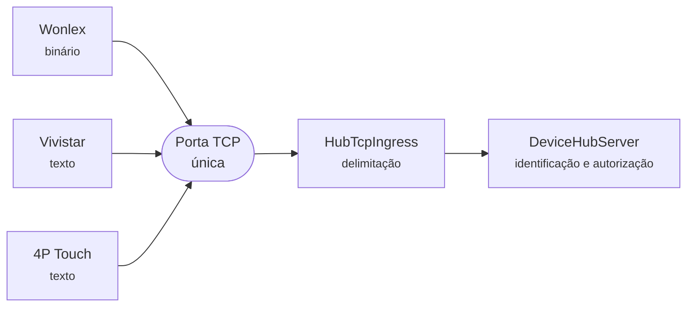
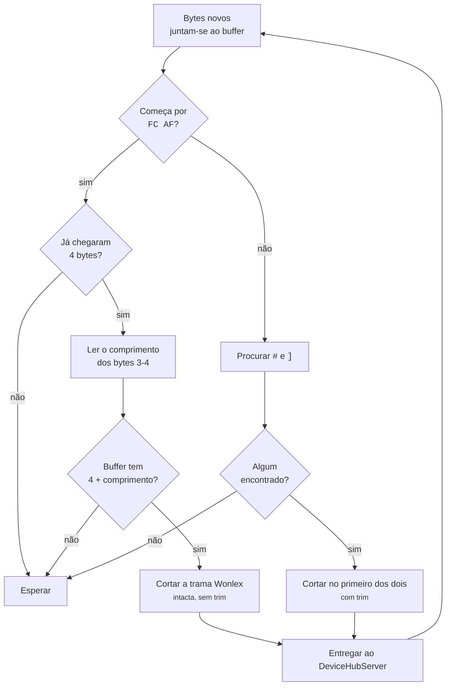
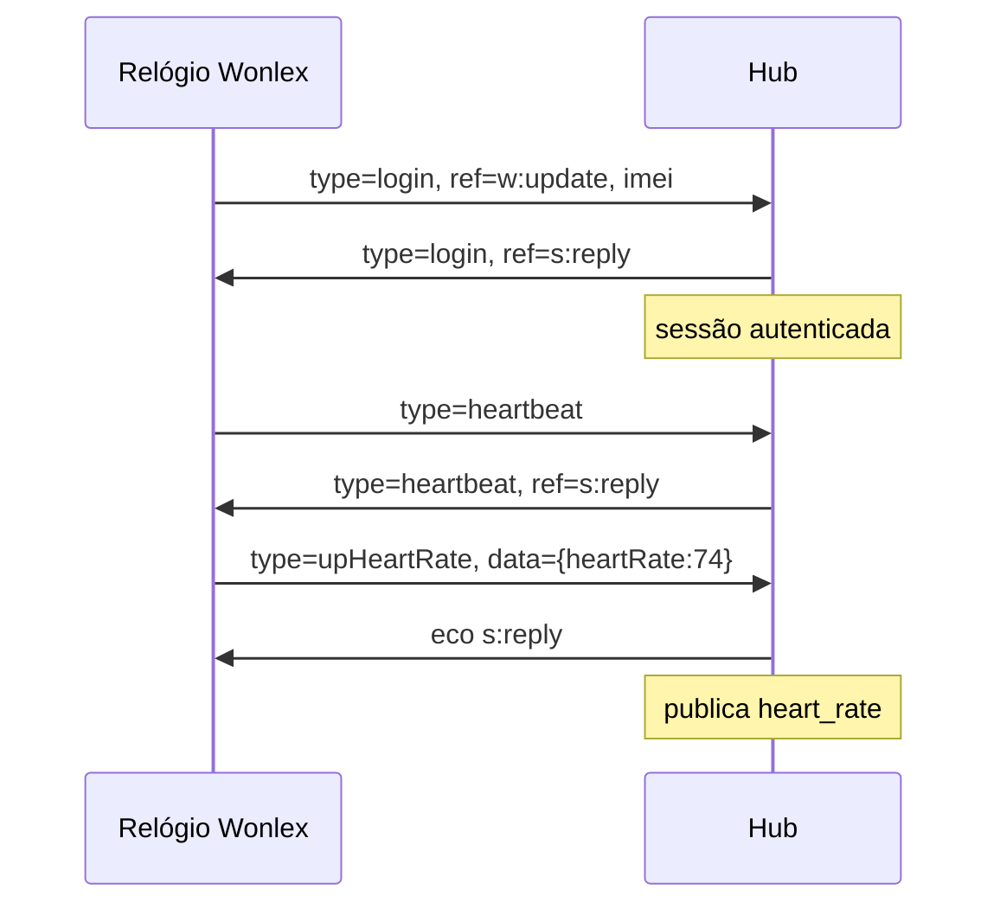
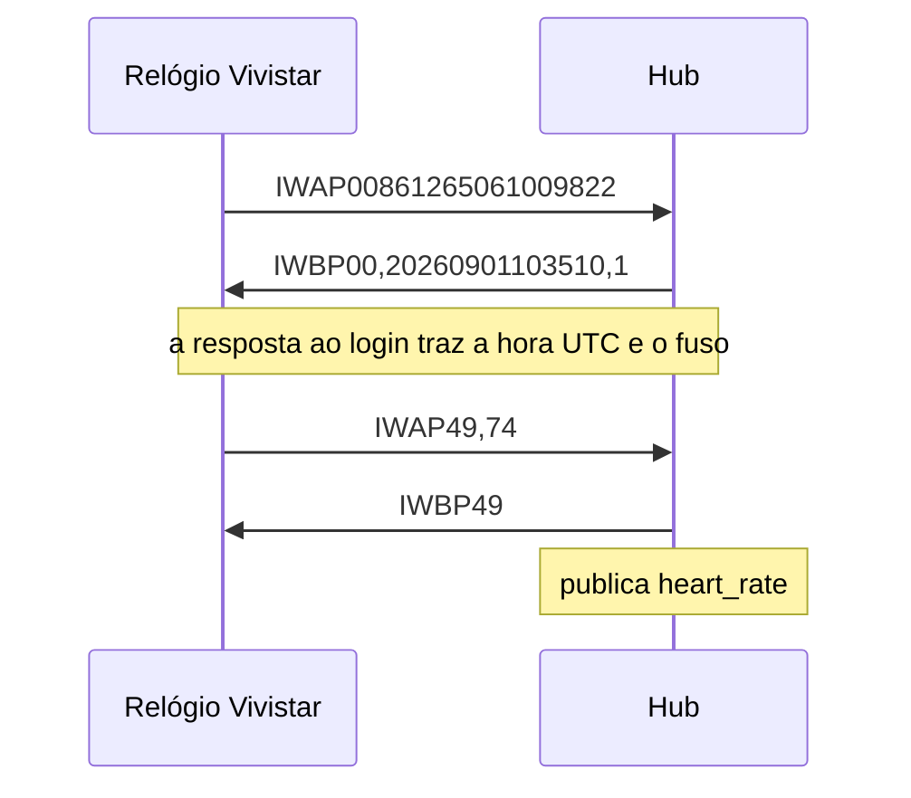
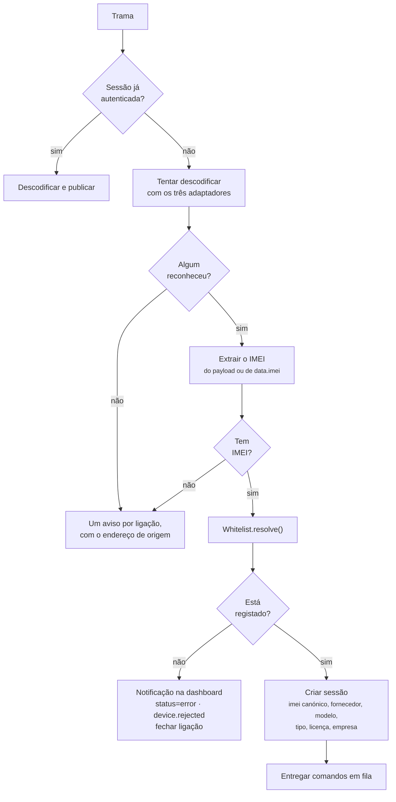

# 02 — Ingestão TCP: os relógios

## Âmbito

Os relógios são os únicos dispositivos que estabelecem ligação ao hub. Abrem um
socket TCP e mantêm-no aberto por períodos prolongados, transmitindo telemetria
e sinais de vida periódicos. As restantes ingestões recebem mensagens já
delimitadas pelo transporte MQTT; nesta, os dados chegam como um fluxo contínuo
de bytes, e a delimitação das mensagens é responsabilidade do hub.

Três fabricantes utilizam protocolos incompatíveis sobre a mesma porta.



A ligação não usa TLS nem autenticação criptográfica. A porta está exposta à
Internet e o controlo de acesso é exercido exclusivamente pela whitelist.

## 1. Delimitação das mensagens

O `HubTcpIngress` acumula os bytes recebidos num buffer por ligação e extrai
mensagens completas enquanto o buffer as contiver. A delimitação ocorre **antes
da identificação do dispositivo**, uma vez que precede a autenticação.



Duas famílias:

| Família | Início | Fim | Quem |
|---|---|---|---|
| **Binária** | `0xFC 0xAF` | Comprimento declarado nos dois bytes seguintes | Wonlex |
| **Textual** | *(não delimitado)* | Primeira ocorrência de `#` ou `]` | Vivistar (`#`), 4P Touch (`]`) |

A trama binária é entregue **sem alterações**; a textual é entregue após
`trim()`. A distinção é necessária porque o corpo JSON da Wonlex pode conter os
caracteres `#` e `]`, razão pela qual o comprimento declarado é avaliado antes
da procura de delimitadores.

**Limite de buffer.** Um buffer que atinja 65535 bytes sem produzir uma mensagem
é descartado na íntegra, com registo de aviso. Sem este limite, uma ligação que
transmitisse dados sem delimitadores consumiria memória indefinidamente.

> `src/Device/HubTcpIngress.php` — `onData()`, `nextPacketLength()`

## 2. Protocolos

### 2.1 Wonlex — `wonlex-json`

Trama binária com corpo JSON em UTF-8:

```text
FC AF | 00 5B | {"type":"login","ident":"...","ref":"w:update","imei":"8650...","data":{...}}
└──┬──┘ └──┬─┘ └────────────────────────────┬──────────────────────────────────────────────┘
  início  comprimento (2 bytes, big-endian)   corpo
```

O campo `ref` identifica a direção da mensagem: `w:update` para transmissões do
dispositivo, `s:reply` para respostas do hub e `s:down` para comandos. O campo
`ident` é o identificador de correlação, devolvido pelo hub na resposta.



Qualquer `w:update` que não seja `login` nem `heartbeat` recebe um eco `s:reply`
com o mesmo tipo — o relógio precisa de saber que a mensagem chegou, senão
repete-a.

### 2.2 Vivistar — `vivistar-iw`

Trama de texto iniciada por `IW` e terminada por `#`:

```text
IWAP00861265061009822#          autenticação
IWAP49,74#                      frequência cardíaca
IWAP03,25,8,85,0,1,2,1234,60#   sinal de vida com passos e bateria
```

A autenticação é o único tipo com formato fixo: `IWAP00` seguido de exatamente
15 dígitos. Os restantes seguem a forma `IW`, dois caracteres de tipo e campos
separados por vírgulas.



As confirmações são fixas, uma por tipo: `AP01`→`IWBP01#`, `AP49`→`IWBP49#`,
`APHT`→`IWBPHT#`, e assim por diante. Um tipo sem confirmação declarada não
recebe resposta nenhuma.

### 2.3 4P Touch — `four-p-touch`

Trama de texto delimitada por parênteses retos, com o comprimento do conteúdo
declarado em hexadecimal:

```text
[CS*3707975737*000A*LK,1234,5,85]
 └┬┘ └────┬───┘ └─┬┘ └─────┬────┘
  │       │       │        conteúdo
  │       │       comprimento do conteúdo, 4 dígitos hex
  │       identificador do aparelho, 10 dígitos
  fabricante: CS ou 3G
```

O comprimento é **validado** contra o conteúdo recebido, e uma divergência
invalida a trama. É o único dos três protocolos com verificação de integridade.

**Identificação por número derivado.** O protocolo 4P Touch não transporta o
IMEI. O identificador de 10 dígitos presente na trama corresponde aos dígitos 5
a 14 de um IMEI de 15. Na whitelist, o registo usa o **IMEI completo** como
chave primária e o número de 10 dígitos na coluna `device_id`; a correspondência
é resolvida na autorização e na construção de comandos. Os tópicos MQTT e o
campo `device.id` do envelope usam sempre o IMEI canónico.

## 3. Identidade e autorização



Quatro características deste fluxo:

- **A deteção do protocolo é feita por tentativa.** Cada adaptador é consultado
  sobre a sua capacidade de descodificar a mensagem, e o primeiro a aceitá-la
  assume-a.
- **O IMEI da whitelist prevalece sobre o transmitido.** Em caso de divergência,
  o valor canónico é o utilizado nos tópicos, no histórico e no envelope.
- **O registo de mensagens não identificadas é feito uma vez por ligação.** Uma
  varredura de portas gera tráfego contínuo, e o log limita-se a uma entrada com
  o endereço de origem.
- **A recusa é publicada.** É inscrita nas notificações da dashboard e emitida
  no MQTT, no espaço sem dono (`null/0`).

## 4. Manutenção da ligação

O hub não inicia comunicação: não emite pedidos de eco nem interroga o
dispositivo. A ligação é mantida pela transmissão periódica do próprio relógio.

Um dispositivo inativo para além de `DASHBOARD_DEVICE_IDLE_TIMEOUT_SECONDS` —
**30 minutos** por omissão — tem o socket encerrado pelo
`MaintenanceScheduler`, com publicação de `status offline` retido e do evento
`device.disconnected`. A verificação decorre a cada 10 segundos.

## 5. Correspondência entre tipo nativo e capacidade

Uma mensagem nativa pode produzir **vários** eventos normalizados. Um sinal de
vida da 4P Touch produz três: o próprio sinal, a atividade e a bateria.

### Wonlex

| Tipo nativo | Capacidades produzidas |
|---|---|
| `upHeartRate` | `heart_rate` |
| `upBP` | `blood_pressure` + `heart_rate` |
| `upBO` · `upBS` · `upBodyTemperature` · `upBreathe` | `blood_oxygen` · `blood_sugar` · `temperature` · `breath_rate` |
| `upECG` · `upHRV` · `upPPG` · `upRR` | `ecg` · `hrv` · `ppg` · `rr_interval` |
| `upBattery` | `battery` |
| `heartbeat` | `heartbeat` + `battery` |
| `upLocation` | `location` |
| `upStep` · `upKcal` · `upDistance` · `upTodayActivity` · `upRun` · `upWalk` | `activity` |
| `upSleep` | `sleep` |
| `upDeviceConfig` | `device_config` |
| `upShutdown` · `upReset` | `device_state` |
| `upBatch` | *(lote — cada entrada segue o mapa acima)* |

### Vivistar

| Tipo nativo | Capacidades produzidas |
|---|---|
| `AP01` | `location` |
| `AP02` | `location` *(só antenas e Wi-Fi, sem GPS)* |
| `AP49` | `heart_rate` |
| `APHT` | `heart_rate` + `blood_pressure` |
| `APHP` | `heart_rate` + `blood_pressure` + `blood_oxygen` + `blood_sugar` |
| `AP50` | `temperature` + `battery` |
| `AP10` | `alarm` + `location` + `battery` |
| `AP03` | `heartbeat` + `battery` + `activity` |
| `AP12` `AP14` `AP28` `AP33` `AP40` `AP43` `AP76` `AP77` `AP84` `AP85` `AP86` `APJZ` | `device_config` |
| `AP16` `AP87` `APXL` `APXY` `APXT` `APXZ` | *(reconhecidos e deliberadamente ignorados)* |

### 4P Touch

| Tipo nativo | Capacidades produzidas |
|---|---|
| `LK` | `heartbeat` + `activity` + `battery` |
| `bphrt` | `blood_pressure` + `heart_rate` |
| `oxygen` · `btemp2` | `blood_oxygen` · `temperature` |
| `UD` `UD2` `UD_WCDMA` `UD_LTE` | `location` + `activity` + `battery` |
| `AL` `AL_WCDMA` `AL_LTE` | `location` + `alarm` + `battery` |
| `CONFIG` · `TAKEPILLS` | `device_config` |
| `VERNO` | `firmware_version` |
| `TS` | `device_status` |

Um tipo ausente destas tabelas é descodificado e publicado no tópico `raw` sem
gerar telemetria. O `raw` transporta sempre a mensagem original, pelo que
nenhum dado é descartado.

## 6. Códigos de alarme

Os dois protocolos que reportam alarmes usam representações distintas: a
Vivistar um código numérico, a 4P Touch uma máscara de bits.

| Significado | Vivistar | 4P Touch |
|---|---|---|
| SOS | `01` | `0x00010000` |
| Bateria fraca | `02` | `0x00020000` |
| Queda | `06` | `0x00200000` |
| Aviso de uso | `04` | `0x00100000` *(remoção)* |
| Cerca virtual | — | `0x00040000` / `0x00080000` |
| Frequência cardíaca anormal | — | `0x00400000` |

Ambos são normalizados na capacidade `alarm`, com `sos`, `lowBattery`, `fall` e
`wearingNotice` como valores booleanos e o código original preservado em
`data.code`. O `code` só aparece quando **exatamente um** motivo está ativo.

**O alarme sai no canal `events`, a QoS 1**, e não em `telemetry`. É um
acontecimento e não uma medição, e a garantia de entrega é a mesma que a de uma
queda detetada por um radar. A `location` que o mesmo frame produz continua em
`telemetry`, com `data.reportKind: "alarm"` — é esse campo que volta a ligar as
duas metades. Ver o [contrato MQTT](08-contrato-mqtt.md).

## Simulação

```bash
docker compose up -d
make simulate-vivistar-tcp IMEI=861265061009822 COMMAND=AP49
make listen-vivistar-tcp   IMEI=861265061009822
```

O simulador implementa os protocolos `vivistar-iw` e `wonlex-json`, selecionados
pelo prefixo do parâmetro `--model` ou impostos por `--protocol`. O protocolo
4P Touch não dispõe de simulador.

## Implementação

| Ficheiro | Responsabilidade |
|---|---|
| `src/Device/HubTcpIngress.php` | Socket, buffers e delimitação de mensagens |
| `src/Tcp/TcpDeviceConnection.php` | Abstração da ligação |
| `src/Device/DeviceHubServer.php` | Autenticação, sessão, publicação e downlink |
| `src/Device/DeviceIdentityExtractor.php` | Extração do IMEI |
| `src/Device/DeviceAuthorizer.php` | Decisão de autorização |
| `src/Protocol/AdapterRegistry.php` | Deteção do protocolo |
| `src/Protocol/Adapter/{Wonlex,Vivistar,FourPTouch}Adapter.php` | Codificação e descodificação de tramas |
| `src/Device/Watch/Supplier/*/` | Respostas e confirmações por fornecedor |
| `src/Device/DeviceEventDecoder.php` | Correspondência entre tipo nativo e capacidades |
| `src/Device/ConnectionRegistry.php` | Ligações abertas e expiração por inatividade |
