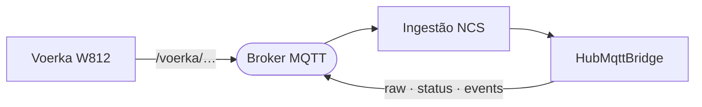
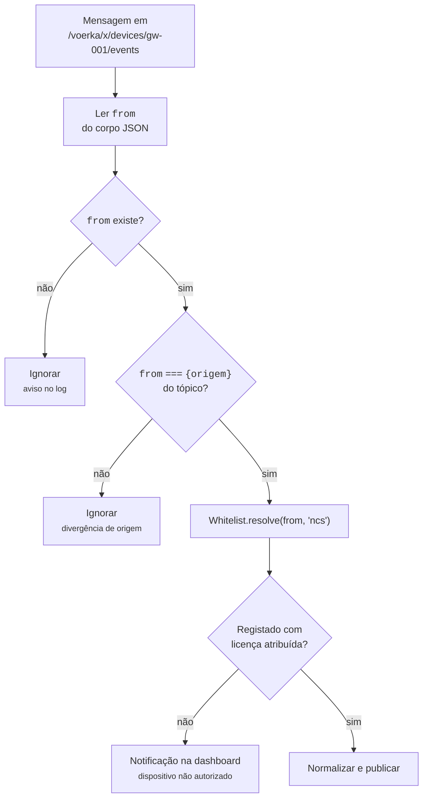

# 03 — Ingestão MQTT: chamada de enfermagem (NCS)

## Âmbito

Os sistemas de chamada de enfermagem da **Voerka**, modelo W812, não
estabelecem ligação ao hub: publicam num broker MQTT que o hub subscreve. Não
existe ligação persistente nem sessão, e cada mensagem é independente das
anteriores.

O âmbito dos dados reportados limita-se a dois acontecimentos: a ativação do
botão de chamada e a transição do estado de ligação. **Estes dispositivos não
produzem telemetria** — nem sinais vitais, nem bateria, nem posição.



O hub subscreve um espaço de tópicos e publica noutro, no mesmo broker,
convertendo o formato do fabricante no contrato normalizado.

## 1. Tópicos subscritos

```text
/voerka/#
```

Configurável por `NCS_TOPIC_FILTER`; ligado ou desligado por `NCS_ENABLED`, que
está **ligado por omissão**.

Os tópicos de origem têm esta forma:

```text
/voerka/{âmbito}/devices/{origem}/{género}[/{nome do estado}]
```

| Segmento | Significado |
|---|---|
| `{âmbito}` | Agrupamento do lado da Voerka. O hub lê-o e preserva-o no `raw`, mas não decide nada com ele |
| `{origem}` | O identificador do aparelho no protocolo Voerka |
| `{género}` | `status`, `events`, `attrs` ou `answer` |
| `{nome do estado}` | Só para `status`; obrigatório, e o único tratado é `online` |

**Só `status` e `events` são processados.** `attrs` e `answer` são reconhecidos
como válidos, registados no log e ignorados — o código chama-lhe explicitamente
"fase 1". Um tópico que não encaixe de todo na forma acima gera um aviso.

## 2. Como o aparelho é identificado

Esta é a parte que distingue o NCS de todas as outras ingestões: a identidade
tem de bater certo **duas vezes**.



Duas exigências distinguem esta ingestão das restantes:

- **Concordância entre corpo e tópico.** Um valor de `from` que não corresponda
  ao segmento do tópico é rejeitado. Sem esta verificação, qualquer entidade com
  acesso de publicação ao broker poderia emitir em nome de outro dispositivo.
- **Licença obrigatória.** Ao contrário dos relógios, que podem permanecer
  registados sem atribuição, um NCS sem licença é tratado como não autorizado. O
  registo usa `deviceType: "ncs"`, o IMEI canónico como chave e o valor de
  `from` na coluna `device_id`.

## 3. O que sai

Três canais, pelo mesmo `HubMqttBridge` de todos os outros dispositivos:

```text
{prefixo}/{empresa}/{licenca}/ncs/{dispositivo}/raw
{prefixo}/{empresa}/{licenca}/ncs/{dispositivo}/status
{prefixo}/{empresa}/{licenca}/ncs/{dispositivo}/events
```

> O documento [`voerka-ncs.md`](voerka-ncs.md) descreve estes tópicos com
> **quatro** segmentos, omitindo a empresa (`{licenca}/ncs/{dispositivo}/…`).
> Essa forma está incorreta: o `Ncs\Bridge` publica através dos mesmos métodos
> das restantes ingestões, que produzem sempre cinco segmentos.

### `status`

Publicado **retido**, para quem subscreve saber logo o estado sem esperar pela
próxima mensagem. Só sai quando chega um `status/online`:

```json
{
  "schemaVersion": 1,
  "state": "online",
  "updatedAt": "2026-09-01T10:35:10Z",
  "device": { "id": "…", "supplier": "Voerka", "model": "W812" }
}
```

### `events`

Dois tipos, conforme o campo `key` do corpo:

| `key` | Evento publicado | O que aconteceu |
|---|---|---|
| `8` | `help_call` | Alguém pediu ajuda |
| `0`, `1`, `2` | `reset` | O pedido foi reposto |
| *(outro)* | *(nenhum)* | Fica só no `raw` |

Um `status/online` produz também um evento, `device.connected` ou
`device.disconnected`.

O identificador do comando de chamada, quando vem, sai em `data.pagerId`.

### `raw`

Leva sempre a mensagem original completa, mais o contexto de onde veio:
`sourceTopic`, `sourceScope`, `sourceMessageKind` e `sourceStatus`. Garante que
uma mensagem cujo `key` o hub não interprete permanece integralmente disponível.

## 4. Designação do evento de chamada

O evento de chamada de ajuda designa-se **`help_call`**, tanto no catálogo de
capacidades como na mensagem publicada. É a mesma designação usada pela pulseira
MOKO, que dispõe da mesma funcionalidade.

Até setembro de 2026 o catálogo declarava `pager_call` enquanto o normalizador
publicava `help_call`, divergência que levava as integrações baseadas no
catálogo a aguardar um evento inexistente. Nas bases de dados anteriores a essa
correção, a linha `ncs:pager_call` da tabela `capabilities` é **renomeada** por
migração e não removida: o identificador dessa linha suporta a associação do
Voerka W812 à capacidade, e a remoção propagaria-se por chave estrangeira.

## Implementação

| Ficheiro | Responsabilidade |
|---|---|
| `src/Ingress/Mqtt/Ncs/Topic.php` | Analisa o tópico de origem e decide se é tratável |
| `src/Ingress/Mqtt/Ncs/Bridge.php` | Subscreve, verifica a identidade, publica |
| `src/Ingress/Mqtt/Ncs/MessageNormalizer.php` | Constrói o `raw`, o `status` e o `event` |
| `src/Domain/Capability/Definition/NcsCapabilityDefinitions.php` | O que o catálogo diz que um NCS tem |
