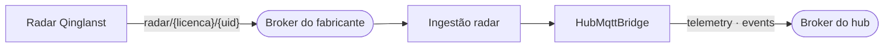
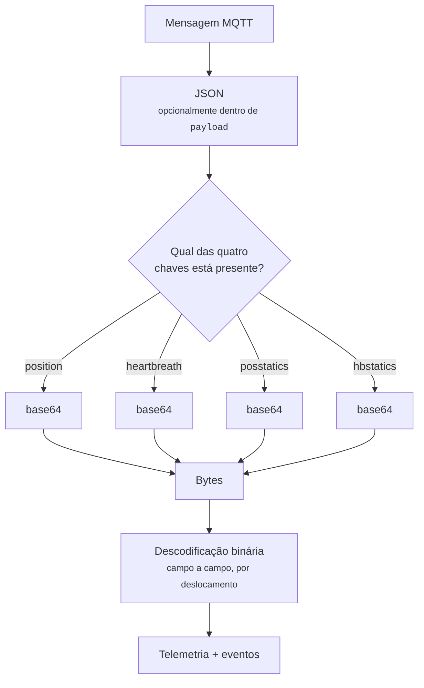

# 04 — Ingestão MQTT: radar

## Âmbito

O radar **Qinglanst** deteta presença humana sem recurso a imagem. Reporta a
posição dentro de uma divisão, a postura — de pé, sentado ou no chão — e, a
curta distância, a frequência respiratória e cardíaca. Sendo um equipamento
fixo, dispensa a utilização e o carregamento exigidos por dispositivos vestíveis.

Três características distinguem esta ingestão das restantes:

1. **Broker dedicado.** O hub estabelece uma segunda ligação MQTT, com
   credenciais próprias, exclusiva dos radares.
2. **Corpo binário codificado em base64 dentro de um envelope JSON.** O conteúdo
   não é legível sem descodificação.
3. **Desativada por omissão.** `QINGLANST_ENABLED` é a única variável de
   ingestão cujo valor por omissão é `false`.



## 1. Tópicos subscritos

```text
radar/{licenca}/{uid}
```

Por omissão `radar/1001/#`, configurável em `QINGLANST_TOPIC_FILTER`. O tópico
traz a licença — é o único protocolo em que o dono vem anunciado pela própria
origem, e não tem de ser descoberto na whitelist.

A ligação usa `QINGLANST_MQTT_HOST`, `_PORT`, `_USERNAME` e `_PASSWORD`, com
identificador de cliente com prefixo `qinglanst-radar`.

## 2. Desembrulhar a mensagem



Tem de estar **exatamente uma** das quatro chaves. É ela que diz como
interpretar os bytes.

### `position` — onde estão as pessoas

Blocos de **16 bytes**, um por pessoa detetada:

| Deslocamento | Campo | Notas |
|---|---|---|
| 0 | índice da pessoa | `88` é um marcador do fabricante, filtrado |
| 1 | posição X | decímetros, com sinal (complemento a 256) |
| 2 | posição Y | decímetros, com sinal |
| 3 | posição Z | centímetros |
| 12 | tempo restante | segundos |
| 13 | postura | de pé, sentado, deitado, no chão… |
| 14 | último acontecimento | entrada, saída, queda… |
| 15 | região | identificador da zona configurada no radar |

Sai como telemetria `presence`, com `count` e a lista `people`.

> **Isto não é o `location` canónico.** São coordenadas relativas ao próprio
> radar, em decímetros, dentro de uma divisão — não latitude e longitude. O
> código diz isso explicitamente, para ninguém as confundir.

### `heartbreath` — sinais vitais

Respiração no byte 1, frequência cardíaca no byte 2, estado de sono nos dois
bits altos do byte 13.

Produz até três telemetrias, **nas mesmas formas que um relógio produz**:

| Capacidade | `data` |
|---|---|
| `heart_rate` | `{ "bpm": 74 }` |
| `breath_rate` | `{ "breathsPerMinute": 16 }` |
| `sleep_state` | `{ "state": "…" }` |

A uniformidade é intencional: a apresentação de uma frequência cardíaca é
independente da origem da medição.

**O valor zero não constitui uma leitura**, mas a indicação de ausência de
deteção. A sua publicação como telemetria apresentaria "0 bpm", interpretável
como paragem cardíaca. Os valores nulos são, por isso, convertidos em evento de
alarme e não em telemetria.

### `posstatics` e `hbstatics` — estatísticas por minuto

Resumos acumulados: distância percorrida, tempo de pé, na cama, em meditação, e
médias de respiração e frequência cardíaca. Saem como `minute_stats` e
`hbstatics`.

## 3. Alarmes

O radar reporta alguns acontecimentos por si; outros são derivados pelo hub a
partir dos valores.

| Limiar | Evento | Nível |
|---|---|---|
| frequência cardíaca > 160 | `heart_rate_high_critical` | perigo |
| frequência cardíaca > 120 | `heart_rate_high` | aviso |
| frequência cardíaca < 20 *(e > 0)* | `heart_rate_low_critical` | perigo |
| frequência cardíaca < 40 *(e > 0)* | `heart_rate_low` | aviso |
| respiração **e** frequência a zero | `vitals_signal_lost` | perigo |

Os quinze tipos de deteção agrupam-se em **três** capacidades, e o tipo
específico viaja dentro do evento:

| Capacidade | Tipos que a compõem |
|---|---|
| `fall` | `fall_confirmed`, `sitting_confirmed`, `on_floor` |
| `vitals_alarm` | os cinco da tabela acima, mais `apnea`, `breathing_high`, `breathing_low` |
| `presence_event` | `room_entry`, `room_exit`, `area_entry`, `area_exit` |

O agrupamento em três capacidades, e não em quinze, mantém a matriz por modelo
proporcional às funcionalidades do equipamento.

Cada evento leva `detectionType`, `detectionCategory`, `detectionLevel` e
`detectionSource`.

> A publicação de um `fall_confirmed` constitui o relato de uma deteção do
> equipamento, e não o levantamento de um alarme. A decisão sobre a resposta
> cabe à aplicação que integra.

## 4. Limitação da taxa de escrita

Um radar publica múltiplas vezes por segundo, volume que excede a capacidade de
escrita útil no Redis e de atualização da interface.

| Escrita | Intervalo mínimo | Variável |
|---|---|---|
| "vi este aparelho" | 5 000 ms | `QINGLANST_DASHBOARD_SEEN_MIN_INTERVAL_MS` |
| Histórico de posições | 1 000 ms | `QINGLANST_POSITION_HISTORY_SAMPLE_MS` |

**O MQTT não é estrangulado.** Só as escritas na dashboard. Quem subscreve
recebe tudo.

Há ainda um resumo periódico no log, a cada `QINGLANST_STATS_FLUSH_SECONDS`
(300 s por omissão), com contagens, taxa e tempo por fase — e só quando houve
mensagens, para não encher o journal de linhas a dizer que não aconteceu nada.

## 5. A chave do dispositivo

O `uid` que vem no tópico de origem serve para **encontrar** o radar na
whitelist, e mais nada. A partir daí vale o **IMEI canónico**: é ele que vai no
tópico publicado, no campo `device.id` e na escrita para a dashboard — como em
todas as outras ingestões.

A whitelist resolve o radar pela coluna `device_id`, que é independente do
`imei` e não é única. Publicar com o `uid` fazia com que um radar registado com
os dois valores diferentes aparecesse com dois nomes, conforme se olhasse para o
broker ou para a interface, e nada no código impedia esse registo.

## Implementação

| Ficheiro | Responsabilidade |
|---|---|
| `src/Ingress/Mqtt/Qinglanst/Topic.php` | `radar/{licenca}/{uid}` |
| `src/Ingress/Mqtt/Qinglanst/Bridge.php` | Subscreve, identifica, publica |
| `src/Ingress/Mqtt/Qinglanst/PayloadDecoder.php` | Os quatro formatos binários |
| `src/Ingress/Mqtt/Qinglanst/RadarValueMapper.php` | Códigos numéricos para nomes |
| `src/Ingress/Mqtt/Qinglanst/MessageNormalizer.php` | Telemetria, limiares e eventos |
| `src/Ingress/Mqtt/Qinglanst/DashboardWritePolicy.php` | Os dois travões |
| `src/Ingress/Mqtt/Qinglanst/IngestStats.php` | O resumo periódico |
| `simulator/benchmark-qinglanst.php` | Mede o custo da ingestão com dados gravados |
