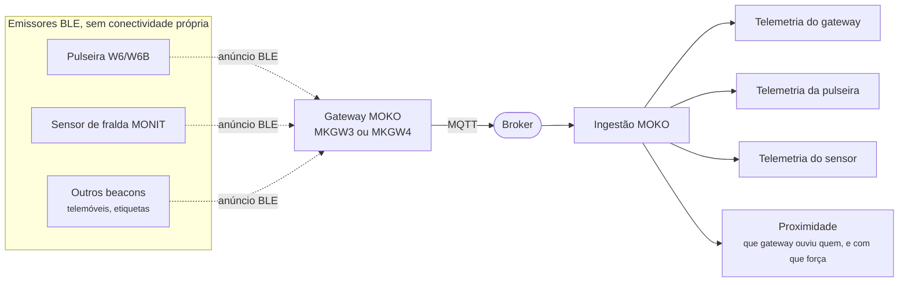
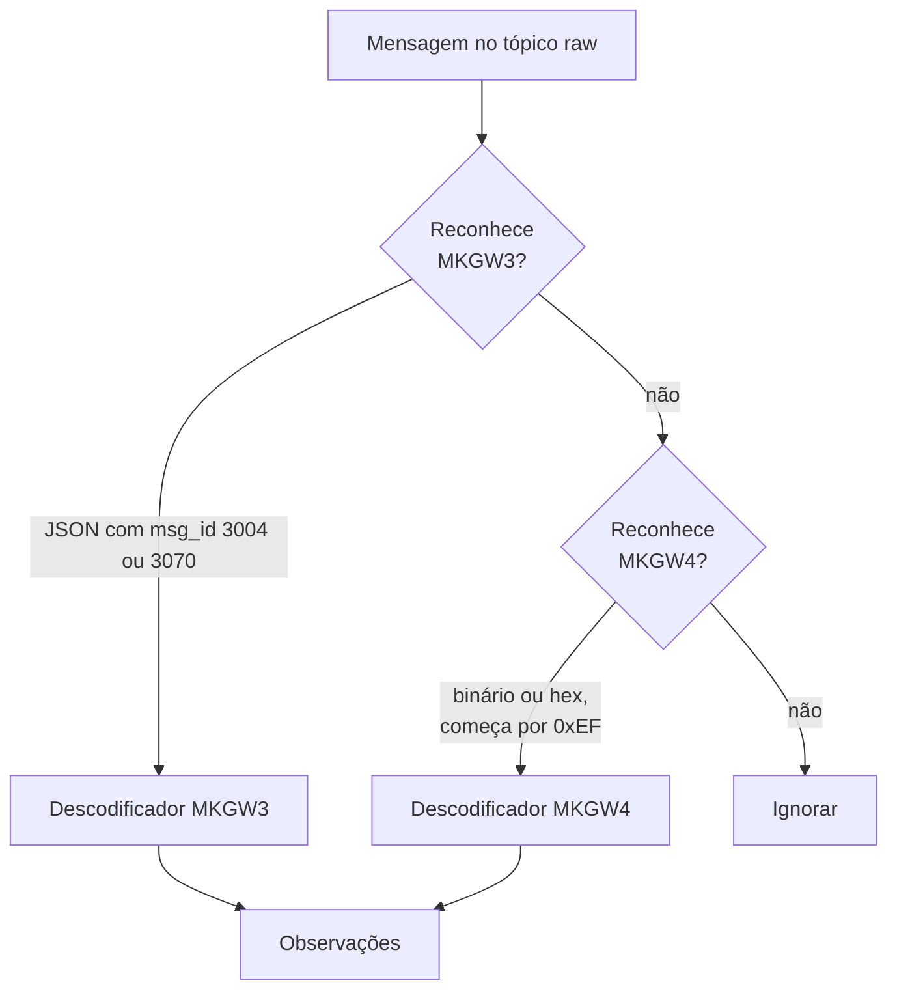
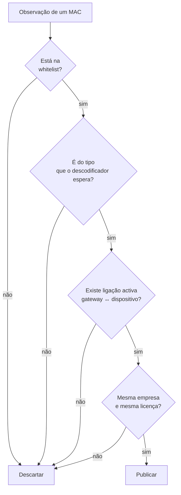

# 05 — Gateways e dispositivos BLE

## Âmbito

As pulseiras e os sensores de fralda não dispõem de conectividade própria: não
têm SIM nem Wi-Fi e não estabelecem qualquer ligação. Limitam-se a **anunciar**,
emitindo periodicamente um conjunto reduzido de bytes com o seu estado, sem
aguardar resposta.

O gateway MOKO é o recetor. Instalado de forma fixa, capta os anúncios BLE ao
seu alcance e publica-os em MQTT. O hub converte esses anúncios em telemetria
atribuída a cada dispositivo emissor, e não ao gateway.



Uma volta que confunde à primeira: **o gateway publica dentro do espaço de
tópicos do próprio hub**, e o hub subscreve-se a si mesmo.

```text
havicare-hub/null/0/gw/{mac}/raw
```

É o tópico que a firmware do gateway está configurada para usar. Não é composto
pelo hub, não leva o prefixo configurável, e o `null/0` não quer dizer que o
gateway não tenha dono — é simplesmente o que está gravado no aparelho. O dono
verdadeiro é resolvido pela whitelist assim que a mensagem chega.

## 1. Dois formatos, o mesmo gateway



### MKGW3 — JSON

Legível à vista. `msg_id` diz o que é (`3004` estado, `3070` relatório de
varrimento) e o MAC do gateway vem em `device_info.mac`.

### MKGW4 — binário tipo-comprimento-valor

Cabeçalho fixo, depois campos que se identificam por uma etiqueta:

```text
EF | 30 A0 | D4 8C 49 F7 90 9C | 01 2C | <campos TLV>
└┬┘ └──┬──┘ └────────┬────────┘ └──┬──┘
 │     │             │             comprimento
 │     │             MAC do gateway
 │     tipo de mensagem
 início
```

Cada campo é `etiqueta (1 byte) + comprimento (2 bytes) + valor`. Quatro tipos
de mensagem são tratados:

| Tipo | O que traz |
|---|---|
| `3004` | Estado do gateway: hora, tipo de rede, qualidade do sinal, tensão da bateria, aceleração, IMEI |
| `3089` | GPS do gateway: longitude e latitude ×10⁻⁷, antena, HDOP |
| `30a0`, `30b2` | Relatórios de varrimento: tudo o que o gateway ouviu |

Num relatório de varrimento, cada dispositivo ouvido traz o tipo de beacon, o
MAC, o RSSI, e os dados de anúncio em bruto. O gateway reconhece catorze
famílias de beacon (iBeacon, Eddystone, os vários BXP da MOKO, PIR, ToF…), mas o
hub **não confia nessa classificação** para identificar os aparelhos que lhe
interessam — olha sempre para os bytes do anúncio.

## 2. Identificação dos dispositivos BLE

A regra estruturante desta camada:

> **A identificação assenta sempre no conteúdo do anúncio, nunca isoladamente no
> endereço MAC.**

A maioria dos dispositivos BLE, incluindo telemóveis, usa endereços aleatórios
rotativos com períodos de poucos minutos. O endereço MAC não constitui, por si,
prova de identidade.

Cada observação é oferecida aos descodificadores por ordem, e o primeiro que a
reclamar fica com ela.

### Sensor de fralda MONIT MECS-PRO

O reconhecimento tem **três** verificações encadeadas:

1. O MAC começa por `eec500` — o prefixo do fabricante.
2. Os dados de fabricante começam por `59 00 02 15`.
3. Os três últimos bytes dos 20 de dados **têm de repetir** os três últimos
   bytes do MAC.

Só depois é que os 20 bytes são lidos, e são lidos **bit a bit**, não byte a
byte:

| Bits | Campo |
|---|---|
| 0–2 | tipo de pacote |
| 3–9 | bateria, em percentagem |
| 10 | tipo de alarme |
| 11–12 | força de transmissão |
| 13–15 | estado do acontecimento |
| 16–75 | dez canais de linha de base, 6 bits cada |
| 76–135 | dez canais de leitura, 6 bits cada |

A humidade de cada canal é `leitura − linha de base`, com o mínimo em zero. O
sensor traz a sua própria referência, o que faz com que a mesma fralda molhada
dê o mesmo número em pessoas diferentes.

O contrato completo do que sai daqui, a derivação do estado e a parametrização
da sensibilidade estão no [capítulo do sensor de fralda](17-sensor-de-fralda.md).

### Pulseira W6B

Tem trama de alarme própria. O toque vem no payload, com um **contador
cumulativo** de quantas vezes o botão foi premido, e quatro modos: simples,
duplo, longo, e inatividade.

Bateria com uma subtileza: acima de 100 o valor está em milivolts, abaixo está
em percentagem.

### Pulseira W6

A W6 dispõe de botão, tal como a W6B, mas executa firmware distinto que **não
implementa trama de alarme**. Utiliza seis espaços de anúncio, e o tipo de
acionamento é determinado pelo espaço que é emitido:

| Espaço | Quando anuncia | O que significa |
|---|---|---|
| Aceleração | sempre | presença, movimento, bateria |
| Identidade | sempre | é esta pulseira |
| `…0011` | 30 s após um toque simples | toque simples |
| `…0012` | 30 s após um toque duplo | toque duplo |
| `…0013` | 30 s após um toque triplo | toque triplo |

Para não ser confundida com qualquer outro beacon Eddystone em alcance, exige-se
que o espaço de nomes seja oito zeros seguidos do próprio MAC.

**Isto é uma convenção de configuração, não algo que o aparelho declare.** Uma
W6 configurada de outra maneira é vista, mas os toques dela não são lidos. Está
assinalado no código e nas notas de arquitetura.

## 3. Ligar um sensor ao gateway certo

Um anúncio BLE é ouvido por todos os gateways ao alcance, e um gateway ouve
tudo, incluindo aparelhos de outros clientes. Antes de publicar seja o que for,
o hub exige **quatro** condições:



A última condição impede a situação mais gravosa: um gateway de uma instalação
captar o sensor de outra e publicá-lo no espaço de tópicos incorreto.

As associações residem na tabela `gateway_device_links` e são geridas pela
dashboard ou pela API.

## 4. Controlo de repetição

Um sensor emite anúncios com intervalos de poucos segundos e é captado
simultaneamente por vários gateways. Sem controlo, o mesmo estado seria
publicado dezenas de vezes por minuto.

| Mecanismo | Função | Âmbito | Omissão |
|---|---|---|---|
| **De-duplicação** | O mesmo anúncio, byte a byte, ouvido outra vez é descartado | sensor de fralda | 5 s |
| **Refrescamento** | Suprime telemetria de conteúdo idêntico até decorrer este período, findo o qual volta a ser publicada | aparelhos MOKO | 60 s |
| **Inatividade do gateway** | Transição para `offline`, com `status` retido | gateways | 180 s |

O refrescamento tem âmbito **por gateway** e não por dispositivo. Com âmbito por
dispositivo, o primeiro gateway a publicar suprimiria os restantes, eliminando a
informação de que o sensor é captado em vários pontos.

### Controlo de acionamentos repetidos

Cada tipo de dispositivo exige um mecanismo distinto:

| Dispositivo | Mecanismo | Fundamento |
|---|---|---|
| **W6B** | Contador cumulativo; o acionamento é registado apenas quando o valor se altera | A trama transporta contador |
| **W6** | Janela temporal de 35 s por modo | A trama não transporta contador e repete-se durante 30 s |
| **Fralda** | Transição de estado | O que releva é a mudança de condição, não a repetição |

Na fralda, a sensibilidade configurada entra no **valor** guardado e não na
chave — assim, mudar a configuração conta como uma transição e o estado é
reavaliado logo, em vez de ficar preso ao anterior.

## 5. Proximidade — quem ouviu quem

Além da telemetria de cada aparelho, o hub publica, por cada avistamento, quão
forte o gateway o ouviu. É o que permite a uma aplicação saber em que divisão
alguém está, ou levantar um alarme quando se afasta.

```json
{
  "type": "proximity",
  "data": {
    "gatewayId": "c5e390f30bce",
    "state": "measured",
    "rssiDbm": -74,
    "rssiMaxDbm": -68,
    "rssiMedianDbm": -75,
    "rssiMinDbm": -86,
    "samples": 7,
    "windowSeconds": 5
  }
}
```

Uma janela de 5 segundos, até 10 amostras. Com um número par de amostras, a
mediana é a **menor** das duas do meio — para ser um valor realmente medido, e
não uma média inventada entre dois.

Quando um par gateway–dispositivo se cala mais de 30 segundos, sai **uma vez**
um `state: "unknown"` com `samples: 0`. O silêncio é informação, e sem isto a
última medição ficava a parecer atual para sempre.

### Porque não sai o sinal em bruto

Um sinal de rádio em bruto não é utilizável como limiar. Uma pulseira **parada
em cima de uma secretária**, durante sessenta segundos, produziu quarenta
amostras entre −79 e −64 dBm — quinze decibéis de amplitude sem que nada se
mexesse. Aplicado a um limiar simples, isso dá **dezoito** mudanças de zona por
minuto num aparelho imóvel.

A janela e a mediana existem para remover essa oscilação. Ficam do lado do hub
porque a correção é sobre o sinal, e sobre o sinal o hub é a única camada com
todas as amostras.

**A divisão de responsabilidade é deliberada.** O hub normaliza e publica
fielmente o sinal entre cada dispositivo e cada gateway que o ouve. O alarme —
os limiares, o que conta como «à porta», quem é avisado — pertence a quem
integra. O hub não tem opinião sobre perigo, e as janelas e contagens são
argumentos do `ProximityTracker`, não configuração exposta.

**Avistamentos não reclamados:** quando nenhum descodificador sabe ler uma
trama, mas o MAC pertence a um dispositivo registado e ligado ao gateway, o RSSI
é aproveitado na mesma. Um sensor cujo anúncio o hub não entende continua a
dizer onde está.

## 6. O que não entra no histórico

Os relatórios de varrimento **não** são escritos no histórico da dashboard, e a
proximidade também não. Ambos são publicados no MQTT, mas um gateway que capte
vinte dispositivos esgotaria a lista de 100 entradas em segundos, eliminando o
seu valor de consulta.

## Diagnóstico

Duas ferramentas de linha de comandos operam sobre um broker real:

```bash
# Dispositivos captados por um gateway, com identificação quando possível
php simulator/ble-scan-probe.php --seconds=120

# Identificação de um dispositivo pela alteração do anúncio ao ser acionado
php simulator/ble-scan-diff.php --baseline=45 --min-rssi=-70
```

A segunda destina-se a dispositivos ainda sem descodificador: regista uma linha
de base do que já é captado e assinala os endereços novos e os anúncios cujo
conteúdo se altere.

> **A aplicação MKScannerPro tem de estar encerrada antes de qualquer
> verificação no broker.** Um gateway MKGW4 suspende a publicação em MQTT
> enquanto a aplicação lhe estiver ligada.

## Implementação

| Ficheiro | Responsabilidade |
|---|---|
| `src/Ingress/Mqtt/Moko/Topic.php` | `…/gw/{mac}/raw` e a forma canónica de um MAC |
| `src/Ingress/Mqtt/Moko/Bridge.php` | O centro: identidade, ligações, travões, publicação |
| `src/Ingress/Mqtt/Moko/MokoMessageDecoder.php` | Seleção entre os formatos MKGW3 e MKGW4 |
| `src/Ingress/Mqtt/Moko/Mkgw3MessageDecoder.php` | JSON |
| `src/Ingress/Mqtt/Moko/Mkgw4MessageDecoder.php` | Binário TLV |
| `src/Ingress/Mqtt/Moko/GatewayNormalizer.php` | Telemetria do próprio gateway |
| `src/Ingress/Mqtt/Moko/MonitMecsProDecoder.php` | Os 20 bytes do sensor de fralda |
| `src/Ingress/Mqtt/Moko/MonitNormalizer.php` | Humidade, índice e estado |
| `src/Ingress/Mqtt/Moko/W6bDecoder.php` · `W6Decoder.php` | As duas pulseiras |
| `src/Ingress/Mqtt/Moko/BraceletTelemetry.php` | Bateria e movimento, comuns às duas |
| `src/Ingress/Mqtt/Moko/ProximityTracker.php` | A janela de RSSI |
| `src/Ingress/Mqtt/Moko/RedisObservationStateStore.php` | De-duplicação, refrescamento, transições |

Os manuais do fabricante estão em
[`fornecedores/gateways/`](fornecedores/gateways/), com as notas de campo em
[`MKGW4 payloads — hex vs JSON.md`](fornecedores/gateways/MKGW4%20payloads%20—%20hex%20vs%20JSON.md).
