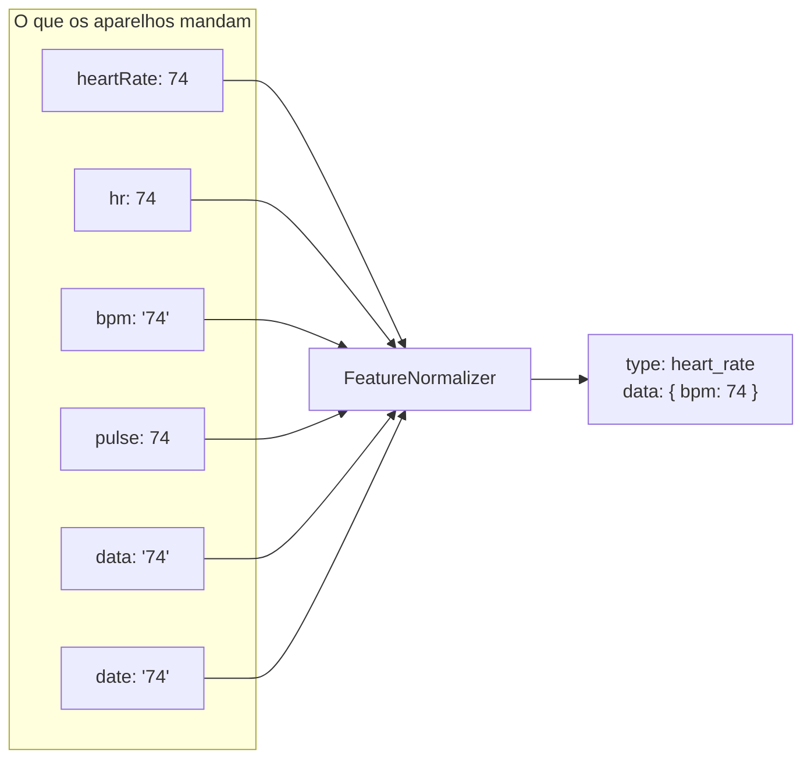
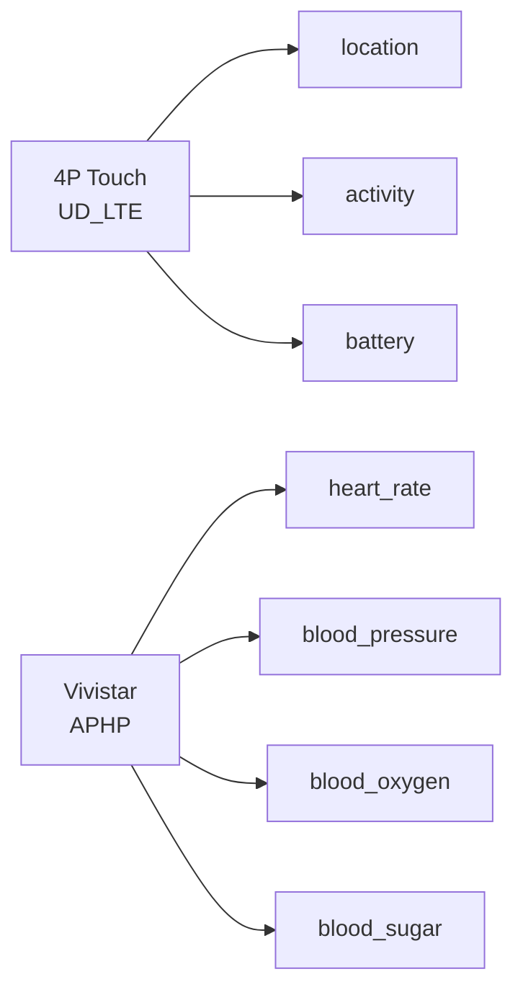

# 06 — Normalização

## Âmbito

A normalização constitui a função central da plataforma e o que a distingue de
um encaminhador.

Os dez protocolos suportados divergem em todos os aspetos da representação: na
designação dos campos, no tipo dos valores — a temperatura pode chegar em texto
ou em número — e nas unidades, com a bateria expressa em percentagem ou em
milivolts. A normalização converte todos numa forma única, comum a relógios,
radares e sensores BLE.



A designação `date` presente na lista não é um erro de transcrição: existe
firmware que a utiliza no lugar de `data`. O hub aceita ambas, reproduzindo
fielmente o que os dispositivos reportam.

## 1. Famílias de envelope

Nem todas as mensagens publicadas são medições. Há três formas, e distinguem-se
pelo campo que as identifica:

| Forma | Canais | Identificador | Tem `data` |
|---|---|---|---|
| Medição ou acontecimento de domínio | `telemetry`, `events` | `type`, com o nome da capacidade | sim |
| Ciclo de vida | `events` | `type`, começado por `device.` | não |
| Estado | `status` | `state` | não |
| Mensagem original | `raw` | `direction` | conforme a ingestão |

O canal não determina a forma: o `events` transporta tanto um alarme, com `data`
e `source`, como um `device.connected`, que só leva a identidade.

> **O envelope não leva versão de esquema.** O campo `schemaVersion` existiu e
> foi removido: nunca foi lido, e o valor seguia o produtor da mensagem em vez
> do canal, o que o tornava enganador. Versionar é assunto da API; no MQTT o
> contrato mantém-se por não se partir o que já está publicado — acrescentar
> campos é seguro, mudar ou remover não é.

## 2. O envelope de telemetria

```json
{
  "type": "heart_rate",
  "occurredAt": "2026-09-01T10:35:10Z",
  "device": {
    "id": "861265061009822",
    "supplier": "Vivistar",
    "model": "L08 Pro",
    "commercialName": "Vivistar L08 Pro"
  },
  "data": { "bpm": 74 },
  "source": { "protocol": "vivistar-iw", "nativeType": "AP49" },
  "extra": { "raw": "IWAP49,74#" }
}
```

| Campo | Notas |
|---|---|
| `type` | O nome da capacidade. A secção 3 lista as reconhecidas pelo `FeatureNormalizer` e as dos ingestores MQTT |
| `occurredAt` | UTC, RFC 3339, **ao segundo**. É o relógio do **hub** no momento de publicar, não o do aparelho |
| `device.id` | Identidade canónica — a mesma que vai no tópico |
| `device.supplier` · `device.model` | O que a whitelist diz. Omitidos se vazios |
| `device.commercialName` | Do catálogo de modelos. Omitido quando o modelo não está lá |
| `data` | A forma partilhada da capacidade |
| `source.protocol` | Quem descodificou: `vivistar-iw`, `wonlex-json`, `four-p-touch`, `voerka-ncs`, `qinglanst-radar`, `moko-mkgw3`, `moko-mkgw4`, `monit-mecs-pro-ble`, `moko-w6`, `moko-w6b` |
| `source.nativeType` | O tipo original do fabricante: `AP49`, `upHeartRate`, `UD_LTE`, `LK`, `heartbreath`… |
| `source.gatewayId` · `source.rssiDbm` | Só em BLE: que gateway ouviu, e com que força |
| `source.topic` | Só no radar: o tópico de origem |
| `extra` | Campos do fabricante preservados de propósito, fora da forma partilhada |

### Campo `occurredAt`

Regista o instante da publicação e **não** o da medição. Os anúncios BLE não
transportam data, e um relógio que esteve sem cobertura transmite lotes com
registos antigos. O instante indicado pelo dispositivo, quando existe, é
preservado em `extra.measuredAt`.

### Campo `extra`

Os campos transmitidos pelo fabricante que não têm correspondência na forma
partilhada são preservados neste campo. Um campo sem utilização atual pode ser
determinante para interpretar uma leitura anómala num momento em que o `raw`
correspondente já não esteja disponível.

**O conteúdo de `extra` não constitui contrato** e varia com as versões de
firmware.

## 3. Capacidades

As vinte capacidades reconhecidas pelo `FeatureNormalizer`. **O contrato
anterior documentava doze** — as oito restantes já eram publicadas, sem
sido escritas.

Campos ausentes são **omitidos**, nunca preenchidos com `null` ou zero. Uma
leitura que não se consegue normalizar não produz evento nenhum.

### Sinais vitais

| `type` | `data` |
|---|---|
| `heart_rate` | `bpm` |
| `blood_pressure` | `systolicMmHg`, `diastolicMmHg` |
| `blood_oxygen` | `spo2Percent` |
| `blood_sugar` | `glucoseMgDl` |
| `breath_rate` | `breathsPerMinute` |
| `temperature` | `bodyCelsius`, `surfaceCelsius`, `environmentCelsius` |

> **A capacidade `blood_pressure` não inclui a frequência de pulso.** Um valor
> transmitido como `"120/80/74"` é decomposto nos três números, mas o terceiro é
> emitido como evento `heart_rate` **independente**, com o mesmo `nativeType`.
> O campo `pulseBpm` não existe no contrato.

### Formas de onda

| `type` | `data` |
|---|---|
| `ecg` · `ppg` | `samples[]`, `frequencyHz`, `collectionId`, `startedAt`, `packetStatus`, `block` |
| `hrv` | `milliseconds` |
| `rr_interval` | `intervals[{timestamp, milliseconds}]`, `frequencyHz`, `collectionId` |

### Atividade e estado

| `type` | `data` |
|---|---|
| `activity` | `steps`, `distanceMeters`, `distanceKm`, `caloriesKcal`, `exerciseSeconds`, `standMinutes` |
| `sleep` | `startTime`, `endTime`, `isAccumulative`, `totalDurationMinutes`, `timingValid`, `segments[]` |
| `battery` | `percent`, `chargingState`, `batteryType` |
| `heartbeat` | `status`, `steps`, `gsmSignal`, `satelliteCount`, `batteryPercent`, `chargingState`, `batteryType`, `rollFrequency`, `remainingSpace`, `fortificationState`, `workMode` |
| `device_state` | `state`, `resetStatus`, `reason` |
| `device_status` | `deviceTime` |
| `firmware_version` | `version` |
| `device_config` | `status`, `ack`, `settings` |
| `alarm` | `code`, `sos`, `lowBattery`, `fall`, `wearingNotice` |
| `location` | ver a secção 4 |

### Só de alguns tipos de aparelho

| `type` | Quem | `data` |
|---|---|---|
| `presence` | radar | `count`, `people[]` |
| `sleep_state` | radar | `state` |
| `position_minute_stats` · `vitals_minute_stats` | radar | resumos por minuto |
| `motion` | pulseira | `xMg`, `yMg`, `zMg`, `magnitudeMg` |
| `proximity` | pulseira, sensor de fralda | `gatewayId`, `state`, `rssiDbm`, `rssiMaxDbm`, `rssiMedianDbm`, `rssiMinDbm`, `samples`, `windowSeconds` |
| `connectivity` | gateway | `interface`, `networkType`, `signalQuality`, `signalStrengthDbm` |
| `diaper_moisture` · `diaper_moisture_level` · `diaper_condition` | sensor de fralda | ver o [capítulo 17](17-sensor-de-fralda.md) |

### Capacidade `sleep`

A normalização do sono aplica validação reforçada, dada a frequência de
inconsistências temporais no firmware dos relógios. O campo `timingValid`
reporta o resultado dessa validação, que exige: instantes compreendidos entre
2000 e 2100, fim posterior ao início, contenção de cada segmento no intervalo
exterior, e concordância entre a duração declarada e as fronteiras, com
tolerância de um minuto.

Em caso de reprovação, os instantes são **removidos** e `timingValid` assume o
valor `false`, mantendo-se os segmentos e a duração total. Um registo com
durações corretas e instantes inválidos conserva utilidade analítica; instantes
inválidos apresentados como válidos não.

Os tipos de segmento são unificados em `deep_sleep`, `light_sleep`, `rem` e
`awake`, independentemente da designação de origem.

## 4. Capacidade `location`

Uma posição pode ter origem em GPS, em antenas de rede móvel, em pontos de
acesso Wi-Fi, ou numa combinação destes. Os fabricantes divergem na designação
dos campos, no sistema de coordenadas e na representação da ausência de posição,
frequentemente codificada como `0,0`.

```json
{
  "source": "cell_wifi",
  "hasCoordinates": true,
  "lat": 41.706841,
  "lon": -8.793279,
  "gpsValid": false,
  "radioType": "lte",
  "coordinateSystem": "wgs84",
  "reportKind": "periodic",
  "accuracyMeters": 48.0,
  "baseStations": [ { "mcc": "268", "mnc": "01", "lac": "…", "cellId": "…", "signalStrengthDbm": -83 } ],
  "wifiAccessPoints": [ { "mac": "dc:fe:23:36:57:4d", "signalStrengthDbm": -61 } ]
}
```

Cinco regras de normalização:

- **A posição `0,0` é eliminada.** Quando `gpsValid` não é verdadeiro e a
  posição é exatamente zero, as coordenadas são removidas. Trata-se da
  codificação usada pelos relógios para indicar ausência de fixação, e a sua
  publicação situaria o dispositivo no golfo da Guiné.
- **O campo `source` é derivado e não copiado.** Assume os valores `gps`,
  `cell`, `wifi` ou `cell_wifi`, determinados pela evidência efetivamente
  presente na mensagem e não pela declaração do fabricante.
- **O campo `hasCoordinates` é o indicador de validade.** Um evento de
  localização sem coordenadas é publicado na mesma, com as antenas e os pontos
  de acesso disponíveis para resolução posterior.
- **Os endereços MAC são normalizados** para `aa:bb:cc:dd:ee:ff` em minúsculas.
- **O campo `signalStrengthDbm` só é aceite com valor negativo.** Um valor
  positivo indica outra escala de medida.

Os vocabulários fechados: `radioType` assume `gsm`, `wcdma`, `lte`, `cdma` ou
`nr`; `coordinateSystem` assume `wgs84`, `gcj02`, `bd09`, `google` ou `tencent`;
`reportKind` assume `periodic`, `requested`, `alarm` ou `replay`.

Os eventos de `location` são subsequentemente submetidos ao enriquecimento
descrito no capítulo
[Localização sem GPS](12-localizacao-sem-gps.md).

## 5. Eventos múltiplos por mensagem

Uma mensagem nativa não corresponde a uma única medição, mas a **zero ou mais**.



Os eventos originados na mesma mensagem partilham os valores de `occurredAt` e
de `source.nativeType`, par que constitui a chave de correlação.

## 6. Catálogo de capacidades

O `FeatureNormalizer` determina o que a plataforma **normaliza**. O
`CapabilityCatalog` determina o que cada tipo de dispositivo **declara
suportar**, e é este que a API devolve em `capabilities` e que a dashboard
apresenta na matriz por modelo.

São listas distintas. Três capacidades publicadas são **deliberadamente**
excluídas do catálogo:

| `type` publicado | Fundamento da exclusão |
|---|---|
| `heartbeat` | Sinal de vida, não medição. Excluído também do histórico da dashboard |
| `device_config` | Confirmação de uma configuração, não leitura |
| `reset` | Reinício de um botão do NCS (códigos 0–2), acontecimento e não medição |

As capacidades `alarm` e `proximity` foram acrescentadas ao catálogo em setembro
de 2026, corrigindo duas omissões: o catálogo declarava a `fall_detection`, que
ativa a deteção de queda, sem declarar o alarme resultante, e a `proximity`
sustenta os alarmes de proximidade sem constar em qualquer declaração.

A migração descrita na [persistência](14-persistencia.md) cria as linhas
correspondentes na tabela `capabilities` das bases de dados preexistentes e
associa-as aos modelos cujo protocolo as suporta.

## Implementação

| Ficheiro | Responsabilidade |
|---|---|
| `src/Device/FeatureNormalizer.php` | As vinte capacidades e as suas formas |
| `src/Device/DeviceEventDecoder.php` | Tipo nativo → capacidades, por protocolo |
| `src/Device/DeviceEventPayloadBuilder.php` | Monta o envelope das medições e dos alarmes |
| `src/Device/RawPayload.php` | Monta os envelopes de `raw`, `status` e ciclo de vida |
| `src/Domain/Capability/CapabilityCatalog.php` | O que cada tipo de aparelho declara ter |
| `src/Ingress/Mqtt/*/…Normalizer.php` | O mesmo trabalho, do lado do MQTT |
