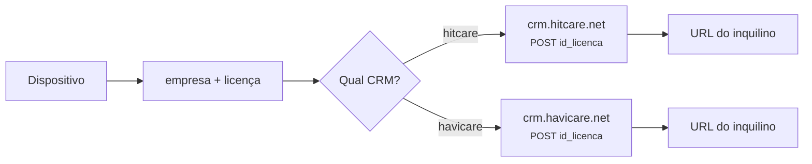
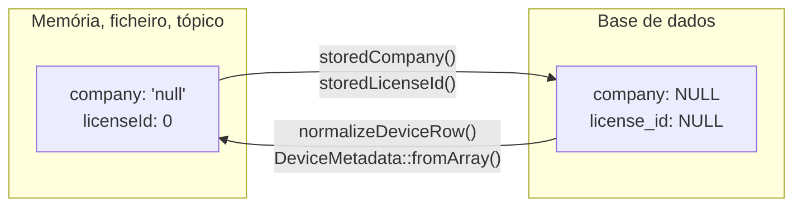

# 07 — Multi-inquilino: empresa, licença e whitelist

## Âmbito

Uma instância única serve múltiplos clientes. Instalações distintas utilizam
equipamento do mesmo fornecedor e ligam-se ao mesmo servidor, sem acesso aos
dados umas das outras.

A separação assenta no par **empresa + licença**, e não num identificador
isolado.

## 1. O par, e porque é um par

O número da licença identifica um cliente **dentro de um CRM**. Há mais do que
um CRM — `hitcare` e `havicare` —, e cada um numera as suas licenças a partir do
princípio. A licença 1001 do `hitcare` e a licença 1001 do `havicare` são
clientes diferentes, em servidores diferentes.

Por isso **metade do par não quer dizer nada**. Uma licença sem empresa não se
consegue resolver, e uma empresa sem licença não identifica um cliente.

Duas regras decorrem desta definição:

- O `licenseId` é **sempre um inteiro**. É essa a numeração do CRM e a forma
  comparada pelo controlo de acesso. Não é representado como cadeia de
  caracteres.
- **A licença 0 não existe.** O valor zero é o marcador de ausência de
  atribuição.

## 2. Representação da ausência de dono

Um dispositivo pode existir sem dono — registado, à espera de ser atribuído a um
cliente. Essa ausência escreve-se de **duas** maneiras diferentes conforme o
sítio, e confundi-las já causou um bug em produção.

| | Empresa ausente | Licença ausente |
|---|---|---|
| **Em memória** | `'null'` *(o texto)* | `0` |
| **No tópico MQTT** | `null` | `0` |
| **No ficheiro da whitelist** | `"null"` | `0` |
| **Na base de dados** | `NULL` *(SQL)* | `NULL` *(SQL)* |

A razão de existirem sentinelas em memória é o tópico MQTT: um tópico é um
caminho de texto, e não há forma de lá escrever "ausente". Tem de haver alguma
coisa naquele segmento.

**A fronteira é o `WhitelistRepository`**, e são duas funções de três linhas:
`storedCompany()` troca `'null'` por `NULL`, `storedLicenseId()` troca `0` por
`NULL`. Tudo o que escreve na tabela passa por elas.

### Consequência de contornar a fronteira

O `database/seed.sql` escrevia diretamente na tabela, **contornando a
fronteira**, e gravava `'null'` na coluna `company` e `0` na coluna
`license_id`.

O efeito observado: o filtro de licenças da dashboard apresentava uma empresa
designada "Sem empresa" contendo uma licença "Sem Licença". Para as restantes
camadas do sistema, uma empresa cujo nome é o texto `null` é uma empresa válida
— tem designação, agrupa dispositivos e integra as listagens.

A anomalia manifestava-se apenas nas instalações onde o seed tinha sido
executado. As bases de dados alimentadas exclusivamente pelo código nunca foram
afetadas.

Está trancado por `tests/Unit/Database/SeedWhitelistTest.php`, que lê o
`seed.sql` como texto e falha se lá encontrar um sentinela. O mesmo teste
verifica a outra regra do par: **ou tem empresa e licença, ou não tem nenhuma
das duas.** Uma linha com licença 1001 e empresa a `NULL` é impossível no
domínio, e existia.

## 3. A grafia da empresa

O nome da empresa é forçado a **minúsculas** na normalização.

Não é cosmética. O nome vai no tópico MQTT, e os tópicos MQTT distinguem
maiúsculas: para quem subscreve, `hitCare/1001/#` e `hitcare/1001/#` são dois
clientes diferentes. Uma grafia só, escolhida numa função só, mantém os
dispositivos de um cliente num sítio só.

## 4. A whitelist

É a fonte de verdade sobre que dispositivos existem e a quem pertencem.

| Coluna | O que guarda |
|---|---|
| `imei` | **Chave primária** — a identidade canónica, mesmo quando o protocolo usa outra |
| `supplier` · `model` | Texto, casado com o catálogo por nome |
| `device_type` | `watch`, `ncs`, `radar`, `gateway`, `diaper_sensor`, `bracelet` |
| `license_id` · `company` | O par. `NULL` os dois, ou nenhum |
| `device_id` | O identificador alternativo do protocolo, quando existe |
| `sim_number` | Para os aparelhos com SIM |

### Resolver uma identidade

Nem todos os protocolos falam por IMEI. A resolução tenta primeiro o IMEI
exato, e só depois os alias — e o alias é **específico do protocolo**:

| Protocolo | Como o aparelho se identifica | Onde o hub procura |
|---|---|---|
| `wonlex-json` · `vivistar-iw` | IMEI | chave primária |
| `four-p-touch` | 10 dígitos derivados do IMEI | `device_id` |
| `voerka-ncs` | o campo `from` | `device_id`, com `device_type = 'ncs'` |
| `qinglanst-radar` | o UID do tópico | `device_id`, com `device_type = 'radar'` |
| BLE | MAC | chave primária |

Forçar o tipo no alias é o que impede um `device_id` de um radar de casar com um
relógio que por acaso tenha o mesmo número.

### Cache

O hub relê a whitelist da base de dados com uma cache de **5 segundos**. É o que
faz com que atribuir um dispositivo a um cliente na dashboard tenha efeito quase
imediato, sem reiniciar nada.

O `config/whitelist.json` é **legado**. Só é usado quando não há base de dados —
em testes e desenvolvimento. O hub a correr não o lê nem lhe escreve. Para
importar um ficheiro antigo, uma vez: `php bin/import-whitelist.php`.

## 5. Reassociar um dispositivo em funcionamento

Mudar um dispositivo de cliente enquanto ele está ligado tem duas armadilhas, e
as duas estão resolvidas.

**A sessão está desatualizada.** A sessão TCP guarda a empresa e a licença do
momento do login, e um relógio pode estar ligado há dias. Por isso o
`DeviceHubServer` **relê a whitelist a cada publicação**, em vez de usar a
sessão. A mudança vale já, sem esperar por uma reconexão.

Com um cuidado: se a whitelist devolver `0`, mantém-se o valor anterior em vez
de mudar o dispositivo para a licença 0. Uma leitura falhada não pode desassociar
um aparelho em silêncio.

**O estado retido fica para trás.** O `status` é publicado retido, o que quer
dizer que o broker o guarda e o entrega a quem subscrever depois. Um dispositivo
que muda de cliente continuaria a anunciar-se no tópico do cliente antigo, para
sempre.

Por isso, ao reassociar, o hub publica uma mensagem **de comprimento zero** no
tópico antigo. É a única forma de o MQTT apagar uma retida — um JSON vazio
apenas a substituiria por outra.

## 6. Quem vê o quê na API

Dois papéis:

| Papel | O que pode |
|---|---|
| `hub_admin` | Tudo. É o único que entra na dashboard |
| `license_client` | Só os dispositivos do seu par empresa+licença, e só em nove rotas |

A verificação por linha exige que **tudo** bata certo: a mesma empresa (sem
distinção de maiúsculas), a mesma licença, e as duas positivas. Um dispositivo
sem dono fica de fora por construção — nenhum cliente tem licença 0.

Um utilizador `license_client` mal ligado — sem licença, sem empresa, ou com
referências inconsistentes — **não autentica de todo**. É deliberado: mais vale
não entrar do que entrar e ver o que não é seu.

Nem todo o `license_client` tem conta. Um administrador emite um token de
inquilino pelo `POST /api/auth/license-token`, sem linha em `api_users` por
trás: é o que permite à plataforma de um cliente dar credenciais às aplicações
dela sem guardar uma password por inquilino. O âmbito do token é o mesmo, e as
verificações por linha não distinguem os dois — o que muda é que um token
emitido não se desactiva, expira.

Os detalhes estão no [capítulo da API](09-api.md).

## Implementação

| Ficheiro | Responsabilidade |
|---|---|
| `src/Domain/DeviceMetadata.php` | Os normalizadores canónicos: empresa, licença, tipo |
| `src/Api/Repository/WhitelistRepository.php` | A fronteira sentinela ↔ `NULL`, e o SQL |
| `src/Registry/Whitelist.php` | A cache do lado do hub e a resolução por alias |
| `src/Device/DeviceAuthorizer.php` | A decisão de deixar entrar |
| `src/Device/DeviceHubServer.php` | `currentLicenseId()` e `currentCompany()` — a releitura |
| `src/Device/HubMqttBridge.php` | `clearRetainedStatus()` — apagar o rasto do cliente antigo |
| `src/Api/Auth/ApiAuthContext.php` | `canAccessTenant()` |
| `tests/Unit/Database/SeedWhitelistTest.php` | Tranca o seed contra os sentinelas |
