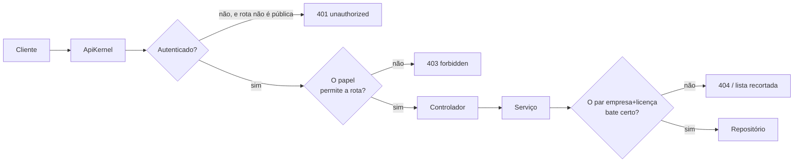
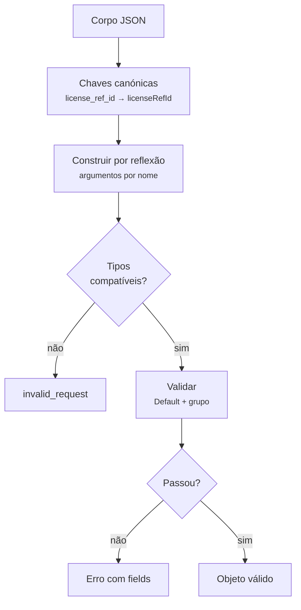

# 09 — A API REST

## Âmbito

O MQTT transporta os acontecimentos em tempo real. A API cobre o restante:
inventário de dispositivos, atribuição a clientes, capacidades suportadas,
configuração em vigor e pedido de medições.

É igualmente a interface consumida pela dashboard. Não existe via de acesso
privilegiada: as operações disponíveis à dashboard estão disponíveis a qualquer
integrador.



A especificação viva está sempre em **`/api/docs`** (Swagger UI) e
**`/api/openapi.json`**, ambas públicas.

## 1. Autenticação

A autenticação **não usa JWT**. Os tokens são opacos e residem no Redis: 64
caracteres hexadecimais sem conteúdo interpretável. O significado do token é
mantido exclusivamente do lado do servidor.

A validade corresponde ao TTL da chave no Redis. Não existe assinatura a
verificar nem data de expiração a comparar: a expiração da chave elimina o
token.

### Três tipos

| Tipo | Para que serve | Validade |
|---|---|---|
| `access` | Chamar a API | 1 hora |
| `refresh` | Obter um par novo | 30 dias |
| `stream` | Abrir **uma** ligação de eventos | 30 segundos |

Configuráveis por `DASHBOARD_API_TOKEN_TTL_SECONDS` e
`DASHBOARD_API_REFRESH_TOKEN_TTL_SECONDS`. O bilhete de stream é fixo.

**Um `refresh` não abre a API.** A verificação recusa qualquer token que não
seja do tipo `access` — mesmo válido, mesmo do utilizador certo.

### Entrar

```http
POST /api/auth/login
{ "username": "…", "password": "…" }
```

A mesma rota **roda** o par se lhe mandares um `refresh_token` em vez de
credenciais. A rotação é destrutiva: o refresh usado é apagado e emitem-se dois
novos. Um refresh reutilizado não vale nada.

```http
POST /api/auth/login
{ "refresh_token": "…" }
```

Depois, em cada pedido:

```http
Authorization: Bearer <access_token>
```

O `access_token` em *query string* **foi removido**. Sobrevivia em logs de
servidores intermédios e em históricos de navegador, e uma credencial não
pertence a um URL.

### O bilhete de stream

`EventSource` não deixa definir cabeçalhos, e por isso o stream não pode levar
`Authorization`. A solução é um bilhete de **uso único**, pedido com o token
normal e passado na query:

```http
POST /api/auth/stream-ticket     →  { "data": { "ticket": "…" } }
GET  /api/devices/{imei}/stream?ticket=…
```

O bilhete é eliminado **antes** de a ligação ser servida, o que o restringe a
uma única utilização. Herda o âmbito de acesso de quem o solicitou, pelo que não
amplia privilégios.

O bilhete existe **apenas** para o `EventSource`. O resolvedor de credenciais
verifica o cabeçalho `Authorization` primeiro e só recorre ao `?ticket=` quando
não há cabeçalho; um cliente que possa definir cabeçalhos — `fetch()` com
leitura do corpo, um consumidor de servidor, uma aplicação móvel — envia o
`Bearer` normal e dispensa o bilhete.

### Tetos de tentativas

O login é a única rota pública que verifica uma password, e tem de o ser: não se
apresenta um token antes de o ter. O `password_verify` é síncrono, está a custo
12, e corre no mesmo *event loop* que serve a ingestão TCP dos relógios — cada
tentativa bloqueia o processo inteiro, **acerte ou falhe**. Quem ataca não
precisa de adivinhar a password; precisa apenas de obrigar o hub a verificar.

Medido na instância de desenvolvimento, com um utilizador real e password
errada: **172 a 187 ms por tentativa**. Cinco sondas lançadas durante uma dessas
tentativas mostram a assinatura de um loop bloqueado — uma delas espera os
mesmos ~180 ms, e as restantes respondem em 0,3 ms depois de ele libertar. A 175
ms, **5,7 tentativas por segundo saturam o loop a 100%**.

> **Uma tentativa com utilizador inexistente custa 0,5 ms**, porque o `&&` em
> `AuthService` faz curto-circuito antes do `password_verify` quando não há
> hash. A diferença de ~350× é um oráculo de enumeração de utilizadores: dá para
> descobrir que contas existem só pelo tempo de resposta. Os tetos abaixo limitam
> quantas tentativas se fazem, mas não igualam os dois tempos. Fechar o oráculo
> — verificar contra um hash fixo quando o utilizador não existe — torna *todas*
> as tentativas caras, e por isso só é seguro fazê-lo com os tetos já em vigor.

Daí três tetos por janela, verificados **antes** da verificação da password, cada
um a fechar uma porta que os outros deixam aberta:

| Teto | Omissão | Fecha |
|---|---|---|
| `DASHBOARD_LOGIN_MAX_PER_ADDRESS` | 20 / 60 s | O atacante único, que é o caso comum |
| `DASHBOARD_LOGIN_MAX_PER_USERNAME` | 10 / 300 s | As tentativas distribuídas contra uma conta só |
| `DASHBOARD_LOGIN_MAX_GLOBAL` | 10 / 10 s | O tempo de loop gasto em bcrypt, independentemente de quantos endereços o atacante tenha |

A 175 ms por tentativa, o teto global de 10 por 10 s deixa o pior caso em cerca
de **18% do loop** — e é o único dos três que resiste a quem rode endereços.

Excedido qualquer um deles, a resposta é `429 too_many_attempts`. Um corpo mal
formado não conta: não custa bcrypt nenhum.

A **renovação com `refresh_token` não passa por estes tetos** — não chama
`password_verify`, e é uma leitura ao Redis e duas escritas. É por isso que uma
aplicação deve guardar o par e renovar, em vez de voltar a autenticar a cada
carregamento de página.

### Modo sem autenticação

Com `DASHBOARD_API_AUTH_REQUIRED=false`, o kernel fabrica um contexto anónimo de
administrador e nada é verificado. **É só para desenvolvimento local.**

## 2. Papéis

| Papel | Alcance |
|---|---|
| `hub_admin` | Tudo. É o único que entra na dashboard |
| `license_client` | Dez rotas, e só os dispositivos do seu par empresa+licença |

As dez rotas do `license_client`:

```text
POST   /api/auth/stream-ticket
GET    /api/stream
GET    /api/devices
GET    /api/devices/{imei}
GET    /api/devices/{imei}/stream
POST   /api/devices/{imei}/requests
PATCH  /api/devices/{imei}/configurations
PATCH  /api/devices/{imei}/association
DELETE /api/devices/{imei}/association
GET    /api/commands/{id}
```

São **duas** verificações independentes: a rota tem de estar na lista, e depois
a linha tem de pertencer ao inquilino. Uma listagem é recortada; um pedido
direto a um dispositivo alheio responde como se ele não existisse.

Um `license_client` mal ligado — sem licença, sem empresa, ou com referências
inconsistentes — **não autentica de todo**. Ver o
[capítulo do multi-inquilino](07-multi-inquilino.md).

## 3. As 51 rotas

**P** = pública · **LC** = admin e `license_client` · **A** = só `hub_admin`

### Autenticação

| | Rota | O que faz | |
|---|---|---|---|
| POST | `/api/auth/login` | Autentica ou roda o par de tokens | **P** |
| POST | `/api/auth/stream-ticket` | Bilhete de uso único para o stream | **LC** |

### O stream do inquilino

| | Rota | O que faz | |
|---|---|---|---|
| GET | `/api/stream` | Tudo o que o MQTT leva da própria empresa e licença | **LC** |

É a via pela qual uma aplicação externa lê em tempo real sem ter uma credencial
de broker no código do cliente. O âmbito é composto a partir do token e **não há
parâmetro que o alargue**: a chave de encaminhamento é `empresa/licença/canal`,
e uma mensagem só chega a quem está registado sob a sua própria chave. Não
existe caminho onde uma mensagem de outro inquilino seja considerada e depois
recusada — nunca é procurada.

Cada mensagem é um evento cujo nome é o canal. A linha `data` é um objeto JSON
por mensagem: os campos que no MQTT vivem no tópico são devolvidos à raiz, e o
`payload` é byte a byte o mesmo documento publicado no MQTT — quem já tem código
escrito contra o MQTT reutiliza a desserialização que tem.

```text
event: telemetry
data: {"topic":"havicare-hub/hitcare/1001/watch/861265061009822/telemetry",
       "company":"hitcare","licenseId":1001,"deviceType":"watch",
       "deviceId":"861265061009822","channel":"telemetry",
       "payload":{ … idêntico ao MQTT … }}
```

Os canais servidos são `telemetry`, `events` e `status`, e o parâmetro
`?channels=` estreita a escolha — é aí que se poupa largura de banda. O `raw`
**não** é servido: é o canal de depuração de um aparelho concreto, e uma
mangueira de inquilino é o pior sítio para o entregar.

Três limites a conhecer. Não há histórico nem retidos: uma ligação nova não
recebe o passado, e o estado inicial vem do `GET /api/devices`, já recortado
pelo mesmo âmbito — abrir o stream primeiro e listar depois, para não perder o
intervalo. Não há `id:`, e portanto não há retoma por `Last-Event-ID`: prometê-la
implicaria um buffer de reposição que não existe. E um cliente que deixe de ler
acumula até um limite, ponto em que a ligação **fecha com um evento
`overflow`** — perder um `event` em silêncio é pior do que uma religação.

O número de ligações abertas tem teto, global e por utilizador
(`DASHBOARD_MAX_OPEN_STREAMS`, `DASHBOARD_MAX_OPEN_STREAMS_PER_USER`); excedido,
a resposta é `503 too_many_streams`. Um `hub_admin` não tem inquilino e por isso
não abre esta rota: o âmbito dele seria o sistema inteiro, que é justamente o
caso que o teto existe para evitar.

Os tetos saem de uma medição, e o que os manda **não é a memória**. Uma ligação
inerte custa ~15 KB de heap e uma com a fila cheia ~111 KB — a 2000 ligações
seriam ~256 MB numa máquina com 15,7 GB, o que é folgado. O
[`DashboardStreamMemoryTest`](../tests/Integration/Dashboard/DashboardStreamMemoryTest.php)
prende esses dois números.

O que manda é o **event loop**. Sem as extensões `ev`, `event` ou `uv`
instaladas, o ReactPHP usa o `StreamSelectLoop`, que é `stream_select()` — o
`select(2)` do sistema, com o `FD_SETSIZE` fixo em **1024** no Linux. É um limite
da implementação e não do sistema operativo: nenhum `LimitNOFILE` o levanta.

> Medido a abrir streams em rampa contra a instância de desenvolvimento: aos
> **1025 descritores** o processo **deixa de servir tudo**. A API passa a não
> responder, os descritores não são libertados nem depois de os clientes
> fecharem, e o processo **não morre** — pelo que o `Restart=always` não o
> recupera e é preciso reiniciar à mão. O teto é partilhado com a ingestão TCP
> dos relógios, que vive no mesmo processo.

Daí o valor por omissão de **400**, que deixa cerca de 600 descritores para tudo
o resto e nunca chega perto do ponto de ruptura. Subir isto passa por instalar
uma extensão de loop primeiro — `config/systemd/limit-nofile.conf` descreve o
caminho. Com epoll em vez de `select`, o teto passa a ser o orçamento de memória
e os ~2000 tornam-se realistas.

O teto por utilizador é, na prática, **por inquilino**: uma licença tem uma
conta, e todos os ecrãs desse cliente entram por ela. Está a 25% do global, de
forma a um inquilino grande poder crescer sem conseguir esfomear os outros.

### Dispositivos

| | Rota | O que faz | |
|---|---|---|---|
| GET | `/api/devices` | Lista paginada e filtrada | **LC** |
| GET | `/api/devices/{imei}` | Detalhe completo — ver a secção 4 | **LC** |
| GET | `/api/devices/{imei}/stream` | Eventos em tempo real (SSE) | **LC** |
| POST | `/api/devices/{imei}/requests` | Pede uma medição por capacidade genérica | **LC** |
| PATCH | `/api/devices/{imei}/configurations` | Altera configurações | **LC** |
| PATCH | `/api/devices/{imei}/association` | Atribui a empresa+licença | **LC** |
| DELETE | `/api/devices/{imei}/association` | Desassocia | **LC** |
| GET | `/api/commands/{id}` | Estado de um comando | **LC** |
| POST | `/api/devices` | Regista | **A** |
| PUT | `/api/devices/{imei}` | Altera metadados | **A** |
| DELETE | `/api/devices/{imei}` | Remove | **A** |
| GET | `/api/devices/{imei}/links` | Dispositivos BLE ligados a um gateway | **A** |
| POST | `/api/devices/{imei}/links/{linkedImei}` | Liga | **A** |
| DELETE | `/api/devices/{imei}/links/{linkedImei}` | Desliga | **A** |

### Catálogo

| | Rota | |
|---|---|---|
| GET | `/api/suppliers` — só leitura; os fornecedores são definidos em código | **A** |
| GET · POST | `/api/models` | **A** |
| GET · PUT · DELETE | `/api/models/{id}` | **A** |
| GET | `/api/models/template` | **A** |
| GET | `/api/device-types/suppliers` · `/api/device-types/suppliers/models` | **A** |
| GET | `/api/protocols` · `/api/protocols/{protocol}/config-catalog` | **A** |
| GET | `/api/capabilities` · `/api/capabilities/{id}` | **A** |

`POST /api/models` aceita JSON **ou** `multipart/form-data`, para trazer a
imagem do modelo no mesmo pedido.

### Descoberta de capacidades

| | Rota | O que faz | |
|---|---|---|---|
| GET · POST | `/api/capability-discovery` | Lista e cria um rascunho a partir de um dispositivo real | **A** |
| GET | `/api/capability-discovery/{id}` | Consulta o rascunho | **A** |
| POST | `/api/capability-discovery/{id}/apply` | Aplica-o ao modelo | **A** |

### Clientes e utilizadores

| | Rota | |
|---|---|---|
| GET · POST | `/api/companies` · `/api/licenses` · `/api/users` | **A** |
| PUT · DELETE | `/api/companies/{id}` · `/api/licenses/{id}` · `/api/users/{id}` | **A** |

### Notificações e sistema

| | Rota | |
|---|---|---|
| GET | `/api/notifications` | **A** |
| PATCH | `/api/notifications/read` | **A** |
| DELETE | `/api/notifications/{id}` | **A** |
| GET | `/api/openapi.json` · `/api/docs` | **P** |

**51 rotas**, que dão **49 operações** na especificação. As duas que faltam são o
`/api/auth/stream-ticket` e o `/api/devices/{imei}/stream`, excluídas por
decisão — ver a [secção 6](#rotas-excluídas-da-especificação).

## 4. Formas de resposta

### Coleções

```json
{
  "data": [ … ],
  "pagination": { "limit": 25, "page": 1, "total_pages": 4, "total": 87 },
  "filters": { "applied": { … }, "available": { … } }
}
```

O `filters.available` diz que valores fazem sentido pedir — a dashboard constrói
os menus a partir dele, sem os ter escritos à mão.

Filtros de lista aceitam as duas grafias: `?k[]=a&k[]=b` e `?k=a,b`.

### Colunas que se descrevem

Algumas listagens acrescentam um `columns` ao envelope, e o `GET /api/users` é a
primeira. Cada entrada diz o que se pode fazer àquela coluna, e nada sobre como
ela se desenha — o nome visível é de quem constrói a interface.

```json
{ "field": "role", "sortable": true, "editable": true,
  "filter": { "type": "select", "param": "role", "multiple": false,
              "options": [ { "value": "hub_admin", "count": 4 } ] } }
```

| Campo | O que diz |
|---|---|
| `sortable` | A coluna pode entrar no `sort` |
| `editable` | O pedido de escrita aceita este campo |
| `filter` | `null`, `{"type":"text"}` ou `{"type":"select"}` com as opções contadas |

Nada disto é escrito à mão: o `sortable` sai das colunas por que a listagem se
deixa ordenar, o `editable` do construtor do pedido de escrita, e as contagens
da própria consulta. Uma coluna nova passa a ordenar-se e a filtrar-se sem
ninguém tocar no cliente.

Cada faceta é contada **sem o seu próprio filtro**: escolher um valor continua a
mostrar os outros, com o número de linhas que cada um daria. Num conjunto
fechado, um valor que os dados não têm sai com `0` em vez de desaparecer — senão
ficava inalcançável.

O `sort` aceita colunas separadas por vírgula, pela ordem de precedência, com o
sentido escrito por extenso: `?sort=role:desc,username:asc`. Sem sentido, é
ascendente.

### Detalhe de um dispositivo

`GET /api/devices/{imei}` é a resposta mais rica da API:

| Campo | O que traz |
|---|---|
| `device` | Metadados do registo mais o estado em tempo real |
| `model` | Fornecedor, modelo, nome comercial, imagem |
| `capabilities` | O que o **modelo suporta**, por secção, com metadados para a interface |
| `configurations` | Os valores genéricos **desejados** |
| `effectiveConfigurations` | Os que o aparelho **confirmou** |
| `configurationSync` | A convergência entre os dois, com revisões e operações |
| `configuration` | Contadores de resumo |

O campo **`capabilities` reflete o que o modelo suporta**, e não o que está
armazenado ou confirmado pelo dispositivo. Um dispositivo recém-registado
apresenta já o conjunto completo de capacidades, com os valores por omissão.

Ver a [configuração de dispositivos](10-configuracao-de-dispositivos.md).

### Erros

```json
{
  "error": {
    "code": "invalid_request",
    "message": "The request contains invalid fields",
    "fields": { "licenseId": ["This value should be positive."] }
  }
}
```

O campo `fields` está presente apenas quando existem erros por campo.

**O estado HTTP é derivado do `code`.** Não é determinado por quem constrói a
resposta: existe um mapa único, consultado pelo `JsonResponder`. Esta
centralização elimina a classe de defeitos em que a forma incorreta era também a
mais curta de escrever.

| Estado | Códigos |
|---|---|
| **400** | `invalid_request`, `invalid_config`, `invalid_link`, `invalid_state`, `unsupported_feature`, `unknown_protocol`, `device_already_associated`, `invalid_association`, `invalid_role`, `invalid_license`, `feature_not_requestable`, `unsupported_capability`, `invalid_requestable_capability`, `upload_failed`, `image_too_large`, `gd_missing`, `gd_jpeg_missing`, `invalid_image`, `image_save_failed` |
| **401** | `invalid_credentials`, `invalid_refresh_token`, `unauthorized` |
| **403** | `forbidden` |
| **404** | `association_not_found`, `capability_not_found`, `company_not_found`, `discovery_not_found`, `license_not_found`, `model_not_found`, `not_found`, `notification_not_found`, `protocol_not_found`, `supplier_not_found`, `user_not_found` |
| **409** | `device_exists`, `model_exists`, `user_exists`, `duplicate` |
| **500** | `server_error` |

São **39 códigos**. Um código não declarado responde com 400.

Duas distinções relevantes:

- **Credencial recusada é 401; pedido mal formado é 400.** Um login sem password
  nenhuma não é uma credencial errada — é um pedido inválido.
- **`code` é estável, o estado pode mudar.** O nome de empresa repetido passou de
  400 para 409 quando se corrigiu o mapa, mas continua a responder
  `code: "duplicate"`. É pelo código que um cliente distingue o caso.

## 5. Validação

Os corpos de escrita são objetos com regras — seis classes em
`src/Api/Request/`, com as restrições declaradas em atributos.



Três regras estruturam a validação:

- **Os tipos incompatíveis são recusados e não convertidos.** Com a conversão de
  texto ativa, `"1001"` é aceite num campo inteiro, mas `"mil e um"` é recusado.
  A conversão `(int)"abc"` produz `0`, valor com significado próprio nas regras
  de licença: a conversão silenciosa criaria um dispositivo sem dono a partir de
  um erro de escrita.
- **Todos os erros são reportados em conjunto**, e não apenas o primeiro.
- **Os grupos de validação evitam a duplicação de regras.** A mesma classe serve
  a criação e a alteração: `password` é obrigatória apenas no grupo `create`, e
  no `PUT` a ausência do campo significa manutenção do valor atual.

### Preservação da mensagem partilhada

Quando **todos** os campos em falha apresentam a mesma mensagem, essa mensagem é
preservada na resposta. A mensagem genérica é usada apenas quando existem
mensagens distintas.

A regra assenta na contagem de mensagens e não de campos. É o que mantém
`company and licenseId are required` — dois campos com uma única mensagem —
inalterado na resposta; a contagem por campos remeteria este caso para a
mensagem genérica, quebrando os clientes existentes.

## 6. Especificação OpenAPI

**Gerada a partir do PHP**, não escrita à mão. OpenAPI 3.1.0.

Os esquemas dos corpos de escrita são **derivados das próprias restrições de
validação**. Não há um esquema escrito ao lado que possa divergir das regras: se
uma restrição muda, o documento muda com ela.

O que é traduzido:

| Restrição | Vira |
|---|---|
| `Choice` | `enum` |
| `Length` | `maxLength` / `minLength` |
| `Positive` | `minimum: 1` |
| `PositiveOrZero` | `minimum: 0` |

**Tudo o resto é ignorado em silêncio no esquema** — continua a ser aplicado na
validação, apenas não aparece documentado. Está preso por um teste, para a lista
não crescer sem se dar por isso.

Quais os campos obrigatórios não é adivinhado por procurar `NotBlank`: a classe é
instanciada sem argumentos e validada, e obrigatório é o campo cujo valor por
omissão as próprias regras recusam. Apanha o `Positive` que a versão anterior
deixava passar.

### Erros ambientais

Todas as operações declaram **500**, e as não públicas declaram adicionalmente
**401**. Ambos são acrescentados automaticamente ao documento.

### Rotas excluídas da especificação

As rotas `/api/auth/stream-ticket` e `/api/devices/{imei}/stream` estão
excluídas por decisão: servem a dashboard, e o formato do stream por dispositivo
não oferece garantia de estabilidade. Um teste verifica a correspondência nos
dois sentidos — todas as rotas constam da especificação, com estas duas exceções
declaradas, e todas as operações da especificação correspondem a rotas
existentes.

O `/api/stream` **não** é uma dessas exceções, e a diferença é deliberada: é
superfície de integração pública, e por isso o envelope dos seus eventos está
declarado na especificação como o de qualquer outra rota.

## 7. Transporte

| | |
|---|---|
| **CORS** | `Allow-Origin: *`, todos os métodos, `Content-Type` e `Authorization`. O preflight responde 204 sem descer ao kernel |
| **`ETag`** | Onze rotas de catálogo revalidam com `ETag` + `Cache-Control: no-cache`, e devolvem 304. Não se aplica a dispositivos: o estado de ligação muda ao segundo, e é isso que a dashboard existe para mostrar |
| **`X-Request-Id`** | Reaproveitado do cliente se vier, gerado se não. Devolvido sempre, e é o que liga uma resposta 500 à linha do log |
| **Registo** | Só `/api/*`, num ficheiro à parte. Corpos truncados por `LOG_BODY_MAX_BYTES`; tudo o que passa por `/api/auth/` é redigido |
| **Limites** | 50 pedidos em simultâneo, 6 MiB de buffer, 5 MiB de corpo analisado |

## Implementação

| Ficheiro | Responsabilidade |
|---|---|
| `src/Api/ApiKernel.php` | Despacho, identidade, `ETag`, erros não apanhados |
| `src/Api/Routing/ApiRouter.php` · `ApiRoute.php` | Encaminhamento |
| `src/Api/Routes/*.php` | As 51 rotas, agrupadas por assunto |
| `src/Api/Auth/ApiTokenStore.php` | Os três tipos de token |
| `src/Api/Auth/RouteAccessPolicy.php` | As nove rotas do `license_client` |
| `src/Api/Auth/ApiAuthContext.php` | `canAccessTenant()` |
| `src/Api/Http/ApiError.php` | Os 39 códigos e o mapa de estados |
| `src/Api/Http/JsonResponder.php` | O estado sai do código do erro |
| `src/Api/Request/RequestBinder.php` | Corpo → objeto validado |
| `src/Api/OpenApi/SchemaFromRequest.php` | Restrições → esquema |
| `src/Api/OpenApiSpec.php` | Monta o documento |
