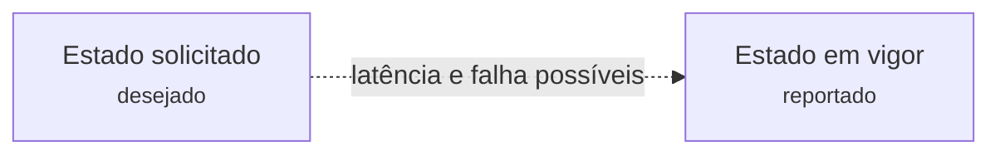
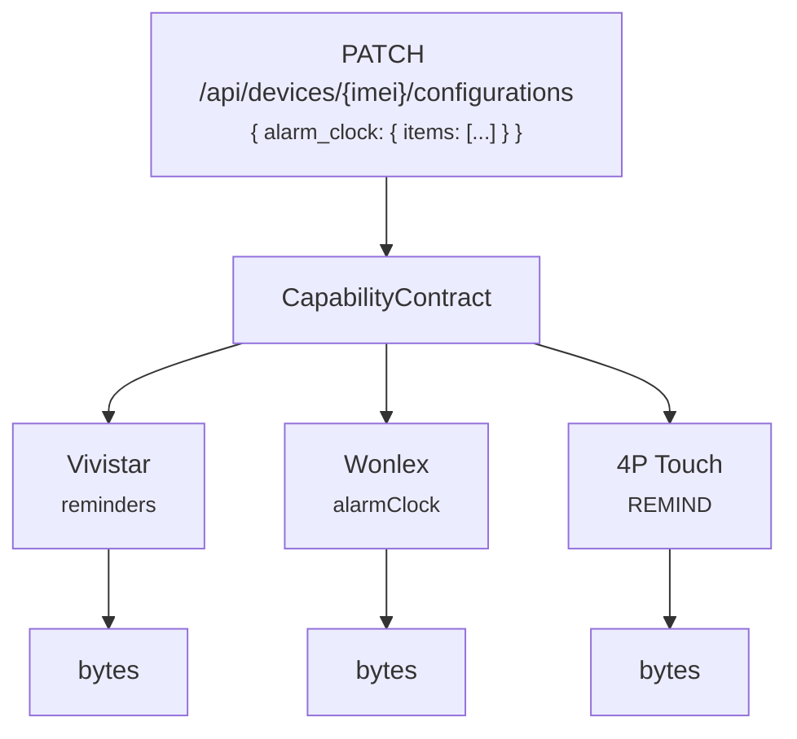
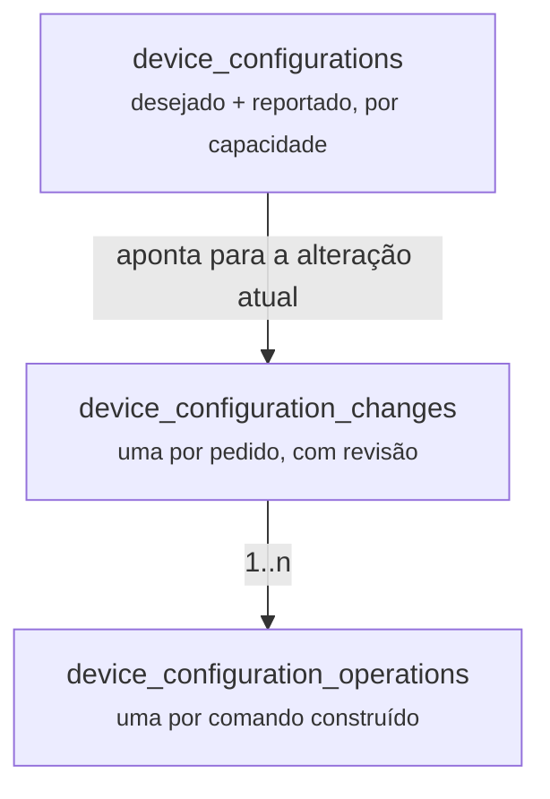
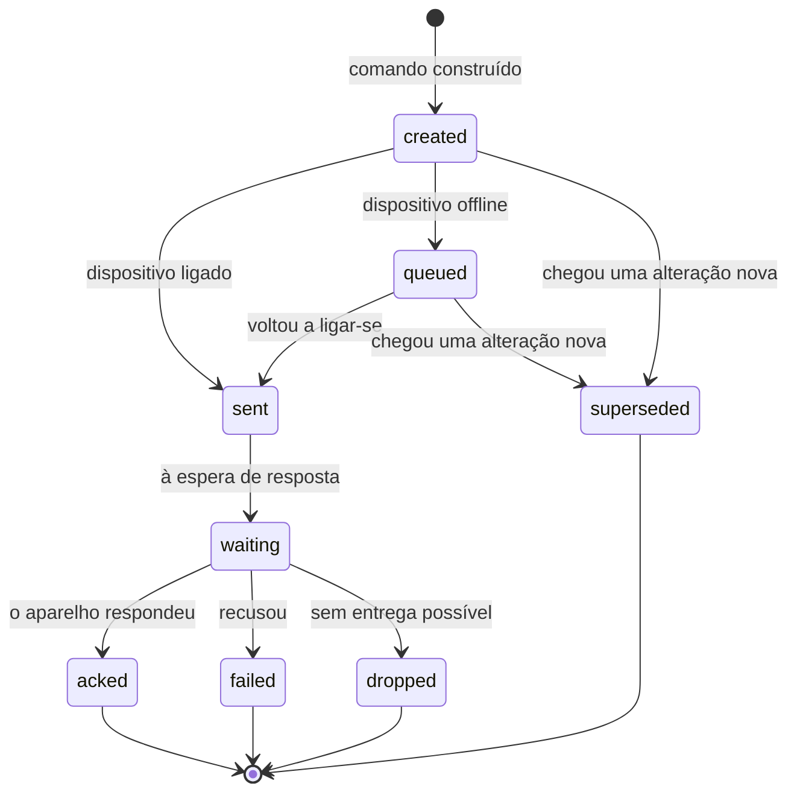

# 10 — Configuração de dispositivos

## Âmbito

A configuração de um dispositivo não se resume à escrita de um valor. Implica a
emissão de um comando através de uma ligação que pode estar fechada, a espera
pela resposta e a determinação posterior de se a configuração foi efetivamente
aplicada.

Entre o estado solicitado e o estado em vigor no dispositivo existe uma
divergência que pode persistir durante horas. O modelo de dados representa
explicitamente essa divergência.



A isso junta-se um segundo problema: os fabricantes não concordam em nada. Um
despertador chama-se `reminders` na Vivistar, `REMIND` na 4P Touch e `alarmClock`
na Wonlex — e as três listas têm formatos que não se parecem.

## 1. Capacidades genéricas

A API só fala em **nomes genéricos**. `alarm_clock`, `sos_contacts`,
`call_whitelist`, `medication_reminders`, `fall_detection`. Quem integra nunca
vê um nome de protocolo.



Cada capacidade complexa é um objeto que sabe traduzir nos dois sentidos:
genérico → nativo para enviar, nativo → genérico para responder. As simples —
interruptores, números, telefones — caem numa implementação genérica.

A tradução precisa de saber o **protocolo** nas duas direções, e não só na de
ida: a mesma chave nativa quer dizer coisas diferentes em fabricantes
diferentes. A Wonlex e a 4P Touch chamam ambas `alarmClock` a listas com
formatos incompatíveis. Sem o protocolo, descodificar é adivinhar.

**Chaves nativas nunca aparecem na API.** Um pedido com `configs` ou com nomes de
protocolo é recusado.

## 2. As três tabelas

O estado de configuração vive em três tabelas, e cada uma responde a uma
pergunta diferente:

| Tabela | Responde a |
|---|---|
| `device_configurations` | Qual é o estado atual de cada capacidade, por dispositivo |
| `device_configuration_changes` | Que alterações foram pedidas, e em que pé estão |
| `device_configuration_operations` | Que comandos concretos foram construídos para as entregar |

Uma alteração pode dar **várias** operações: uma lista de dez alarmes pode ser
dez comandos, e a alteração só está confirmada quando todos estiverem.



### Revisões

Cada alteração incrementa `desired_revision`. O `confirmed_revision` só sobe
quando o aparelho confirma. A diferença entre os dois é, literalmente, o que
ainda não chegou lá.

## 3. O ciclo de vida de uma operação



O estado da **alteração** é derivado do de todas as suas operações:

| Se alguma operação está… | A alteração fica |
|---|---|
| `failed` ou `dropped` | `failed` |
| `created` ou `queued` | `pending_delivery` |
| `sent` ou `waiting` | `awaiting_ack` |
| todas `acked` | `confirmed` |

Existe um quinto estado, **`confirmation_unavailable`**: todas as operações
foram confirmadas, mas o modo de confirmação é `ack_only`, no qual o dispositivo
acusa a receção sem confirmar a aplicação. A distinção face a `confirmed` evita
declarar uma confirmação que o protocolo não fornece.

O modo `ack_only` aplica-se a um único caso: a frequência de medição da
Vivistar.

### Supersessão

Uma alteração nova à mesma capacidade **substitui** a anterior. As operações da
antiga que ainda não saíram são marcadas `superseded` e nunca chegam a ser
enviadas — não faz sentido entregar uma configuração que já foi substituída.

A verificação acontece no momento de esvaziar a fila, logo depois de o aparelho
se autenticar.

## 4. O que a API devolve

`GET /api/devices/{imei}` traz quatro vistas do mesmo assunto:

| Campo | O que é |
|---|---|
| `capabilities` | O que o **modelo suporta**, com metadados para a interface |
| `configurations` | Os valores genéricos **desejados** |
| `effectiveConfigurations` | Os que o aparelho **confirmou** |
| `configurationSync` | A distância entre os dois, com estados e operações |

A distinção que mais confunde: **`capabilities` não é o que está guardado.** É o
que o modelo sabe fazer e o que a API aceita. Um dispositivo acabado de registar
já traz as capacidades todas, com valores por omissão.

As secções escrevíveis são `health`, `contacts`, `alarms` e `settings_system`.
A secção `telemetry` é **só de leitura** — descreve o que se pode medir:

```json
{
  "capabilities": {
    "telemetry": {
      "heart_rate": { "supported": true, "requestable": true },
      "location":   { "supported": true, "requestable": true }
    }
  }
}
```

As entradas escrevíveis trazem ainda `value`, com o valor público atual, e
`_meta`, com as opções e as etiquetas que uma interface precisa para as
desenhar. **Nenhuma entrada pública expõe identidade de protocolo** — os nomes
nativos só aparecem nas `operations[]` da resposta a um `PATCH`.

### Pedir uma medição

```http
POST /api/devices/{imei}/requests
{ "feature": "heart_rate" }
```

O nome é genérico. O cliente **não** deve depender de identificadores nativos
como `BPXL` ou `dnHeartRate` — o hub escolhe o comando certo para o protocolo
daquele aparelho e, mais tarde, a medição sai normalizada no MQTT.

Que capacidades se podem pedir num dado dispositivo lê-se em
`capabilities.telemetry.{feature}.requestable`.

### Alterar configurações

```http
PATCH /api/devices/{imei}/configurations
{
  "configurations": {
    "alarm_clock": {
      "items": [
        { "time": "08:10", "enabled": true, "type": 2,
          "recurrence": { "kind": "custom", "days": [1, 3, 5] } }
      ]
    },
    "working_mode": { "mode": 8, "intervalSeconds": 60, "gpsEnabled": true }
  }
}
```

A resposta traz as chaves alteradas, cada uma com as `operations[]` que foram
criadas para as entregar — incluindo o `nativeKey` de cada uma, que é onde a
identidade de protocolo aparece, e só ali.

### Uma capacidade a fundo: `alarm_clock`

Serve de exemplo do padrão que todas seguem. A resposta do
`GET /api/devices/{imei}` traz a capacidade em dois sítios com papéis distintos:

| Onde | O que é |
|---|---|
| `capabilities.alarms.alarm_clock` | O que o **modelo** suporta, presente mesmo sem configuração guardada |
| `configurations.alarm_clock` | O que está **guardado** para aquele dispositivo |

O `_meta` da capacidade descreve o que a interface pode oferecer, e é ele que
absorve as diferenças entre fabricantes:

```json
{
  "value": [ { "time": "08:10", "enabled": true } ],
  "_meta": {
    "limit": 3,
    "recurrence": { "options": ["once", "daily", "custom"] },
    "days": { "options": [1, 2, 3, 4, 5, 6, 7] },
    "type": { "options": [1, 2, 3] },
    "label": { "supported": true },
    "url": { "supported": true, "schemes": ["http", "https"] }
  }
}
```

| Fabricante | Particularidade |
|---|---|
| Vivistar | O `type` é obrigatório no `PATCH` |
| 4P Touch | O `type` não é suportado, e enviá-lo é recusado |
| Wonlex | Aceita `label` e um `url` de áudio, e só `daily` ou `custom` — o protocolo dele é uma máscara semanal |

**Nada disto se lê no código do cliente.** O que estiver ausente do `_meta` não
é suportado naquele dispositivo, e o `limit` diz quantas entradas cabem. Um
`items` vazio é válido e apaga os alarmes guardados.

## 5. Descoberta de capacidades

Um modelo novo chega sem se saber o que suporta. Em vez de o adivinhar, o hub
tem um fluxo que **pergunta ao aparelho**:

```text
POST   /api/capability-discovery          cria um rascunho a partir de um dispositivo real
GET    /api/capability-discovery/{id}     consulta o que se descobriu
POST   /api/capability-discovery/{id}/apply   aplica ao modelo
```

O rascunho fica guardado até alguém decidir aplicá-lo. É deliberado: descobrir é
observar, aplicar é uma decisão de administração.

## 6. Configuração de uma pulseira

A pulseira difere do relógio em dois pontos que se notam aqui.

O primeiro é que **grande parte do que ela mede depende de estar configurada para
o fazer**. Um relógio que não mede é um relógio a quem ninguém pediu nada; uma
pulseira que não mede pode estar apenas com a monitorização desligada, e o
resultado é uma série vazia indistinguível de uma avaria. A janela do oxigénio de
dia inteiro é o caso exemplar: com a monitorização ligada mas a janela a
`00:00–00:00`, o aparelho responde sempre um registo de zeros.

O segundo é que a tradução para a forma do fabricante **não acontece no hub**.
O payload viaja genérico até ao gateway que detém a sessão BLE, e é o SDK que lá
corre que monta as tramas. O construtor do hub valida, e só isso:

| Entrada | Campos | Configurações que a usam |
|---|---|---|
| `toggle` | `enabled` | As nove monitorizações do comando `0xB8` |
| `windowToggle` | `enabled`, `range` | Oxigénio de dia inteiro |
| `heartRateThresholds` | `enabled`, `maxBpm`, `minBpm` | Alerta de frequência cardíaca |
| `number` | `level` | Tom de pele |
| `personalInfo` | altura, peso, idade, sexo e as duas metas | Dados para cálculo |

A janela é escrita como `HH:MM-HH:MM`, o mesmo formato do `timeRange` dos
relógios, e apresentada como dois campos de hora para não se poder escrever uma
que não existe.

### O que fica de fora, e porquê

A pulseira deixa configurar bastante mais do que isto: alarmes, oito lembretes
com janela e intervalo próprios, o ecrã que acende ao levantar o pulso, o sistema
de unidades. **Nada disso altera uma leitura.** É comportamento de relógio de
pulso, e não de sensor.

O critério é esse: o hub configura o que o aparelho **mede** e como **calcula**.
Uma configuração que não muda telemetria não pertence a uma API de integração de
saúde — é ruído para quem integra, e mais uma superfície para manter.

O **tom de pele** e os **dados para cálculo** não são preferências de quem usa a
pulseira: entram nas contas do aparelho. O tom de pele regula a potência do LED do
sensor ótico, de que saem a frequência cardíaca, o oxigénio, a variabilidade, a
tensão e o stress; a altura, o peso, a idade e o sexo entram no cálculo das
calorias e da composição corporal. Configurados a valores de fábrica, a telemetria
sai calibrada para um corpo que não é o de ninguém.

A confirmação **relê o aparelho**. O `command_result` do gateway sai só depois de
a leitura devolver o que foi pedido; quando não devolve, o gateway não confirma e
a operação segue o caminho normal de quem não teve resposta — repetição e, no
fim, expiração.

Esta distinção não é teórica. Confirmar a execução dava por aplicada uma
configuração que o aparelho tinha aceitado e ignorado, que é pior do que a dar
por falhada: o estado desejado e o estado em vigor divergiam com os dois a
dizerem-se iguais.

> Ficou registado, para quem lá volte: a escrita dos lembretes do comando `0xE7`
> é recusada pela MF91 através do SDK do fabricante. A trama sai correta, o
> aparelho responde, e mantém os valores que já tinha — a leitura devolve `01` no
> byte de estado e a escrita devolve `00`. A aplicação do fabricante consegue
> alterá-los, portanto é limitação do SDK e não do aparelho. Não foi perseguida
> porque estes lembretes não alteram nenhuma medição.

## 7. Sensibilidade do sensor de fralda

O único caso em que uma configuração **não viaja para o aparelho**. O sensor
MONIT não aceita comandos; a sensibilidade é aplicada pelo hub, do lado de cá, ao
interpretar os canais de humidade.

É por isso que o protocolo `monit-mecs-pro-ble` declara suportar catálogo de
configuração apesar de não aceitar downlink. Quem decide se algo viaja é cada
capacidade, não o protocolo inteiro.

Os dois parâmetros, os três perfis e a forma como entram na derivação do estado
estão no [capítulo do sensor de fralda](17-sensor-de-fralda.md).

## Implementação

| Ficheiro | Responsabilidade |
|---|---|
| `src/Domain/Capability/CapabilityContract.php` | O contrato dos dois sentidos da tradução |
| `src/Domain/Capability/CapabilityRegistry.php` | Que capacidades têm implementação própria |
| `src/Domain/Capability/CapabilityCatalog.php` | A identidade pública e o suporte por protocolo |
| `src/Command/DeviceConfigurationCatalog.php` | As definições nativas, por fabricante |
| `src/Command/Configuration/Payload/*.php` | Construir o corpo de cada comando |
| `src/Api/Services/DeviceConfigurationUpdateService.php` | O `PATCH`: validar, traduzir, criar operações |
| `src/Api/Repository/DeviceConfigurationLifecycleRepository.php` | As três tabelas e a derivação do estado |
| `src/Api/Services/ConfigurationSyncStatus.php` | Desejado contra reportado |
| `src/Domain/Capability/AlarmClock/*.php` | A capacidade `alarm_clock`, por fabricante |
