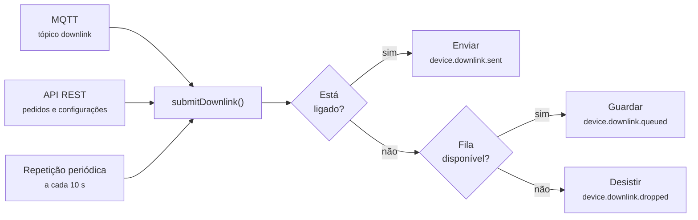
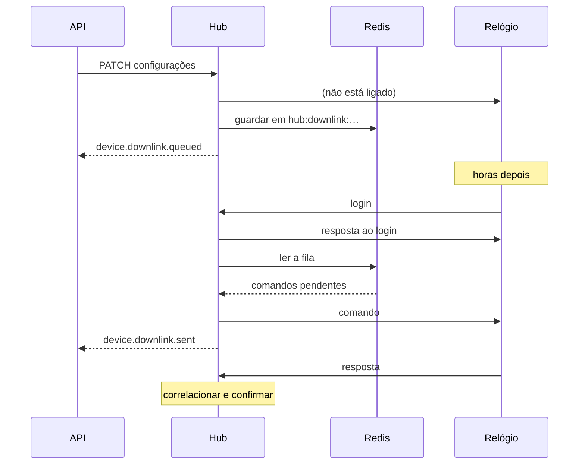
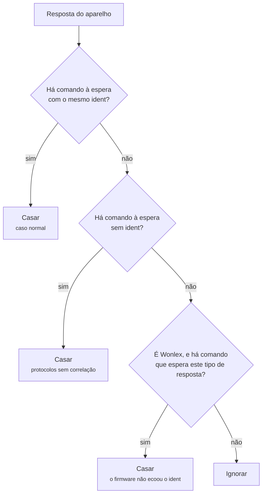

# 11 — Comandos e downlink

## Âmbito

A transmissão de comandos para um dispositivo apresenta condições distintas da
receção. Um relógio sem dados a transmitir não mantém ligação aberta, e um
dispositivo sem cobertura de rede está inalcançável. O comando tem, por isso, de
ser retido até à disponibilidade do destinatário.

Acresce a necessidade de correlacionar cada resposta com o comando que a
originou.

## 1. Origens de um comando



O resultado é sempre um de três: `sent`, `queued` ou `dropped`. Os três são
publicados como eventos, portanto quem integra sabe sempre o que aconteceu — não
há falha silenciosa.

## 2. Construir os bytes

Cada protocolo constrói de sua maneira:

| Protocolo | Como |
|---|---|
| `wonlex-json` | JSON com `ref: "s:down"` dentro da trama binária, com um `ident` aleatório entre 100000 e 999999 |
| `vivistar-iw` | Texto `IWBP…#` |
| `four-p-touch` | Trama `[CS*…]` com o identificador de 10 dígitos derivado do IMEI |

O `ident` da Wonlex é o número de correlação: é por ele que a resposta se liga à
pergunta.

## 3. A fila

Vive no Redis, com duas chaves por dispositivo:

```text
hub:downlink:{imei}:{chave}      o comando, com TTL
hub:downlink:{imei}:index        o conjunto de chaves pendentes
```

O TTL corresponde a `DOWNLINK_QUEUE_TTL_SECONDS`, **300 segundos** por omissão.
Um comando que exceda esse período é descartado, por decisão: uma configuração
emitida há uma hora não representa necessariamente a intenção atual.

### Chave de de-duplicação

A chave impede a acumulação de versões sucessivas do mesmo comando e é
determinada pela informação mais específica disponível:

| Informação disponível | Chave |
|---|---|
| Identificador de operação | `operation:` seguido do resumo desse identificador |
| Tipo nativo | `command:` seguido do resumo de `protocolo:tipo` |
| Apenas os bytes | `raw:` seguido do resumo dos bytes |

**A gravação é substitutiva.** Um comando novo do mesmo tipo sobrepõe-se ao
anterior, sendo a versão mais recente a que deve ser entregue. Cinco alterações
sucessivas à hora do despertador com o dispositivo offline resultam num **único**
comando em fila, com o último valor.

### Esvaziamento da fila

Ocorre **imediatamente após a autenticação**, antes de qualquer outro
processamento. Os comandos são emitidos por ordem de chegada.

Antes de cada um sair, verifica-se se ainda é o atual: os que foram substituídos
por uma alteração mais recente são marcados `superseded` e não chegam a ser
enviados.



## 4. Repetir e desistir

A cada 10 segundos, o hub olha para os comandos que estão à espera de resposta:

| Parâmetro | Valor |
|---|---|
| Intervalo entre tentativas | 60 s |
| Tentativas máximas | 3 |
| Tempo até desistir | `DASHBOARD_COMMAND_TIMEOUT_SECONDS`, 1 hora por omissão |

Passado esse tempo, o comando é expirado. Um comando expirado não volta a ser
tentado, e o estado fica visível na API e na dashboard.

## 5. Correlação da resposta

O procedimento previsto pelo protocolo consiste na correspondência pelo `ident`,
que a resposta deve replicar. Na prática, **existe firmware Wonlex que gera um
`ident` novo** em vez de o replicar, invalidando essa correspondência.

A correlação tenta, por ordem:



Em todos os casos, o comando só é candidato se estiver mesmo à espera **e** se o
tipo da resposta for um dos que ele declarou esperar. O recurso semântico é o
último, nunca o primeiro — se o `ident` bater certo, é esse que ganha.

Há ainda um caso específico: na 4P Touch, uma resposta `TAKEPILLS` traz um campo
de confirmação que vale `1` ou `0`, e é isso que distingue aceite de recusado.

## 6. O que sai no MQTT

Cada passo é publicado, em dois sítios:

- No canal `events`, um de `device.downlink.sent`, `.queued` ou `.dropped`. Os
  `dropped` levam `error.code` — `device_offline` ou `queue_unavailable`.
- No canal `raw`, a trama enviada, com `direction: "downlink"`. Serve para
  reconstruir exatamente o que saiu para o aparelho.

## 7. Emissão de comandos

**Pela API**, via recomendada e a única aplicável a todos os tipos de
dispositivo:

```http
POST  /api/devices/{imei}/requests          { "feature": "heart_rate" }
PATCH /api/devices/{imei}/configurations    { "configurations": { … } }
GET   /api/commands/{id}                    consulta do estado
```

**Pelo MQTT**, só para relógios:

```text
{prefixo}/{empresa}/{licenca}/watch/{imei}/downlink
```

Ver o [contrato MQTT](08-contrato-mqtt.md) para as formas aceites do corpo.

## Implementação

| Ficheiro | Responsabilidade |
|---|---|
| `src/Device/DeviceHubServer.php` | `submitDownlink()`, `sendDownlink()`, `flushPendingDownlinks()` |
| `src/Device/RedisPendingDownlinkQueue.php` | A fila e a chave de de-duplicação |
| `src/Device/HubDownlinkSubscriber.php` | O tópico MQTT de entrada |
| `src/Command/DeviceCommandCatalog.php` | Construir os bytes, por protocolo |
| `src/Dashboard/DeviceCommandStore.php` | Estado dos comandos e a correlação da resposta |
| `src/Runtime/MaintenanceScheduler.php` | Repetir e expirar |
| `simulator/vivistar-command-client.php` · `wonlex-command-client.php` | Mandar comandos à mão |
