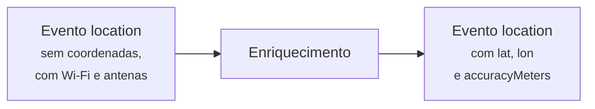
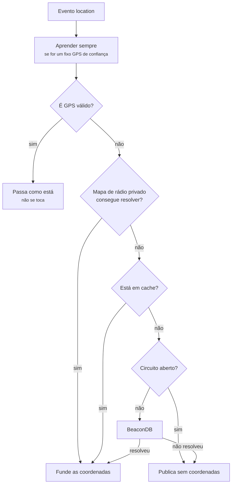

# 12 — Localização sem GPS

## Âmbito

Um dispositivo no interior de um edifício não tem visibilidade dos satélites. O
GPS é indisponível precisamente nos locais onde os utentes permanecem mais
tempo, e uma posição obtida apenas no exterior tem utilidade reduzida.

Em ambiente interior, o dispositivo continua a detetar antenas de rede móvel e
pontos de acesso Wi-Fi. Estes não constituem uma posição, mas o conjunto de
pontos de acesso observados em simultâneo identifica um local com precisão
suficiente.



**As coordenadas entram no mesmo evento.** Não há um segundo envelope, nem um
tipo novo. Quem já consumia `location` não muda nada.

## 1. A ordem de resolução



O mapa privado vem **antes** da cache de propósito: um sítio acabado de aprender
localmente deve substituir de imediato uma estimativa mais antiga vinda de fora.

Um fixo GPS válido **atravessa tudo sem ser tocado**. Ninguém tem de melhorar uma
posição que já é boa.

## 2. Comportamento em caso de falha

A camada é integralmente assíncrona e **nenhuma falha impede a publicação**. Se
a resolução não for bem-sucedida, o evento é publicado na mesma, com as antenas
e os pontos de acesso preservados, sem coordenadas e com `hasCoordinates: false`.

Este é o formato que os consumidores já processam em segurança, por corresponder
ao comportamento anterior à introdução da resolução.

O resultado é explícito em ambos os casos:

| | `hasCoordinates` | `lat` · `lon` · `accuracyMeters` |
|---|---|---|
| Resolveu | `true` | presentes |
| Não resolveu | `false` | **removidos** |

Remover é importante: coordenadas em que já não se confia são piores do que
coordenadas nenhumas.

## 3. Mapa de rádio privado

O mapa é construído por aprendizagem automática a partir das próprias
observações. Quando um dispositivo reporta uma fixação GPS fiável em simultâneo
com um conjunto de redes Wi-Fi, a posição dessas redes é registada. Observações
posteriores das mesmas redes sem GPS passam a ser resolúveis localmente.

### Aprendizagem

Só a partir de um fixo em que se confia:

- `source` é `gps` e `gpsValid` não é falso;
- **e** a precisão declarada é melhor que **100 m**, ou há pelo menos **4
  satélites** — caso em que se assume uma precisão de 50 m.

Cada ponto de acesso acumula uma média móvel ponderada pelo número de
observações, limitado a 1000 para uma posição estabilizada não ser arrastada por
leituras novas.

**Um ponto que apareça a mais de 250 m do sítio onde estava é marcado como
conflituoso, para sempre.** É o que acontece quando alguém leva um router para
outro lado, ou quando um telemóvel em modo hotspot foi aprendido por engano. Um
ponto conflituoso nunca mais é usado para resolver.

Entradas semeadas à mão são autoritativas e nunca são sobrepostas pela
aprendizagem.

### Resolução

- Exige **pelo menos 2** pontos conhecidos e não conflituosos.
- Seleciona o **maior aglomerado** dentro de um raio de 150 m, impedindo que um
  ponto isolado e incorreto influencie o resultado.
- Calcula o centróide ponderado por `1/precisão²`, atribuindo maior peso aos
  pontos de maior fiabilidade.
- A precisão final é `max(25 m, maior precisão + dispersão)`, e um resultado
  acima de 500 m é rejeitado.

### Semear um sítio conhecido

```bash
composer location:radio-map -- seed \
  --lat=41.706841 --lon=-8.793279 --accuracy=25 \
  --bssids=dc:fe:23:36:57:4d,dc:fe:23:b7:ed:ff
```

## 4. Privacidade: os BSSID nunca são guardados

Um endereço MAC de router é um identificador estável de um sítio físico. Guardar
uma lista deles em claro é construir um mapa das casas das pessoas.

Por isso a tabela **não tem coluna para o MAC**. Só guarda um resumo com chave:

```php
hash_hmac('sha256', $mac, $chave)
```

A chave é `RADIO_MAP_HASH_KEY`. Ser HMAC e não um resumo simples é o que importa:
sem a chave, ninguém consegue verificar se um MAC concreto está na tabela, mesmo
tendo a tabela toda.

**Na ausência de chave configurada, o mapa privado é desativado.** O sistema não
armazena identificadores reversíveis como alternativa: regista o erro e o hub
passa a recorrer diretamente à BeaconDB. A indisponibilidade da funcionalidade é
preferível ao armazenamento de identificadores reversíveis.

## 5. BeaconDB

Serviço público utilizado quando o mapa privado não dispõe de dados
suficientes. Não exige conta paga, chave de API nem meio de pagamento.

### Pedido

Formato MLS/Ichnaea, com os mecanismos de reserva **explicitamente desativados**:
sem localização por endereço IP e sem localização por antena isolada. Na
ausência de evidência suficiente, o serviço não devolve resultado.

Validação dos endereços antes da emissão do pedido:

- pelo menos **2** pontos Wi-Fi válidos, senão nem se pergunta;
- fora os MAC só a zeros ou só a `ff`;
- fora os multicast e os de administração local — são hotspots de telemóvel e
  aparelhos que se movem, e envenenariam a base;
- fora duplicados e mal formados;
- respeitado o `_nomap` no nome da rede, que é como um dono declara que não quer
  ser mapeado.

O nome da rede é opcional: há firmware que só reporta o endereço e a força do
sinal, e essas observações continuam a servir.

### A resposta

Só é aceite se o estado for 2xx, a latitude e a longitude estiverem dentro dos
limites, não forem exatamente `0,0`, e a precisão for **melhor que 500 m**.

### A cache

Chaveada pela evidência de rádio, não pelo dispositivo — dois aparelhos no mesmo
sítio partilham a resposta.

A chave é calculada **removendo o que é volátil**: força do sinal, nome da rede,
canal, frequência. Sem isso, a mesma sala dava uma chave diferente a cada
leitura e a cache não servia para nada.

| | Duração |
|---|---|
| Resposta que resolveu | 24 horas |
| Resposta que não resolveu | 60 segundos |

Guardar os insucessos evita perguntar mil vezes por um sítio que a BeaconDB não
conhece. Sessenta segundos porque ela pode aprender.

Pedidos em voo para a mesma evidência são coalescidos: chegam dez eventos do
mesmo sítio ao mesmo tempo, sai **um** pedido.

## 6. Proteger o serviço de fora

| Proteção | Valor |
|---|---|
| Pedidos em simultâneo | 5 |
| Fila máxima | 1000 |
| Falhas seguidas até abrir o circuito | 3 |
| Tempo com o circuito aberto | 300 s |
| HTTP 429 | abre já, pelo `Retry-After` ou 3600 s |

Com o circuito aberto, o hub **não estabelece qualquer pedido de rede**. O
estado reside no Redis e sobrevive a reinícios, evitando que um processo
reiniciado durante uma indisponibilidade retome de imediato as chamadas ao
serviço externo.

Duas distinções na contabilização:

- **Um erro não recuperável não conta para o circuito** e limpa o contador. O
  circuito destina-se a indisponibilidade do serviço, não a pedidos inválidos.
- **A ausência de resultado não constitui falha**, mas um resultado válido. É
  registada com nível informativo e não como aviso.

## 7. Diagnóstico

```bash
# a partir de uma telemetria guardada
BEACONDB_USER_AGENT='HaviCare location test (ops@example.com)' \
  composer location:probe -- --file /caminho/para/location-telemetry.json

# a partir do MQTT ao vivo
BEACONDB_USER_AGENT='HaviCare location test (ops@example.com)' \
  composer location:probe -- \
  --topic 'havicare-hub/+/+/watch/+/telemetry' \
  --host 127.0.0.1 --port 1883 --once
```

A ferramenta constrói o pedido, invoca a BeaconDB e apresenta a resposta. A
chamada real **não** integra as suites de teste: o serviço tem estatuto
experimental e as suites não dependem de serviços de terceiros.

## Implementação

| Ficheiro | Responsabilidade |
|---|---|
| `src/Location/LocationEnricherFactory.php` | Monta a cadeia inteira |
| `src/Location/PrivateRadioMapTelemetryEnricher.php` | A ordem: aprender, tentar o privado, cair no público |
| `src/Location/PrivateRadioMap.php` | Aprendizagem, aglomerados, HMAC |
| `src/Location/PdoPrivateRadioMapStore.php` | A tabela e a cache de 60 s |
| `src/Location/BeaconDbTelemetryEnricher.php` | Curto-circuitos, cache, coalescência |
| `src/Location/BeaconDbRequestBuilder.php` | O pedido MLS e a higiene dos endereços |
| `src/Location/LocationResponseValidator.php` | O que se aceita como resposta |
| `src/Location/CircuitBreakingLocationProvider.php` | O disjuntor |
| `bin/radio-map.php` · `simulator/location-beacondb-probe.php` | Semear e diagnosticar |
