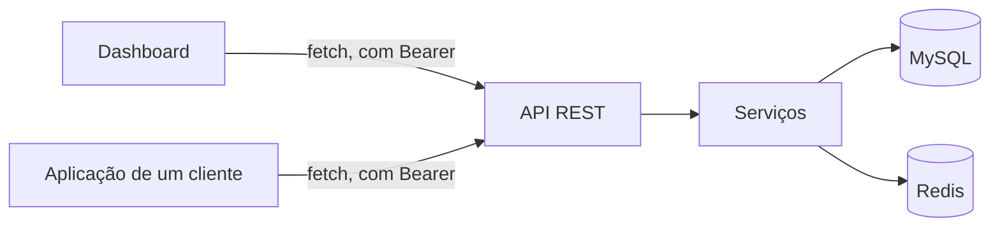

# 13 — A dashboard

## Âmbito

Interface de administração da plataforma: registo de dispositivos, atribuição a
clientes, visualização dos dados recebidos e configuração.

> A arquitetura do frontend está documentada em
> [`src/Dashboard/README.md`](../src/Dashboard/README.md), que descreve as
> regras de organização, a árvore de módulos ficheiro a ficheiro, a composição
> de um ecrã e as limitações conhecidas. Este capítulo não a duplica: descreve
> as funcionalidades da dashboard e a sua articulação com as restantes camadas.

## 1. Não há caminho privilegiado

A dashboard consome **a mesma API** que qualquer integrador. Não há atalhos por
baixo, não há endpoints internos.

Daqui decorre que **todas as operações disponíveis à dashboard estão
disponíveis a qualquer integrador**. Não existe funcionalidade acessível apenas
através da interface.

## 2. Composição

Casca em PHP, comportamento em módulos ES nativos. **Sem passo de compilação** —
o browser carrega os módulos tal como estão no repositório.

| | |
|---|---|
| Página | `src/Dashboard/index.php` gera o HTML |
| Comportamento | ~72 módulos em `src/Dashboard/dashboard/` |
| Estilo | Bootstrap, mais quatro folhas próprias. A ordem no `<head>` **é** a cascata |
| Dependências | Bootstrap, Font Awesome, SweetAlert2 e Swagger UI, todas guardadas no repositório |

A regra que estrutura tudo: **só os módulos de `dashboard/api/` chamam `fetch`.**
Um ficheiro por recurso, e nada fora dali sabe o que é um pedido HTTP.

## 3. O que mostra

**Ecrã principal**, em duas colunas:

- À esquerda, o dispositivo: seletor, ficha com imagem e estado, os factos do
  registo, os botões de pedir uma medição, e os eventos de chamada quando é um
  NCS.
- À direita, o detalhe: filtros por data e por tipo, a cronologia de ligações, a
  telemetria recebida, e os comandos enviados.

Na barra de topo, o sino de notificações — dispositivos recusados, reinícios
sujos do hub — e o seletor de tema.

**Modal de definições**, com quatro separadores:

| Separador | O que gere |
|---|---|
| Catálogo | Fornecedores, modelos e imagens, e as capacidades de cada modelo |
| Capacidades | O catálogo genérico, por tipo de dispositivo |
| Licenças | Empresas, com as licenças lá dentro |
| Utilizadores API | Contas e papéis, em tabela de dados |

Os três primeiros são árvores: o que os organiza — o tipo, o fornecedor, a
empresa — **é** a estrutura, e por isso não levam filtros nem ordenação por
cima dela. Os **Utilizadores API** são uma lista plana e por isso são uma
tabela: ordena-se por coluna, filtra-se pelo cabeçalho e edita-se a célula com
duplo clique, tudo servido pelo `columns` que a API devolve. É a única tabela de
dados da dashboard, e o `dashboard/grid.js` é o único módulo que conhece a
biblioteca que a desenha.

Registar e editar são caixas **separadas**, e não a mesma a mudar de forma: um
registo pede a identidade e pouco mais, ao passo que a edição dá acesso às
configurações do aparelho. O desenho de cada uma está em
[`src/Dashboard/README.md`](../src/Dashboard/README.md).

## 4. Tempo real

O detalhe de um dispositivo abre um stream de eventos do servidor contra
`GET /api/devices/{imei}/stream`, com um cursor incremental: um `snapshot`
inicial e depois `update` a cada novidade.

O stream é lido com `fetch` e um `ReadableStream`, e não com `EventSource`: a
credencial vai no cabeçalho `Authorization`, que o `EventSource` não deixa
definir. O cliente separa os frames pela linha em branco que os delimita e
guarda o resto do buffer, porque um frame pode chegar partido entre dois pedaços
da resposta. Uma ligação que caia é retomada com recuo exponencial, e o recuo só
volta a zero quando um frame é efetivamente entregue.

## 5. Sessão

**Não há sessão de servidor. Não há cookie.** Os tokens vivem no
`sessionStorage` do separador.

| | |
|---|---|
| Quem entra | **Só `hub_admin`.** Um `license_client` é recusado no login com uma mensagem explícita |
| Renovação | Automática, 60 s antes de o token expirar; num 401, tenta uma vez e repete o pedido |
| Aviso de inatividade | 15 minutos |
| Sessão terminada | 20 minutos |

A deteção de atividade considera ponteiro, teclado, deslocamento e toque, bem
como o regresso ao separador. A escrita do marcador é limitada a uma por
segundo.

> **O papel `license_client` aplica-se à API e não à interface.** A dashboard
> aceita exclusivamente contas com o papel `hub_admin`.

## 6. Imagens dos modelos

Servidas em `/model-images/{32 hexadecimais}.jpg`, com o caminho validado por
expressão estrita. Ficam em `var/dashboard/model-images`, que está fora do
controlo de versões — por isso as imagens de exemplo viajam em
`database/seed-model-images/` e são copiadas na sementeira, **sem nunca
substituir** um ficheiro existente.

No upload, qualquer imagem é redimensionada para 640 px e convertida para JPEG.
O nome é aleatório, nunca derivado do que foi enviado.

## 7. Servir os ficheiros

O mesmo servidor HTTP serve a API e a dashboard. Tudo o que comece por `/api/`
vai para o kernel da API; o resto é a página, as imagens ou os ficheiros
estáticos.

O acesso a ficheiros é restringido em quatro camadas: prefixos permitidos,
rejeição de `..` e de bytes nulos, confirmação de que o caminho resolvido fica
dentro da raiz, e uma lista de extensões aceites.

As dependências de terceiros levam cache de um ano; o resto revalida por `ETag`.

## Implementação

| Ficheiro | Responsabilidade |
|---|---|
| [`src/Dashboard/README.md`](../src/Dashboard/README.md) | **A referência do frontend.** Começa por aqui |
| `src/Dashboard/DashboardHttpServer.php` | Encaminhamento não-API, ficheiros estáticos, cache |
| `src/Dashboard/index.php` | A casca da página |
| `src/Dashboard/dashboard/api/` | O único sítio que fala HTTP |
| `src/Dashboard/dashboard/auth/session.js` | Tokens, inatividade, renovação |
| `src/Dashboard/DashboardStore.php` | O estado em Redis que a interface lê |
| `src/Runtime/DashboardServerFactory.php` | Servidor, limites, CORS e registo |
