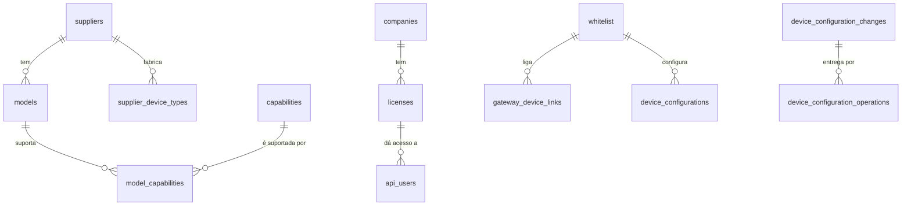
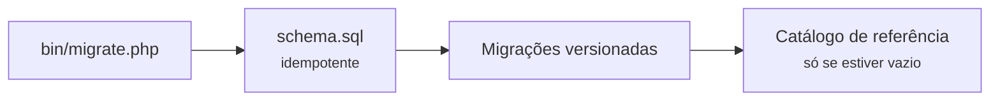

# 14 — Persistência

## Âmbito

A persistência assenta em duas bases de dados com funções distintas:

- **MySQL** armazena o estado durável: inventário de dispositivos, atribuição a
  clientes, capacidades suportadas e configuração.
- **Redis** armazena o estado corrente: presença, mensagens recentes, comandos
  pendentes e sessões abertas.

**Não existe tabela de telemetria.** A plataforma não constitui um arquivo
histórico — ver a
secção 3.

## 1. MySQL — as 16 tabelas



### Catálogo — o que existe no mundo

| Tabela | Guarda |
|---|---|
| `suppliers` | Os sete fornecedores. Nome único |
| `models` | Modelo interno, nome comercial, tipo de dispositivo, imagem |
| `supplier_device_types` | Que tipos cada fornecedor fabrica |
| `capabilities` | O catálogo genérico: chave, secção, e as bandeiras de telemetria, configurável e pedível |
| `model_capabilities` | Que capacidades cada modelo tem, com a possibilidade de sobrepor |

### Registo — o que temos e de quem é

| Tabela | Guarda |
|---|---|
| `whitelist` | **O registo de dispositivos.** IMEI como chave, fornecedor, modelo, tipo, e o par empresa+licença |
| `gateway_device_links` | Que dispositivos BLE cada gateway pode retransmitir |
| `companies` · `licenses` | Os clientes. Uma licença é única dentro da sua empresa |
| `api_users` | Contas da API, com papel e âmbito |

### Configuração — o que pedimos e o que foi feito

| Tabela | Guarda |
|---|---|
| `device_configurations` | Estado atual por dispositivo e capacidade: desejado, reportado, revisões |
| `device_configuration_changes` | Uma linha por pedido de alteração, com o seu estado |
| `device_configuration_operations` | Os comandos concretos, com bytes, tentativas e entrega |

Ver o [capítulo da configuração](10-configuracao-de-dispositivos.md).

### Resto

| Tabela | Guarda |
|---|---|
| `dashboard_notifications` | Recusas e avisos, com contagem de ocorrências e marca de lido |
| `private_radio_map_access_points` | O mapa de rádio. **Só resumos HMAC**, nunca endereços |
| `schema_migrations` | Que versões já foram aplicadas |

### Ausências deliberadas de chave estrangeira

**A `whitelist` não referencia `models`.** O fornecedor e o modelo são
armazenados como texto e associados ao catálogo por correspondência de nome. A
ausência de restrição permite registar um dispositivo de um modelo ainda não
catalogado.

**A tabela `device_configurations` não referencia a `whitelist`.** A remoção de
um dispositivo elimina as respetivas configurações numa transação explícita. Uma
chave estrangeira converteria uma mensagem em trânsito, no caminho crítico do
MQTT, numa exceção.

## 2. Esquema e migrações

O esquema **nunca** é alterado por uma ligação normal. `php bin/migrate.php` é um
passo explícito de instalação, e o hub **recusa arrancar** se a base estiver
atrasada.



O catálogo de referência — fornecedores, modelos, capacidades — é semeado **só
numa base sem capacidades**. Reiniciar o hub não recria o que foi apagado nem
desfaz escolhas de um administrador.

> **Uma migração corre antes do semeador, e isso tem uma armadilha.** A guarda do
> semeador é "a tabela `capabilities` está vazia?". Uma migração que escreva nessa
> tabela numa base de raiz faz a guarda saltar, e a instalação nasce sem
> fornecedores, sem modelos e sem empresas. Por isso a migração do catálogo
> começa por desistir quando a tabela está vazia: numa base nova não há nada a
> trazer a dia, e a linha de base trata do assunto.

Há hoje **uma** migração, `2026_09_01_catalog_alarm_proximity_help_call`. Traz o
catálogo de capacidades ao que o código declara: renomeia `ncs:pager_call` para
`help_call` preservando o `id` — e com ele as ligações por modelo —, dá linha ao
`alarm` e à `proximity`, e liga-as aos modelos cujo protocolo as suporta.

O inventário de exemplo — 26 dispositivos, licenças, imagens — é `bin/seed-inventory.php`
e está **fora** do plano de migrações de propósito: senão cada teste de integração
começava com 26 dispositivos lá dentro.

## 3. Redis — os seis espaços de chaves

| Prefixo | Guarda | Expira? |
|---|---|---|
| `hub:dashboard` | Presença, metadados em execução, histórico, comandos, avistamentos | não — mas limitado |
| `hub:api-tokens` | Os três tipos de token | sim, é o TTL que os valida |
| `hub:downlink` | A fila de comandos por entregar | sim, 300 s |
| `hub:moko` | De-duplicação, refrescamento e transições de estado BLE | parcialmente |
| `hub:location:circuit` | O estado do disjuntor | sim |
| `hub:location:resolution` | Cache de resoluções de localização | sim, 24 h ou 60 s |

### O histórico é limitado, não é um arquivo

Cada dispositivo tem quatro listas — `raw`, `telemetry`, `events`, `commands` — e
cada uma guarda as últimas **100** entradas (`DASHBOARD_HISTORY_LIMIT`). O corte
é feito no mesmo pipeline da escrita.

A retenção é dimensionada para a apresentação do passado recente na dashboard.
**A conservação de série temporal cabe às aplicações que subscrevem o MQTT.**

Dois tipos de mensagem são excluídos do histórico, pelo volume que representam:
os sinais de vida dos relógios e os relatórios de varrimento dos gateways.

## 4. Duas instâncias no mesmo Redis

A raiz `hub:` **já é partilhada** com o reencaminhador, que é outra aplicação e
lá tem as suas `hub:forward:*` e `hub:crm:target:*`.

A variável `REDIS_PREFIX` permite executar uma segunda instância contra o mesmo
Redis. O valor vazio corresponde a produção, mantendo as chaves nas suas
posições originais; a instância de desenvolvimento usa `dev:`.

**O prefixo é aplicado ao cliente e não a cada componente.** Existem seis
espaços de chaves, e a aplicação por componente faria com que um sétimo espaço
adicionado posteriormente ficasse sem prefixo, sem erro visível. Um teste
verifica os seis.

Uma segunda instância a escrever nas mesmas chaves não produziria erro:
sobreporia o estado dos dispositivos da primeira e as sessões das duas
dashboards seriam partilhadas.

## 5. O que se perde ao reiniciar

| | Sobrevive? |
|---|---|
| MySQL | tudo |
| `hub:dashboard` | sim — não tem TTL |
| `hub:moko:last` e `:condition` | sim, por ausência deliberada de TTL |
| `hub:api-tokens`, `hub:downlink`, `hub:location:*`, `hub:moko:dedupe` | conforme o TTL |
| Ligações TCP abertas, gateways online, janelas de proximidade | **não**, por residirem em memória do processo |

O estado do disjuntor reside no Redis por decisão: um processo reiniciado
durante uma indisponibilidade externa não retoma de imediato as chamadas ao
serviço.

## 6. Verificação do isolamento

A contagem das chaves de cada instância, antes e depois de uma alteração,
identifica eventuais escritas no espaço da outra:

```bash
redis-cli --scan --pattern 'hub:*'     | grep -vc '^dev:'
redis-cli --scan --pattern 'dev:hub:*' | wc -l
```

As chaves `hub:forward:*` e `hub:crm:target:*` pertencem ao reencaminhador e
integram a primeira contagem sem pertencerem ao hub.

## Implementação

| Ficheiro | Responsabilidade |
|---|---|
| `database/schema.sql` | A linha de base — as 16 tabelas |
| `database/seed.sql` · `bin/seed-inventory.php` | O inventário de exemplo |
| `src/Infrastructure/Persistence/DatabaseMigrator.php` | Esquema, migrações, catálogo |
| `src/Infrastructure/Persistence/DatabaseSchemaGuard.php` | Recusa arrancar atrasado |
| `src/Infrastructure/Persistence/ReferenceCatalogSeeder.php` | Fornecedores, modelos e capacidades |
| `src/Api/Repository/` | Um repositório por assunto |
| `src/Dashboard/DeviceRuntimeStore.php` · `DeviceEventStore.php` · `DeviceCommandStore.php` | Os três espaços de `hub:dashboard` |
| `src/Runtime/HubServices.php` | Onde o prefixo do Redis é aplicado |
| `tests/Unit/Runtime/RedisPrefixTest.php` | Tranca os seis espaços de chaves |
