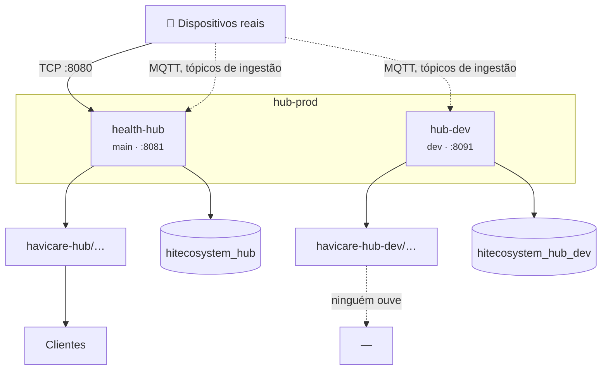

# 15 — Operação

> **As regras de trabalho estão no [`CLAUDE.md`](../CLAUDE.md).** Este capítulo
> explica como o sistema está montado; esse diz o que se pode e não se pode
> fazer, e em que ordem.

## 1. Duas instâncias, uma máquina

O servidor `hub-prod` corre **duas** instâncias do hub, separadas em tudo o que
guarda estado.

| | desenvolvimento | produção |
|---|---|---|
| Diretório | `/opt/havicare-hub-dev` | `/opt/havicare-hub` |
| Serviço | `hub-dev` | `health-hub` |
| Ramo | `dev` | `main` |
| Dashboard | `:8091` | `:8081` |
| Ingestão TCP | `127.0.0.1:8090` | `0.0.0.0:8080` |
| Base de dados | `hitecosystem_hub_dev` | `hitecosystem_hub` |
| Prefixo do Redis | `dev:` | *(vazio)* |
| Tópicos MQTT | `havicare-hub-dev` | `havicare-hub` |
| Id de cliente MQTT | `health-mqtt-dev` | `health-mqtt` |

A instância de desenvolvimento **lê os tópicos de ingestão reais** — vê os
mesmos dispositivos que a produção — mas publica, guarda e comanda tudo no seu
próprio espaço.

Não consegue tocar em nenhum aparelho real: os relógios ligam-se por TCP à porta
da produção, e os comandos saem para tópicos MQTT que nenhum aparelho ouve.



### Valores críticos para o isolamento

**O identificador de cliente MQTT.** Os subscritores de ingestão usam
identificador **estável**, sem número de processo, porque as sessões são
persistentes. Dois clientes com o mesmo identificador expulsam-se do broker em
ciclo — e o sintoma é ingestão a falhar de forma intermitente, sem erro óbvio.

**O prefixo do Redis.** Vazio é produção. Uma instância de desenvolvimento sem
prefixo escreveria por cima do estado da produção, sem dar erro nenhum.

## 2. Publicar

O trabalho vai primeiro à instância de desenvolvimento:

```bash
cd /opt/havicare-hub-dev
git pull --ff-only
composer install --no-dev --optimize-autoloader
php bin/migrate.php
systemctl restart hub-dev
```

E só depois de confirmado ali é que se promove:

```bash
git push origin dev:main
cd /opt/havicare-hub && make prod-update
```

O alvo `make prod-update` executa `git pull --ff-only`, instala as dependências
de produção, aplica as migrações e **só então** reinicia o serviço. A ordem é
determinada pela verificação de esquema: o hub recusa arrancar com a base de
dados desatualizada.

> **Ao mudar de ramo em produção, `git fetch` primeiro.** A `main` local do
> servidor já esteve centenas de commits atrasada, e um `checkout` sozinho leva
> a árvore para trás sem avisar.

## 3. Ver o estado

```bash
systemctl status hub-dev      # ou health-hub
journalctl -u hub-dev -f
make prod-status              # produção
make prod-logs
```

O arranque regista um resumo com as portas, a configuração da fila de downlink e
os tópicos efetivos de cada ingestão ativa, permitindo confirmar o espaço de
tópicos em que cada instância publica.

Uma paragem suja é detetada por um marcador em ficheiro e aparece como
**notificação no sino da dashboard**, além do log. O `Restart=always` levanta o
processo em milissegundos, e sem isto a única prova ficava no `journalctl`.

## 4. Registo

| Canal | Ficheiro |
|---|---|
| Hub | `LOG_FILE`, por omissão `var/log/server.log` |
| API | `LOG_FILE_API`, por omissão `var/log/api.log` |

A separação do canal da API é deliberada: o volume de pedidos consumiria a
retenção operacional do canal do hub. Ambos são igualmente escritos na saída
padrão.

**Todos** os pedidos a `/api/*` são registados — os que correm bem, os que falham
a validação, e os recusados por falta de autorização. Cada entrada leva:

`request_id` · `method` · `path` · `query` · `route` · `status` · `duration_ms` ·
`auth_state` · `username` · `role` · `license_id` · `request_body` ·
`response_body`

Os corpos vão como objetos estruturados, truncados por `LOG_BODY_MAX_BYTES`.
Passwords, tokens de acesso e de renovação e parâmetros de token são
substituídos por `********` antes de serem escritos.

O `X-Request-Id` é reaproveitado se o cliente o mandar, e gerado se não. É o que
liga um erro 500 a uma linha do log.

> **Os registos da API contêm dados operacionais de dispositivos e de utentes.**
> As credenciais são redigidas; os restantes campos não o são, e um corpo de
> resposta com telemetria inclui medições clínicas. A retenção destes ficheiros
> está sujeita ao regime aplicável a dados clínicos e não ao de registos de
> aplicação.

## 5. Funcionalidades configuráveis

| Variável | Omissão | O que controla |
|---|---|---|
| `DASHBOARD_API_AUTH_REQUIRED` | `true` | **A autenticação inteira.** A `false`, tudo é administrador anónimo |
| `NCS_ENABLED` | `true` | Ingestão Voerka |
| `MOKO_GATEWAY_ENABLED` | `true` | Ingestão de gateways e BLE |
| `QINGLANST_ENABLED` | **`false`** | Ingestão de radares |
| `LOCATION_RESOLUTION_ENABLED` | `true` | Localização sem GPS |
| `RADIO_MAP_ENABLED` | `true` | Mapa privado — **desliga-se sozinho** sem `RADIO_MAP_HASH_KEY` |
| `MQTT_TLS_ENABLED` | `false` | TLS para o broker |
| `REDIS_PREFIX` | *(vazio)* | O que permite duas instâncias |

## 6. Verificações que valem a pena

**Isolamento das instâncias.** Contar as chaves dos dois lados antes e depois de
uma alteração:

```bash
redis-cli --scan --pattern 'hub:*' | grep -vc '^dev:'
redis-cli --scan --pattern 'dev:hub:*' | wc -l
```

A raiz `hub:` é partilhada com o reencaminhador (`hub:forward:*`,
`hub:crm:target:*`), que é outra aplicação — conta para o primeiro número sem ser
do hub.

**O broker.** O mosquitto do `mqtt-prod` está configurado para escrever em
`/var/log/mosquitto.log`, ficheiro que não existe; só os avisos chegam ao
journal. Ainda assim serve de detetor de identificadores repetidos:

```bash
journalctl -u mosquitto | grep "already connected"
```

**Sentinelas contra `NULL`.** Um dispositivo sem dono tem `NULL` no `company` e
no `license_id`. O texto `'null'` e o `0` só valem em memória e no ficheiro da
whitelist — ver o [multi-inquilino](07-multi-inquilino.md).

**Gateways MOKO.** Um MKGW4 **suspende a publicação** enquanto a aplicação
MKScannerPro lhe estiver ligada. A aplicação tem de estar encerrada antes de se
diagnosticar uma avaria.

## 7. Ambiente de desenvolvimento local

```bash
cp .env.example .env
docker compose up -d
make simulate-vivistar-tcp IMEI=861265061009822
```

Arranca o mosquitto, o Redis, o MySQL e o hub. O contentor do hub monta o
repositório e reinicia automaticamente perante alterações ao código.

A variável `HUB_MQTT_HOST` permite apontar o ambiente local ao broker de
produção para observar dispositivos reais. **Apenas em leitura**: a publicação a
partir de um ambiente de desenvolvimento para os tópicos de produção emite
comandos para equipamento em serviço.

> O ambiente local executa MySQL e a produção executa MariaDB 10.11. O esquema e
> as consultas evitam sintaxe exclusiva de qualquer dos motores, condição
> verificada pela integração contínua a cada push — ver os
> [testes](16-testes.md).

## Implementação

| Ficheiro | Responsabilidade |
|---|---|
| [`CLAUDE.md`](../CLAUDE.md) | As regras de trabalho e de segurança operacional |
| `Makefile` | `prod-update`, `prod-status`, `prod-logs`, e os alvos locais |
| `bin/migrate.php` | O passo explícito de esquema |
| `bin/dev.sh` | O vigia de ficheiros do contentor |
| `src/Runtime/StartupBanner.php` | O resumo de arranque |
| `src/Runtime/CrashWatch.php` | A deteção de paragem suja |
| `.env.example` | Todas as variáveis, com as razões |
