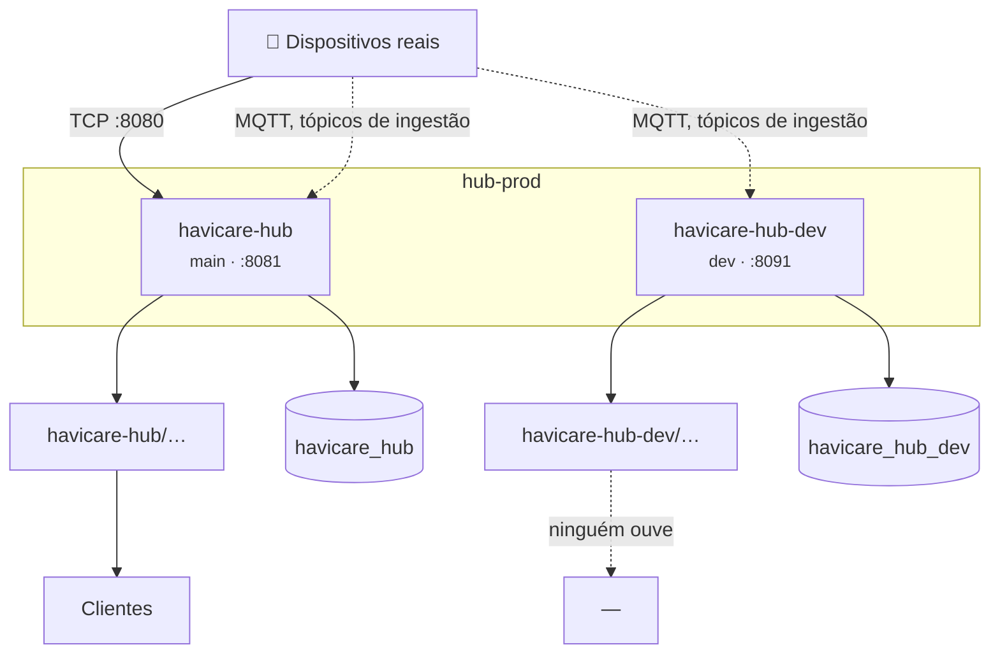

# 15 — Operação

> **As regras de trabalho estão no [`CLAUDE.md`](../CLAUDE.md).** Este capítulo
> explica como o sistema está montado; esse diz o que se pode e não se pode
> fazer, e em que ordem.

## 1. Duas instâncias, uma máquina

O servidor `hub-prod` corre **duas** instâncias do hub, separadas em tudo o que
guarda estado.

| | desenvolvimento | produção |
|---|---|---|
| Diretório | `/opt/havicare-hub-dev` | `/opt/havicare-hub` |
| Serviço | `havicare-hub-dev` | `havicare-hub` |
| Ramo | `dev` | `main` |
| Dashboard | `:8091` | `:8081` |
| Ingestão TCP | `127.0.0.1:8090` | `0.0.0.0:8080` |
| Base de dados | `havicare_hub_dev` | `havicare_hub` |
| Prefixo do Redis | `dev:` | *(vazio)* |
| Tópicos MQTT | `havicare-hub-dev` | `havicare-hub` |
| Id de cliente MQTT | `health-mqtt-dev` | `health-mqtt` |

A instância de desenvolvimento **lê os tópicos de ingestão reais** — vê os
mesmos dispositivos que a produção — mas publica, guarda e comanda tudo no seu
próprio espaço.

Não consegue tocar em nenhum aparelho real: os relógios ligam-se por TCP à porta
da produção, e os comandos saem para tópicos MQTT que nenhum aparelho ouve.



### Valores críticos para o isolamento

**O identificador de cliente MQTT.** Os subscritores de ingestão usam
identificador **estável**, sem número de processo, porque as sessões são
persistentes. Dois clientes com o mesmo identificador expulsam-se do broker em
ciclo — e o sintoma é ingestão a falhar de forma intermitente, sem erro óbvio.

O identificador final é `{prefixo}-{sufixo}`, onde o sufixo identifica o
subscritor (`sub`, `ncs-sub`, `moko-sub`). O prefixo é o que tem de ser único
por hub, e é limitado a 14 caracteres — o identificador é truncado aos 23.

**O prefixo dos tópicos MQTT.** Dois hubs que o partilhem publicam nos mesmos
tópicos e escrevem por cima das mensagens retidas de `status` um do outro. Não
se expulsam, porque os identificadores de cliente são distintos; o efeito é mais
silencioso do que isso, e é ver-se o estado de um dispositivo a alternar entre
duas versões conforme quem publicou por último.

**O prefixo do Redis.** Vazio é produção. Uma instância de desenvolvimento sem
prefixo escreveria por cima do estado da produção, sem dar erro nenhum.

### Uma terceira instância: a máquina de quem desenvolve

O ambiente local aponta frequentemente ao broker de produção, para ver os
aparelhos reais. Quando o faz, passa a ser um terceiro hub no mesmo broker e
precisa do seu próprio espaço:

| | Tópicos | Id de cliente | Id de cliente do radar |
|---|---|---|---|
| Produção | `havicare-hub` | `health-mqtt` | `qinglanst-radar` |
| Desenvolvimento | `havicare-hub-dev` | `health-mqtt-dev` | `qinglanst-radar-dev` |
| Máquina local | `havicare-hub-{nome}` | `{nome}` | `{nome}-radar` |

> **O prefixo de tópicos é obrigatório no `.env` da produção.** A omissão de
> `MQTT_TOPIC_PREFIX` no `src/Config.php` é **vazia**, e com ela o hub publicaria
> em `hitcare/1001/…` sem raiz, deixando de casar com os subscritores. A produção
> declara `MQTT_TOPIC_PREFIX=havicare-hub`. Já os dois identificadores de cliente
> — `health-mqtt` e `qinglanst-radar` — têm omissão igual à tabela e podem não ser
> declarados; ainda assim, convém não mexer nesses literais de código sem os
> declarar primeiro no `.env`.

## 2. Publicar

O trabalho vai primeiro à instância de desenvolvimento:

```bash
cd /opt/havicare-hub-dev && make update
```

E só depois de confirmado ali é que se promove:

```bash
git push origin dev:main
cd /opt/havicare-hub && make update
```

É o mesmo alvo nos dois sítios. Executa `git pull --ff-only`, instala as
dependências de produção, aplica as migrações e **só então** reinicia o serviço.
A ordem é determinada pela verificação de esquema: o hub recusa arrancar com a
base de dados desatualizada.

O serviço que ele reinicia sai do diretório em que corre, e não de um alvo que
se escolha — o diretório já identifica a instância, e uma escolha a mais é uma
escolha que se pode fazer mal. Fora dos dois diretórios do servidor, o alvo
recusa-se a correr em vez de adivinhar.

> **Ao mudar de ramo em produção, `git fetch` primeiro.** A `main` local do
> servidor já esteve centenas de commits atrasada, e um `checkout` sozinho leva
> a árvore para trás sem avisar.

## 3. Ver o estado

```bash
make status    # o serviço da instância em que se está
make journal   # e o journal dela, a seguir
```

O arranque regista um resumo com as portas, a configuração da fila de downlink e
os tópicos efetivos de cada ingestão ativa, permitindo confirmar o espaço de
tópicos em que cada instância publica.

Uma paragem suja é detetada por um marcador em ficheiro e aparece como
**notificação no sino da dashboard**, além do log. O `Restart=always` levanta o
processo em milissegundos, e sem isto a única prova ficava no `journalctl`.

## 4. Registo

| Canal | Ficheiro |
|---|---|
| Hub | `LOG_FILE`, por omissão `var/log/server.log` |
| API | `LOG_FILE_API`, por omissão `var/log/api.log` |

A separação do canal da API é deliberada: o volume de pedidos consumiria a
retenção operacional do canal do hub. Ambos são igualmente escritos na saída
padrão.

**Todos** os pedidos a `/api/*` são registados — os que correm bem, os que falham
a validação, e os recusados por falta de autorização. Cada entrada leva:

`request_id` · `method` · `path` · `query` · `route` · `status` · `duration_ms` ·
`auth_state` · `username` · `role` · `license_id` · `request_body` ·
`response_body`

Os corpos vão como objetos estruturados, truncados por `LOG_BODY_MAX_BYTES`.
Passwords, tokens de acesso e de renovação e parâmetros de token são
substituídos por `********` antes de serem escritos.

O `X-Request-Id` é reaproveitado se o cliente o mandar, e gerado se não. É o que
liga um erro 500 a uma linha do log.

> **Os registos da API contêm dados operacionais de dispositivos e de utentes.**
> As credenciais são redigidas; os restantes campos não o são, e um corpo de
> resposta com telemetria inclui medições clínicas. A retenção destes ficheiros
> está sujeita ao regime aplicável a dados clínicos e não ao de registos de
> aplicação.

## 5. Configuração da máquina

A configuração do sistema que pertence ao hub está versionada em `config/`, para
que a perda da máquina não leve consigo o que estava montado nela. A cópia no
servidor é idêntica à do repositório.

| Ficheiro versionado | Destino na máquina |
|---|---|
| `config/logrotate/havicare-hub` | `/etc/logrotate.d/havicare-hub` |
| `config/nftables/havicare-hub.nft` | `/etc/sysconfig/nftables.conf` |
| `config/systemd/watchdog.conf` | `…/havicare-hub*.service.d/watchdog.conf` |
| `config/systemd/ev-loop.conf` | `…/havicare-hub*.service.d/ev-loop.conf` |
| `config/systemd/limit-nofile.conf` | `…/havicare-hub*.service.d/limit-nofile.conf` |

Os três drop-ins do systemd têm cada um o seu próprio cabeçalho a explicar o que
resolve e o que exige; os dois últimos **só se instalam juntos**, e só depois de
uma extensão de event loop, pelas razões da secção seguinte.

```bash
sudo cp config/logrotate/havicare-hub    /etc/logrotate.d/havicare-hub
sudo cp config/nftables/havicare-hub.nft /etc/sysconfig/nftables.conf
sudo nft -f /etc/sysconfig/nftables.conf
sudo systemctl enable --now nftables
```

**A rotação dos registos** limita os dois canais por tamanho e não por calendário,
porque é o volume que cresce sem parar. O padrão `/opt/havicare-hub*/var/log/`
cobre as duas instâncias: sem o asterisco, a de desenvolvimento crescia sem
limite — chegou aos 47 MB num único ficheiro. O `copytruncate` é obrigatório,
porque o processo mantém os descritores abertos e o Monolog não os reabre.

**A firewall** fecha o porto 3306 à internet. O MariaDB escuta em `0.0.0.0` e
estava a receber milhares de tentativas de autenticação contra `root` e `admin`;
passam apenas o localhost e o endereço de quem administra.

> A política da tabela é `accept` e existe uma única regra de recusa, para o 3306.
> Uma política de recusa obrigaria a enumerar o SSH da porta 1983, a ingestão TCP
> do 8080, as dashboards e o nginx — e um esquecimento nessa lista tirava os
> dispositivos da rede.

A linha do endereço do administrador é a única a rever ao instalar noutra máquina,
por ser residencial e mudar. Um túnel dispensa-a por completo:

```bash
ssh -L 3306:127.0.0.1:3306 hub-prod
```

### O event loop, e o teto que ele impõe

O ReactPHP escolhe a melhor implementação de loop entre as extensões instaladas.
Sem nenhuma, cai no `StreamSelectLoop`, que é `stream_select()` — o `select(2)` do
sistema, com o `FD_SETSIZE` fixo em **1024** no Linux. É um limite da
implementação, e nenhum `LimitNOFILE` o levanta. O `StartupBanner` imprime a
implementação escolhida no arranque, porque instalar uma extensão troca o loop
sem deixar rasto em código.

Esse teto é partilhado por tudo o que o processo aceita: as ligações TCP dos
relógios, os sockets MQTT, os pedidos HTTP e cada ligação aberta ao
`/api/stream`. Medido a abrir streams em rampa, o que acontece ao passar dos 1024
é isto:

- O `stream_select()` começa a avisar `You MUST recompile PHP with a larger value
  of FD_SETSIZE`, **uma vez por iteração do loop** — e o loop itera milhares de
  vezes por segundo. Numa ocorrência, o journald registou **3 161 543 mensagens
  suprimidas em cerca de 18 segundos**.
- O processo deixa de servir. Na primeira ocorrência ficou vivo e mudo, com os
  descritores nunca libertados e o systemd a reportar `active (running)`; noutra
  saiu com `status=255`.

Instalar o `php-pecl-ev` remove o teto: o loop passa a `ExtEvLoop`, que usa epoll.
Confirma-se assim, e a resposta tem de dizer `ExtEvLoop`:

```bash
php -d extension=ev -r 'require "vendor/autoload.php";
    echo get_class(React\EventLoop\Loop::get()), PHP_EOL;'
```

> O pacote instala `/etc/php.d/40-ev.ini`, carregado por **todos** os processos
> PHP da máquina. Com ele activo, a instância de produção troca de loop no
> próximo reinício, qualquer que seja o motivo. O
>  `config/systemd/ev-loop.conf` existe para evitar isso: desactiva-se o ini
> global e carrega-se a extensão pela linha de comando de uma unit só.

### Reiniciar um processo que não morreu

O `Restart=always` das units reage ao processo **terminar**, e o modo de falha
acima não termina nada. Daí o `config/systemd/watchdog.conf`, que resolve duas
coisas distintas.

**`WatchdogSec=60s` com `NotifyAccess=main`.** O `SystemdWatchdog` manda
`WATCHDOG=1` de um temporizador do event loop, e é isso que o torna útil: o ping
**só sai se o loop estiver a girar**, pelo que é prova de vivacidade e não de
existência. Verificado com um `SIGSTOP` ao processo — vivo, loop parado:

```text
Watchdog timeout (limit 1min)!
Killing process 979108 (php) with signal SIGABRT.
Failed with result 'watchdog'.
Scheduled restart job, restart counter is at 2.
```

Sessenta segundos do último ping ao kill, de pé cinco segundos depois. O
`NotifyAccess=main` com `Type=simple` é deliberado: o systemd vigia os pings sem
exigir um `READY=1` no arranque, pelo que um defeito na implementação faz o
watchdog não funcionar em vez de o serviço ser declarado como não tendo arrancado.

O SIGABRT deixa um core dump — 4,1 MB comprimidos para um processo de 143 MB, com
a retenção de três dias que o systemd traz de origem. Vale mais como diagnóstico
do que custa em disco, e por isso fica.

**A janela do `StartLimit`.** Os valores de omissão são `StartLimitBurst=5` em dez
segundos: um processo que morra logo e repetidamente — um `.env` mal formado, uma
extensão que deixou de carregar depois de uma subida de PHP, o MySQL ainda a
arrancar — faz o systemd desistir e deixar o serviço **morto**. A janela passa a
cinco minutos com backoff exponencial, o que aguenta uma dependência lenta a
recuperar e continua a desistir de uma falha permanente, que é o que a torna
visível no `systemctl status`.

> As chaves `StartLimitIntervalSec` e `StartLimitBurst` vivem na secção `[Unit]`.
> Postas em `[Service]`, o systemd escreve `Unknown key … ignoring` no journal e
> segue com os valores de omissão — a mesma falha silenciosa que estas linhas
> existem para fechar.

## 6. Funcionalidades configuráveis

| Variável | Omissão | O que controla |
|---|---|---|
| `DASHBOARD_API_AUTH_REQUIRED` | `true` | **A autenticação inteira.** A `false`, tudo é administrador anónimo |
| `NCS_ENABLED` | `true` | Ingestão Voerka |
| `MOKO_GATEWAY_ENABLED` | `true` | Ingestão de gateways e BLE |
| `QINGLANST_ENABLED` | **`false`** | Ingestão de radares |
| `LOCATION_RESOLUTION_ENABLED` | `true` | Localização sem GPS |
| `RADIO_MAP_ENABLED` | `true` | Mapa privado — **desliga-se sozinho** sem `RADIO_MAP_HASH_KEY` |
| `MQTT_TLS_ENABLED` | `false` | TLS para o broker |
| `REDIS_PREFIX` | *(vazio)* | O que permite duas instâncias |

## 7. Verificações que valem a pena

**Isolamento das instâncias.** Contar as chaves dos dois lados antes e depois de
uma alteração:

```bash
redis-cli --scan --pattern 'hub:*' | grep -vc '^dev:'
redis-cli --scan --pattern 'dev:hub:*' | wc -l
```

A raiz `hub:` é partilhada com o reencaminhador (`hub:forward:*`,
`hub:crm:target:*`), que é outra aplicação — conta para o primeiro número sem ser
do hub.

**O broker.** O mosquitto do `mqtt-prod` está configurado para escrever em
`/var/log/mosquitto.log`, ficheiro que não existe; só os avisos chegam ao
journal. Ainda assim serve de detetor de identificadores repetidos:

```bash
journalctl -u mosquitto | grep "already connected"
```

**Sentinelas contra `NULL`.** Um dispositivo sem dono tem `NULL` no `company` e
no `license_id`. O texto `'null'` e o `0` só valem em memória e no ficheiro da
whitelist — ver o [multi-inquilino](07-multi-inquilino.md).

**Gateways MOKO.** Um MKGW4 **suspende a publicação** enquanto a aplicação
MKScannerPro lhe estiver ligada. A aplicação tem de estar encerrada antes de se
diagnosticar uma avaria.

**Cópias de segurança.** A cópia da base de dados corre às 03:30 e roda sozinha.
Uma falha do temporizador é silenciosa, e o que a denuncia é o número de
ficheiros guardados deixar de crescer:

```bash
systemctl list-timers havicare-hub-backup.timer
ls -lh /var/backups/havicare_hub
```

Ver as [cópias de segurança](18-backups.md).

## 8. Ambiente de desenvolvimento local

```bash
cp .env.example .env
docker compose up -d
make simulate-vivistar-tcp IMEI=861265061009822
```

Arranca o mosquitto, o Redis, o MySQL e o hub. O contentor do hub monta o
repositório e reinicia automaticamente perante alterações ao código.

A variável `HUB_MQTT_HOST` permite apontar o ambiente local ao broker de
produção para observar dispositivos reais. **Apenas em leitura**: a publicação a
partir de um ambiente de desenvolvimento para os tópicos de produção emite
comandos para equipamento em serviço.

> O ambiente local executa MySQL e a produção executa MariaDB 10.11. O esquema e
> as consultas evitam sintaxe exclusiva de qualquer dos motores, condição
> verificada pela integração contínua a cada push — ver os
> [testes](16-testes.md).

## Implementação

| Ficheiro | Responsabilidade |
|---|---|
| [`CLAUDE.md`](../CLAUDE.md) | As regras de trabalho e de segurança operacional |
| `Makefile` | `update`, `restart`, `status`, `journal`, e os alvos locais |
| `bin/migrate.php` | O passo explícito de esquema |
| `bin/backup-db.sh` | A cópia diária da base de dados — ver o [capítulo 18](18-backups.md) |
| `config/logrotate/havicare-hub` | A rotação dos registos das duas instâncias |
| `config/nftables/havicare-hub.nft` | A firewall que fecha o porto 3306 |
| `bin/dev.sh` | O vigia de ficheiros do contentor |
| `src/Runtime/StartupBanner.php` | O resumo de arranque |
| `src/Runtime/CrashWatch.php` | A deteção de paragem suja |
| `.env.example` | Todas as variáveis, com as razões |
