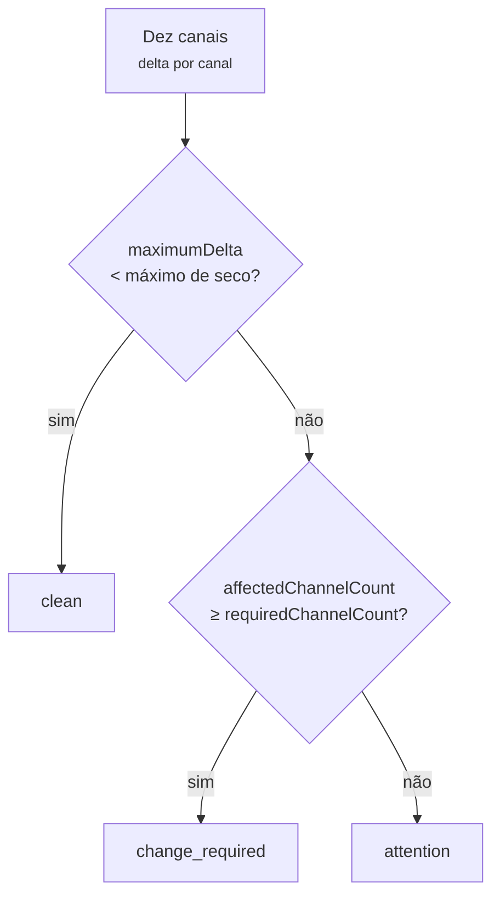

# 17 — Sensor de fralda

## Âmbito

O MONIT MECS-PRO é um beacon BLE não conectável: anuncia, e nada lhe é enviado. A
descodificação do anúncio e o reconhecimento do dispositivo estão descritos nos
[gateways e BLE](05-gateways-ble.md); a estrutura dos tópicos, no
[contrato MQTT](08-contrato-mqtt.md); a forma do envelope, na
[normalização](06-normalizacao.md).

Este capítulo descreve o que é publicado a partir daquele anúncio, como o estado
da fralda é derivado, e o que dessa forma é estável ao ponto de se poder
construir por cima.

Constitui a especificação de referência de uma ingestão completa, do anúncio ao
contrato público.

## 1. As cinco capacidades e o evento

Todas as leituras chegam ao **mesmo** tópico `telemetry`. Os wildcards do MQTT
filtram pelo caminho e não pelo conteúdo, pelo que escolher uma capacidade é
sempre uma verificação do `type` do lado do cliente.

| `type` | Canal | O que leva |
|---|---|---|
| `battery` | `telemetry` | `{ "percent": 83 }` |
| `diaper_moisture` | `telemetry` | Os dez canais capacitivos, em bruto e normalizados |
| `diaper_moisture_level` | `telemetry` | O nível genérico, de 0 a 100 |
| `diaper_condition` | `telemetry` | O estado: `clean`, `attention` ou `change_required` |
| `proximity` | `telemetry` | O sinal para cada gateway que o ouviu |
| `change_required` | `events` | A transição para o estado de muda |

### `diaper_moisture` — o detalhe do fornecedor

```json
{
  "channels": [
    {"index": 1,  "baseline": 1,  "value": 2,  "delta": 1},
    {"index": 5,  "baseline": 32, "value": 36, "delta": 4},
    {"index": 10, "baseline": 32, "value": 36, "delta": 4}
  ],
  "affectedChannelCount": 0,
  "maximumDelta": 4,
  "requiredChannelCount": 4,
  "wetDelta": 12
}
```

| Campo | Significado |
|---|---|
| `index` | Número do canal, de 1 a 10 neste modelo |
| `baseline` | A referência de seco do canal, de 0 a 63. Varia muito entre canais — é uma calibração por elétrodo, não uma leitura |
| `value` | A leitura capacitiva atual, de 0 a 63 |
| `delta` | `max(value - baseline, 0)`. É o único número do canal com significado para quem consome |
| `affectedChannelCount` | Quantos canais têm `delta` igual ou superior ao `wetDelta` |
| `maximumDelta` | O maior `delta` dos dez canais |
| `requiredChannelCount` | Quantos canais molhados obrigam a muda **neste** sensor |
| `wetDelta` | O `delta` a partir do qual um canal conta como molhado **neste** sensor |

Os dois últimos são configuráveis por sensor e viajam com a leitura precisamente
para não serem copiados: quem apresenta «3 de 4 canais afetados» precisa do
quatro, e esse quatro já não é o mesmo em todos os sensores.

Esta mensagem é a forma do fornecedor, não o contrato genérico. Outro medidor
terá outra contagem de canais, ou uma leitura única e canal nenhum.

### `diaper_moisture_level` — o nível genérico

```json
{ "index": 29, "alertIndex": 40 }
```

| Campo | Significado |
|---|---|
| `index` | Inteiro de 0 a 100 |
| `alertIndex` | O valor a partir do qual o estado passa a `change_required` |

**O `index` não é uma percentagem de enchimento e não pode ser apresentado como
tal.** O sensor mede capacitância contra uma linha de base de seco; não existe
calibração para volume, referência de fralda saturada, nem absorvência por
marca. O número exprime a distância entre o seco e o limiar de muda, comparável
entre leituras do mesmo sensor. Admite a designação de «nível» ou um indicador
gráfico, nunca «43% cheia».

É esta a capacidade sobre a qual construir o que tiver de servir mais do que um
fornecedor: todos os medidores têm um «quão húmido, 0 a 100»; só o MONIT tem dez
canais.

### `diaper_condition` — o estado

```json
{ "state": "attention" }
```

| `state` | Significado |
|---|---|
| `clean` | Seca |
| `attention` | Húmida em algum ponto, ainda não é muda |
| `change_required` | Precisa de ser mudada |

### `change_required` — o evento

```json
{
  "type": "change_required",
  "occurredAt": "2026-09-01T10:35:10Z",
  "device": { "id": "eec5000202f9", "supplier": "MONIT", "model": "MECS-PRO" },
  "data": { "previousState": "attention" },
  "source": { "protocol": "monit-mecs-pro-ble", "gatewayId": "c5e390f30bce" }
}
```

Publicado **na transição para** `change_required`, uma vez. Não se repete
enquanto o estado se mantiver, por muitas observações que cheguem. Sair do
estado não produz evento — para levantar um alarme segue-se o evento, para o
limpar segue-se a telemetria `diaper_condition`.

O `previousState` vale `clean`, `attention` ou `null`. **O `null` significa que
o hub não tinha estado anterior para este sensor** — uma primeira observação, ou
a primeira depois de o estado guardado se ter perdido. É uma transição como
qualquer outra e tem de levantar o alarme: um sensor cuja primeira leitura já
pede muda é exatamente o caso que não se pode engolir.

## 2. Como o estado e o nível são derivados

Documentado para que os números sejam explicáveis, não para serem
reimplementados.

Três limiares governam tudo, e dois deles vêm na própria leitura:

| Limiar | De onde vem | No perfil normal | Papel |
|---|---|---|---|
| Canal molhado | `wetDelta` | 12 | Um canal com este `delta` conta como molhado |
| Máximo de seco | Derivado: `intdiv(wetDelta, 4) + 1` | 4 | Abaixo disto em *todos* os canais a fralda está seca |
| Canais para muda | `requiredChannelCount` | 4 | Tantos canais molhados obrigam a muda |



A assimetria é deliberada: um canal com `delta` entre o máximo de seco e o
`wetDelta` menos um — 4 e 11 no perfil normal — não conta como afetado, mas é
suficiente para o estado deixar de ser `clean`.

### O nível

A saturação é a média, sobre os dez canais, de `min(delta / wetDelta, 1)` — na
prática, quantos dos dez canais valem por um canal molhado, em fração. Essa
saturação é depois colocada dentro da banda que pertence ao estado já decidido,
o que garante que o número e o estado nunca se contradizem.

| Estado | Banda |
|---|---|
| `clean` | 0–25 |
| `attention` | 25–39 |
| `change_required` | 40–100 |

O `attention` é a única banda reescalada. Ali a saturação vai de quase zero até
`(wetDelta - 1) / wetDelta`, e cortar em 39 empilharia a maior parte do dia no
mesmo valor — precisamente no estado onde o número tem de se mexer.

Longe do perfil normal o índice comprime-se nos extremos e várias leituras
distintas encostam ao 25 ou ao 40. Perde-se resolução, não correção.

## 3. Sensibilidade por sensor

Dois parâmetros decidem quando uma fralda conta como suja. São a mesma grandeza
que a aplicação do fabricante expõe, e são o **único** caso em que uma
configuração não viaja para o aparelho: o sensor não aceita comandos, e o que
muda é a regra com que o hub interpreta a mesma leitura física.

| Parâmetro | Significado | Gama |
|---|---|---|
| `pollutionValue` | O `delta` por canal que conta como molhado — publicado como `wetDelta` | 5–25 |
| `pollutionRange` | Quantos canais molhados exigem muda — publicado como `requiredChannelCount` | 2–10 |

| Perfil | `pollutionRange` | `pollutionValue` |
|---|---|---|
| Baixa | 7 | 15 |
| Normal | 4 | 12 |
| Alta | 3 | 7 |

O perfil nunca é guardado: é derivado do par de valores. O hub nomeia-os pela
grandeza que se regula, como a `fall_sensitivity` dos relógios — é a
sensibilidade baixa que produz menos alertas, e uma chave que falasse de
contagem de alertas obrigaria a inverter o eixo para a ler.

Grava-se pela via genérica de configuração, descrita na
[configuração de dispositivos](10-configuracao-de-dispositivos.md):

```http
PATCH /api/devices/{imei}/configurations
{ "configurations": { "diaper_sensitivity": { "pollutionRange": 3, "pollutionValue": 7 } } }
```

O `GET /api/devices/{imei}` devolve-a em
`capabilities.settings_system.diaper_sensitivity`, com o perfil derivado no valor
e as gamas e graduações no `_meta`.

## 4. O contrato congelado

### Seguro para construir por cima

- Os valores de `type`, e o canal de cada um.
- O `requiredChannelCount` e o `wetDelta` acompanharem sempre a leitura dos
  canais, e serem os limiares realmente aplicados a essa leitura.
- O `diaper_condition.data.state` ser exatamente um de `clean`, `attention`,
  `change_required`.
- O `diaper_moisture_level.data.index` ser um inteiro de 0 a 100, e o
  `alertIndex` viajar sempre com ele.
- O `change_required` disparar na transição para o estado, com `previousState`
  possivelmente `null`.
- Poderem ser **acrescentados** campos novos a qualquer objeto `data` sem aviso.
  Ler com tolerância: ignorar chaves desconhecidas em vez de falhar.

### Não depender de

- **Os valores dos limiares.** São política do hub, configuráveis por sensor.
  Ler o `alertIndex`, o `requiredChannelCount` e o `wetDelta` do payload; nunca
  escrever 40, 4 ou 12.
- **Os limiares serem iguais em todos os sensores.** Dois sensores do mesmo
  modelo podem estar em perfis diferentes, porque a necessidade varia de pessoa
  para pessoa. Uma leitura idêntica pode produzir estados diferentes em dois
  sensores, e isso não é defeito.
- **Os limiares serem estáveis no tempo.** Mudam por ação de quem cuida, e a
  avaliação seguinte é feita com as regras novas.
- **Dez canais.** É a forma do MONIT. O `diaper_moisture_level` é o campo que
  existe para servir mais do que um fornecedor.
- **As capacidades chegarem juntas.** Ver abaixo.
- **O `index` como percentagem física de enchimento.** Não é.
- **Precisão abaixo do segundo.** O `occurredAt` tem precisão ao segundo e é o
  relógio de publicação do hub.

### Cadência

Cada capacidade tem a sua própria supressão: o hub calcula uma impressão digital
do `data` por sensor, capacidade e gateway, e suprime um payload idêntico durante
60 segundos. Dados que mudaram publicam de imediato. O `proximity` ignora a
supressão, porque o seu sinal muda a cada observação.

Duas consequências para quem consome:

1. **Duas capacidades não chegam juntas.** O `diaper_moisture_level` é um inteiro
   grosseiro que frequentemente não se mexe entre leituras, e por isso chega
   menos vezes do que o `diaper_moisture`. Guardar o último valor de cada `type`
   em separado.
2. **A supressão é por gateway.** Com dois gateways ao alcance recebem-se duas
   cópias da mesma leitura, diferindo no `source.gatewayId` e no `rssiDbm`. É
   intencional — cada observação é uma medição distinta. Para ignorar qual o
   gateway, deduplicar por `device.id`, `type` e `occurredAt`.

## 5. Verificar a partir da linha de comandos

A password do broker não está escrita aqui de propósito; exportá-la como
`MQTT_PASSWORD` antes de correr o que segue.

```sh
# Tudo, o mais cru possível
mosquitto_sub -h 88.99.104.197 -p 1883 -u health-hub -P "$MQTT_PASSWORD" \
  -t 'havicare-hub/+/+/diaper_sensor/#' -v

# Só o estado da fralda, uma linha por leitura
mosquitto_sub -h 88.99.104.197 -p 1883 -u health-hub -P "$MQTT_PASSWORD" \
  -t 'havicare-hub/+/+/diaper_sensor/+/telemetry' \
  | jq -rc 'select(.type == "diaper_condition")
            | [.occurredAt, .device.id, .data.state] | @tsv'

# Que capacidades estão a chegar, e com que frequência
mosquitto_sub -h 88.99.104.197 -p 1883 -u health-hub -P "$MQTT_PASSWORD" \
  -t 'havicare-hub/+/+/diaper_sensor/+/telemetry' -W 120 \
  | jq -r .type | sort | uniq -c
```

Para as outras instâncias, o mesmo broker com o prefixo correspondente — ver a
[operação](15-operacao.md).

## Implementação

| Ficheiro | Responsabilidade |
|---|---|
| `src/Ingress/Mqtt/Moko/MonitMecsProDecoder.php` | O anúncio BLE, lido bit a bit |
| `src/Ingress/Mqtt/Moko/MonitNormalizer.php` | Os canais, a derivação do estado e do nível |
| `src/Domain/DiaperSensitivity.php` | Os limiares, os perfis e o máximo de seco derivado |
| `src/Domain/DiaperSensitivityLookup.php` | O valor em vigor para cada sensor |
| `src/Domain/Capability/DiaperSensitivityCapability.php` | A capacidade, na API |
| `src/Api/Repository/DiaperSensitivityRepository.php` | A persistência do par de valores |
| `src/Ingress/Mqtt/Moko/Bridge.php` | A transição de estado e o evento `change_required` |
| `src/Domain/Capability/Definition/DiaperSensorCapabilityDefinitions.php` | As capacidades no catálogo |
