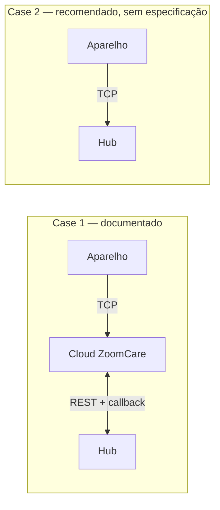

# 19 — Dispensador de comprimidos

## Âmbito

O Zayata/ZoomCare M228 é um dispensador automático de comprimidos com prato
rotativo e ligação celular. **Ainda não está integrado no hub**, e este capítulo
não descreve código que exista.

Descreve o que está estabelecido sobre o aparelho, o que foi verificado contra a
API real do fabricante, e as armadilhas que a integração vai encontrar. Existe
porque metade desta matéria não consta de documento nenhum do fornecedor — foi
obtida do aparelho, da aplicação deles e de chamadas à API — e perder-se-ia.

A decisão de transporte continua em aberto e está na secção 2. As questões que
dependem do fornecedor estão reunidas na secção 9.

## 1. O aparelho

| | |
|---|---|
| Modelo | M228 |
| Células | 28, em prato rotativo |
| Ligação | 4G com SIM. Há variantes só-WiFi na mesma família |
| Interface | ecrã LCD, botões A/B/C, tecla de função, altifalante |
| Alimentação | bateria com carregador |
| Firmware da unidade de ensaio | 5.2 |
| Número de série | prefixo `89-`, dezoito dígitos |

O prefixo do número de série não corresponde ao dos exemplos da documentação,
que usam `5a-` e `d3-`. Se identifica o modelo, ainda não está confirmado.

A aplicação do fabricante reutiliza os ecrãs do modelo M126 para o M228 — todas
as *activities* se chamam `M126*`, e as ilustrações de ajuda mostram um aparelho
que não é este. **As instruções da aplicação não descrevem a unidade que temos.**

## 2. Como fala

O fabricante oferece dois modelos de integração, e recomenda o segundo.



**Case 1** é o que a documentação cobre: o aparelho fala com a cloud deles, e nós
falamos com essa cloud por HTTPS, recebendo eventos num callback nosso.

**Case 2** é o que eles recomendam, por razões de RGPD — no Case 1, dados de
medicação de utentes portugueses atravessam um servidor na China. O aparelho
ligar-se-ia por TCP directamente ao hub, como já fazem os relógios descritos na
[ingestão TCP](02-ingestao-tcp-relogios.md).

**A especificação do Case 2 não nos foi entregue.** Os dois documentos que
existem em [`pill-dispensor/`](pill-dispensor/) descrevem a API REST, que é o
Case 1. Enquanto não chegar, o Case 2 não é implementável.

O BLE tem um único papel, e não é o nosso: provisionar credenciais de WiFi na
primeira utilização, por **BluFi** (protocolo da Espressif, ESP32, só 2,4 GHz).
Numa unidade que anda por 4G, não se usa.

### O APN é gravado de fábrica

O aparelho traz o APN programado pelo fabricante e **não o expõe em nenhum
menu**. Nas unidades destinadas a Portugal vem `internet`, que é o APN de consumo
da MEO.

Um cartão M2M da MEO exige `internetm2m` e por isso **nunca anexa**. Foi o que
aconteceu na unidade de ensaio: só ligou com um cartão de consumo. Para uma
instalação a sério isto não escala — ou o fabricante grava `internetm2m` nas
unidades que nos vende, ou a frota leva cartões não-M2M, o que é decisão de
contrato.

## 3. A API de parceiro (Case 1)

Base de teste: `https://api-en-test.zoomcare.tech/index.php?s=/Company/CommonApi`
Base de produção: `https://api-en.zoomcare.tech/…`

Os dois nomes resolvem para o mesmo endereço mas **são bases de dados
separadas**: um aparelho registado em produção devolve `604` no ambiente de
teste.

Tudo é POST com JSON em UTF-8, e a resposta tem sempre a forma
`{"code":…,"message":…,"data":…}`. As credenciais de teste estão no PDF do
fornecedor e funcionam.

### Autenticação e identidade

O `company_code` e o `company_secret` identificam a empresa integradora e obtêm
um `token` válido por **7200 segundos**. O token viaja no **corpo** de cada
pedido, não em cabeçalho, e renova-se quando surgir o erro `701`.

A identidade de um aparelho é sempre o par `user_id` + `device_sn`. O `user_id` é
de um utilizador que **nós** registamos; um aparelho associado na aplicação de
consumidor não é visível à empresa integradora.

```
POST /get_token      → data.token, data.expire
POST /user_register  → data.user_id
POST /bind_device    → data.patient_id
POST /unbind_device
```

O `bind_device` devolve um `patient_id` que a documentação não menciona — a
secção de resposta está elidida no PDF.

### Leitura

| Endpoint | Devolve | Funciona offline |
|---|---|---|
| `get_status` | `status`: `1` ligado, `0` desligado | sim |
| `get_plan` | plano, alarmes e medicamentos | **sim** — é dado da cloud |
| `get_information` | toda a telemetria e configuração | **não** — erro `611` |
| `get_medication_record` | histórico, `{count, list}` | sim |

O `get_medication_record` **não consta da documentação** e foi encontrado por
sondagem. Aceita `start_date`, `end_date`, `page` e `limit`. É a única forma de
reconciliar tomas depois de uma falha, e por isso importa: sem ele, um callback
perdido é um evento perdido para sempre.

### Escrita

Comandos: `take_drug` (toma antecipada), `mute_alarm`, `reboot`, `reset` (repõe o
prato).

Plano: `set_alarm` (um alarme de cada vez), `set_plan` (células cheias e período
de validade).

Configuração: `set_time_format`, `set_date_format`, `set_voice`, `unfazed`,
`set_omitting`, `set_time_out`, `set_language`, `set_timezone`.

**As escritas falham com `611` quando o aparelho está desligado, e não ficam em
fila.** Qualquer configuração que o hub aplique precisa de reconciliação, à
maneira do que está descrito na
[configuração de dispositivos](10-configuracao-de-dispositivos.md).

### Códigos

`200` sucesso · `602` início e fim do não-incomodar iguais · `604` aparelho
inexistente · `606` hora inválida · `608` sem associação · `610` utilizador já
associado · `611` **aparelho desligado** · `612` falha ao configurar · `701`
**token inválido** · `708` utilizador inexistente · `804` plano inexistente ·
`901` alarme inexistente · `902` hora de alarme repetida.

Um endpoint desconhecido responde `{"code":-1,"msg":"API does not exist"}`.

## 4. O callback

Fornecemos um URL; a cloud deles faz POST. Respondemos `{"code":200}`.

| `type` | Conteúdo | Estados |
|---|---|---|
| `1` estado | `device_sn`, `status` | `1` desligado, `2` avaria, `3` tampa aberta |
| `2` medicação | `device_sn`, `alarm_id`, `status`, `take_time` | `0` a tocar, `1` a horas, `2` em atraso, `3` esquecida |

Três lacunas, e a primeira é de segurança:

- **Não há autenticação definida.** A documentação diz apenas que o parceiro
  fornece o endereço. Quem souber o URL injecta tomas falsas. Antes de produção
  tem de haver segredo no caminho, assinatura ou lista de endereços.
- **Não traz instante absoluto.** O `take_time` é `"12:00"` — sem data e sem
  fuso. Ver a secção 7.
- **Não traz o medicamento**, só o `alarm_id`, que obriga a cruzar com o
  `get_plan` — e esse pode ter mudado entretanto.

Não existe evento de emergência: o callback só tem os tipos 1 e 2.

## 5. Capacidades do aparelho

**Medicação.** Até **seis alarmes por dia**, em slots fixos. Não se criam nem se
apagam: o `get_plan` devolve sempre os seis, com `alarm_id` atribuído, e
configura-se um slot livre. O `status` de um alarme é `0` inicial, `1` válido ou
`2` inválido — desactivar é pôr a `2`.

Cada alarme leva uma lista de medicamentos com nome e quantidade, em texto livre,
sem catálogo nem dosagem estruturada.

**Dispensa.** O prato avança uma célula por toma, em sequência. O
`ceil_used` declara quantas células foram cheias; o `ceil_remaining` quantas
faltam.

**Registo.** Cada toma fica como a horas, em atraso ou esquecida, e a aplicação
deriva daí uma percentagem de adesão.

**Estado.** Ligado, bateria em estado e percentagem, alimentação, sinal, tampa
aberta, falha de rotação, versão de firmware, célula actual.

### O que não faz

- **A medicação é igual todos os dias.** Os alarmes repetem-se dentro do período
  de validade; não há forma de dizer que numa terça-feira leva outra coisa.
- **Não sabe quem tomou**, nem se a pessoa ingeriu — apenas que a célula foi
  dispensada.
- **Não fala português.** O `set_language` oferece chinês e inglês.

### SOS

O aparelho tem botão de emergência e anuncia "Emergency call" ao ser premido. A
funcionalidade existe na plataforma do fabricante — notifica administrador e
supervisor, e liga para um número configurado — mas **está desligada na conta**,
não é configurável em lado nenhum da aplicação, e **não tem evento no callback**.

Hoje, um SOS neste aparelho não chega a ninguém.

## 6. Configurações e domínios

| Definição | Valores | Endpoint |
|---|---|---|
| Formato de data | `0` yy-mm-dd · `1` dd-mm-yy · `2` mm-dd-yy | `set_date_format` |
| Formato de hora | `0` 24 h · `1` 12 h | `set_time_format` |
| Volume | `1` máximo · `2` médio · `3` mínimo · `4` mudo | `set_voice` |
| Idioma | `1` chinês · `2` inglês | `set_language` |
| Fuso | `+0100`, `-0600` | `set_timezone` |
| Não incomodar | ligado/desligado e janela em 24 h | `unfazed` |
| Lembrete de atraso | 5 a 120 min, múltiplo de 5 | `set_time_out` |
| Lembrete de falha | 10 a 240 min, múltiplo de 10 | `set_omitting` |
| Células cheias | 1 a `device_ceil_amount` | `set_plan` |
| Período de validade | intervalo de datas, ou sempre válido | `set_plan` |

A documentação descreve o volume de duas maneiras diferentes — `1 Max, 2 Mid,
3 Min, 4 Mute` no `get_information` e `1 High, 2 low, 3 Low, 4 Mute` no
`set_voice`. A aplicação mostra quatro opções, *High*, *Medium*, *Low* e *Mute*,
o que resolve a contradição a favor da primeira.

## 7. Armadilhas confirmadas

**A telemetria não se lê com o aparelho desligado.** O `get_information` devolve
`611`, não devolve valores em cache. O hub tem de guardar o último valor
conhecido, ou a dashboard perde bateria e sinal sempre que a caixa adormecer.

**O relógio do aparelho não é de confiar.** Num ensaio, um alarme marcado para as
12:55 ficou registado como cumprido "a horas" às **11:45**. A discrepância não foi
explicada, e o aparelho tem uma função de calibração de relógio — que existe
precisamente porque deriva. Como o callback só traz `HH:MM`, sem data e sem fuso,
**a ingestão tem de carimbar o instante na recepção** e tratar a hora reportada
como etiqueta, nunca como timestamp.

**As datas vazias vêm a `0000-00-00`.** É a data-zero do MySQL, devolvida quando
o plano é sempre válido. Parte qualquer conversão ingénua.

**O sinal é mais fino do que o documentado.** A API descreve `wifi` e `gsm` como
`0-4`, mas a aplicação mostra um valor em dB. Se o número em cru estiver
disponível, é melhor telemetria do que a documentada.

**A dispensação suspende-se sem rede.** A aplicação do fabricante contém a
mensagem *"Network disconnected, medication dispensing has been paused"*. Se se
confirmar no M228, a disponibilidade da cloud do fabricante passa a ser crítica
para a função clínica, e não apenas para a telemetria.

## 8. O que a aplicação expõe e a API de parceiro não

A aplicação usa uma API própria, em `/Home/Device/*` e `/Home/User/*`, com cerca
de cinquenta rotas contra as vinte e uma da API de parceiro. Alguns campos só lá
existem:

| | |
|---|---|
| `Remarks` | texto livre por alarme |
| Fotografia | imagem por medicamento |
| Toque | `Bell1` e seguintes |
| Calibração de relógio | acerto manual |
| Supervisor | terceiro papel, além de administrador e convidado |

A associação de um aparelho a contas de consumidor vive nessa API, e é
independente da associação feita pela API de parceiro. Um aparelho comprado e
configurado na aplicação tem de ser libertado antes de poder ser gerido por nós.

## 9. Em aberto

A decisão de transporte e o que dela depende estão nas
[notas de arquitetura](99-notas-de-arquitetura.md), com as restantes dependências
do fabricante.
