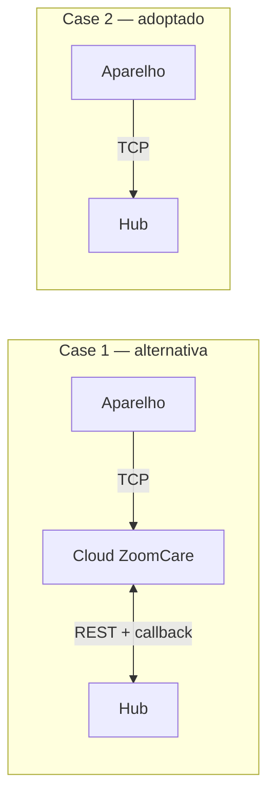

# 19 — Dispensador de comprimidos

## Âmbito

O Zayata/ZoomCare M228 é um dispensador automático de comprimidos com prato
rotativo e ligação celular. **O caminho de subida já está implementado**: o hub
descodifica as tramas TCP do aparelho e publica-as como telemetria e eventos. O
que ainda não existe é o caminho de descida — comandos e plano de medicação.

Descreve o que está estabelecido sobre o aparelho, o que foi verificado contra a
API e a aplicação do fabricante, e as armadilhas que a integração vai encontrar.
Existe porque parte desta matéria não consta de documento nenhum do fornecedor —
foi obtida do aparelho, da aplicação deles e de chamadas à API — e perder-se-ia.

A decisão de transporte está tomada e registada nas
[notas de arquitetura](99-notas-de-arquitetura.md): o aparelho liga-se por TCP
directamente ao hub. As secções 3 a 5 descrevem esse protocolo e a 6 o que o hub
já faz com ele; as secções 7 e 8 descrevem a alternativa por cloud, que fica
documentada por ter sido a única via disponível durante o levantamento e por ser
o que a aplicação do fabricante usa.

> As tabelas das secções 4 e 5 são as do **tipo de dispositivo `0x02`**. A
> especificação traz também as do tipo `0x01`, com os mesmos números de TAG a
> significarem outra coisa — ler a tabela errada dá um descodificador que compila
> e mente.

## 1. O aparelho

| | |
|---|---|
| Modelo | M228 / M228A |
| Células | 28, em prato rotativo removível |
| Ligação | 4G Cat1 com SIM. Há variantes só-WiFi na mesma família |
| Interface | ecrã, **painel táctil** que bloqueia por inactividade, altifalante |
| Sensores | temperatura e humidade |
| Fecho | chave física no prato |
| Alimentação | bateria com carregador |
| Firmware da unidade de ensaio | 5.2 |
| Número de série | prefixo `89-`, dezoito dígitos |

O prefixo do número de série não corresponde ao dos exemplos da documentação da
API, que usam `5a-` e `d3-`. Se identifica o modelo, ainda não está confirmado.

A aplicação do fabricante reutiliza os ecrãs do modelo M126 para o M228 — todas
as *activities* se chamam `M126*`, e as ilustrações de ajuda mostram botões
físicos A/B/C que **este aparelho não tem**. As instruções da aplicação não
descrevem a unidade que temos; o manual do M228A, sim.

### Modo de dispensa

O aparelho tem dois comportamentos à hora da toma, e a escolha muda o que "toma"
significa:

- **Button** — o comprimido só cai depois de o utente carregar.
- **Auto** — cai sozinho.

A toma antecipada tem quatro modos: desligada, livre, protegida por bloqueio de
criança, ou com dupla confirmação.

## 2. Como fala

O fabricante oferece dois modelos de integração e recomenda o segundo, que é o
adoptado.



No **Case 1** o aparelho fala com a cloud do fabricante e nós falamos com essa
cloud por HTTPS, recebendo eventos num callback nosso. No **Case 2** o aparelho
liga-se por TCP directamente ao hub, como já fazem os relógios descritos na
[ingestão TCP](02-ingestao-tcp-relogios.md).

O Case 2 ganha em todas as dimensões que importam — eventos com instante
absoluto, nove alarmes em vez de seis, telemetria que a API REST não expõe, sem
cloud intermédia e sem dados clínicos a atravessar um servidor na China. O
fabricante reaponta o aparelho para o nosso endereço a pedido, e o próprio
protocolo permite fazê-lo por comando.

O BLE tem um único papel, e não é o nosso: provisionar credenciais de WiFi na
primeira utilização, por **BluFi** (protocolo da Espressif, ESP32, só 2,4 GHz).
Numa unidade que anda por 4G, não se usa.

### O cartão SIM tem de ser Cat1

O modem é **4G Cat1**. Os cartões M2M são **CatM**, uma tecnologia de rádio
diferente, e por isso **não funcionam** — não é questão de configuração.

Na unidade de ensaio, um cartão M2M da MEO nunca anexou e só um cartão de consumo
a pôs online. O APN também vem gravado de fábrica e não é alterável no aparelho,
mas isso é secundário: mesmo com o APN certo, um cartão CatM não ligaria.

Para uma instalação a sério, a escolha de operador tem de recair sobre cartões
compatíveis com Cat1. O fabricante forneceu a lista dos que suporta. É decisão de
contrato, não técnica.

## 3. O protocolo TCP

Especificado em
[`Network_Equipment_Communication_Protocol_V1.0_M2_Series_EN.docx`](pill-dispensor/).
É um protocolo binário maduro, com vinte e seis revisões desde 2017.

Suporta TCP, UDP e HTTP, com TCP preferido. Em HTTP o `content-type` é
`application/octet-stream`.

### Enquadramento

| Campo | Tipo | Bytes | Conteúdo |
|---|---|---|---|
| Header | INT8U | 1 | fixo `0xAA` |
| Length | INT16U | 2 | de `Status` ao fim dos dados |
| Status | INT8U | 1 | resultado do pacote |
| Version | INT8U | 1 | fixo `0x01` |
| Serial number | INT16U | 2 | incrementa por pacote, 0–65535 |
| Subserial / Subpacket total | INT8U | 1+1 | fragmentação |
| Flag | INT8U | 1 | bit1 dispensa resposta, bit2 cifra AES128-CFB |
| Device type | INT8U | 1 | `0x02` para a série M2 |
| Device number | INT64U | 8 | identidade, ver abaixo |
| Packet type | INT8U | 1 | ver tabela |
| Application data | ARRAY | 0–1400 | TFLV |
| Check code | INT16U | 2 | CRC16 |

**A ordem de bytes é a do anfitrião**, não a da rede — o que é invulgar e fácil
de errar.

O **CRC16** é o de MODBUS: polinómio `0xA001` reflectido, valor inicial `0xFFFF`,
calculado de `Length` ao fim dos dados. O anexo do documento traz a
implementação em C.

### Identidade

O `Device number` de 64 bits codifica **MAC ou IMEI**, e não o número de série
que a aplicação mostra:

- bits 63–62: `00` MAC, `01` IMEI
- bits 61–60: reservados, a zero
- bits 59–0: o identificador. O IMEI vai em BCD 8421

É este valor que a whitelist do hub tem de reconhecer. A relação entre ele e o
`device_sn` com prefixo `89-` que a aplicação mostra ainda não está estabelecida.

### Corpo em TFLV

Os dados de todos os pacotes são uma sequência de estruturas TFLV:

| Campo | Bytes | Conteúdo |
|---|---|---|
| Tag | 2 | o parâmetro |
| Flag | 1 | bits 0–4 tipo de dados, bits 5–7 estado |
| Length | 1 | comprimento do valor |
| Value | 0–255 | o valor |

Sendo auto-descritivo, o descodificador é uma tabela de TAGs e não um analisador
por mensagem.

O campo de estado no `Flag` é o que traz o resultado de uma escrita: `000`
sucesso, `001` TAG inválida, `010` tipo inválido, `011` comprimento não
corresponde, `100` valor ilegal, `101` operação falhou.

### Tipos de pacote

| Tipo | Resposta | Quem envia | O quê |
|---|---|---|---|
| `0x01` | `0x81` | aparelho | registo |
| `0x02` | `0x82` | aparelho | heartbeat, pode levar estado |
| `0x03` | `0x83` | aparelho | **evento** |
| `0x04` | `0x84` | aparelho | notificação de alteração |
| `0x05` | `0x85` | hub | ler configuração |
| `0x06` | `0x86` | hub | escrever configuração |
| `0x07` | `0x87` | hub | consultar estado |
| `0x08` | `0x88` | hub | controlo |
| `0x0A`–`0x0D` | `0x8A`–`0x8D` | hub | descobrir que parâmetros o aparelho suporta |
| `0x0E`, `0x0F` | `0x8E`, `0x8F` | hub | actualização de firmware |

O aparelho regista-se logo após ligar. Se já existir ligação para o mesmo
`Device number`, o servidor **fecha a anterior** e fica com a nova. Na primeira
vez que um aparelho se regista, cabe ao servidor ler-lhe os parâmetros para
sincronizar.

Os pacotes `0x0A` a `0x0D` permitem perguntar ao aparelho que parâmetros de
configuração, estado, controlo e evento ele suporta — o que evita ter de manter
uma tabela por modelo.

## 4. Os eventos de medicação

São o coração da integração e chegam em pacotes `0x03`.

| TAG | Campo | Tipo | Valores |
|---|---|---|---|
| `0xC201` | identificador do alarme | INT8U | 0–8, para os alarmes 1 a 9 |
| `0xC202` | hora prevista | STRING | `2001-01-02T20:05:04` |
| `0xC203` | hora da toma | STRING | `2001-01-02T20:05:04` |
| `0xC204` | número da célula | INT8U | 0–28 |
| `0xC205` | método | INT8U | `0` a horas · `1` antecipada · `2` atrasada |
| `0xC206` | resultado | INT8U | ver abaixo |

O resultado tem **quatro** estados, um a mais do que o callback da cloud:

| | |
|---|---|
| `0` | tomada a horas |
| `1` | tomada tarde, depois do aviso |
| `2` | **tomada anormal — depois de já ter sido dada como falhada** |
| `3` | falhada |

**As duas horas são ISO-8601 completas.** É a diferença mais importante face ao
Case 1, onde o callback só traz `HH:MM` sem data nem fuso.

## 5. Parâmetros do tipo de dispositivo `0x02`

O anexo do protocolo define a tabela completa. O que se segue é o que interessa
ao hub.

### Estado

| TAG | O quê | Notas |
|---|---|---|
| `0x8101` | medicação | `0` normal · `1` a acabar · `2` sem medicação |
| `0x8103` / `0x8104` | bateria | nível, e estado `0` normal · `1` cheia · `2` fraca · `3` a carregar · `4` sem bateria |
| `0x8109` | alimentação DC | |
| `0x810A` / `0x810B` | sinal WiFi e GSM | INT16S, −300 a 300 — **valor real, não barras** |
| `0x810C` / `0x810D` | nível de sinal | a escala grosseira |
| `0x810E` / `0x810F` | **temperatura e humidade** | INT8S de −40 a 120 °C, INT8U de 0 a 100 %RH — **um byte cada**, ao contrário do sinal, que é INT16S |
| `0x8112` | chamada de emergência | `0` normal · `1` em curso |
| `0x811A` / `0x811B` / `0x811D` | célula actual, total e restantes | o `0x811B` é a **capacidade do prato**, não quantas vão carregadas — essas são a configuração `0x101C` |
| `0x8121`–`0x8125` | falhas | rotação, reset do prato, empurrador, porta da célula, teclas |
| `0x8131`–`0x8139` | estado de cada um dos nove alarmes | |
| `0x8102` / `0x8106` / `0x8107` | bloqueio de criança, copo, fecho do prato | |

A temperatura e a humidade **não existem na API REST**. As falhas, que na API
REST eram um único `rotate`, aqui vêm discriminadas em cinco.

### Configuração

| TAG | O quê |
|---|---|
| `0x1001`–`0x1003` | idioma, formato de data, formato de hora |
| `0x1004`–`0x100A` | período de validade dos alarmes e respectivo interruptor |
| `0x100B`–`0x100E` | som das teclas, bloqueio de criança, toma antecipada, **chamada de emergência** |
| `0x1012` / `0x1013` | tipo de toque e volume |
| `0x1014` / `0x1015` | calibração automática de relógio, fuso horário |
| `0x1017` / `0x1018` / `0x1019` | aviso de atraso, tempo até falha, dispensa em falha |
| `0x101A` / `0x101C` / `0x101D` | célula actual, células carregadas, aviso de poucas células |
| `0x1021`–`0x1029` | **hora de cada um dos nove alarmes** |
| `0x1031`–`0x1039` | minuto de cada alarme |
| `0x1041`–`0x1049` | interruptor de cada alarme |
| `0x1051`–`0x1055` | não incomodar: interruptor e janela |
| `0x1063` | pausa do toque |
| `0x8004` / `0x800B` | intervalo de heartbeat, tempo de permanência online |

**São nove alarmes, não seis.** A API REST só expõe seis.

### Controlo

`0xA001` reiniciar · `0xA002` reposição de fábrica · `0xA003` cancelar
sincronização forçada · `0xA004` novo registo · `0xA101` calibrar relógio ·
`0xA102` silenciar · `0xA103` repor o prato · `0xA123` toma antecipada.

A lista acaba aqui. O `0xA124` (rodar para uma célula indicada) e o `0xA125`
(pausa da medicação) **existem só no tipo de dispositivo `0x01`** e não estão
disponíveis no M228 — uma versão anterior deste capítulo atribuía-lhos por erro.

E, com relevo para a operação: `0xA011` intervalo de heartbeat, **`0xA021` IP do
servidor, `0xA022` domínio e `0xA023` porta**. O aparelho pode ser reapontado
para outro servidor pelo próprio protocolo.

## 6. O que o hub já faz com isto

O aparelho entra pela mesma porta TCP dos relógios. O protocolo chama-se
`zayata-m228` e o tipo de dispositivo é `pill_dispenser`.

**Identidade.** O `Device number` de 64 bits é descodificado para um MAC (doze
hexadecimais) ou um IMEI (quinze dígitos), e é esse valor que a whitelist tem de
ter. O número de série `89-` da aplicação não entra em lado nenhum.

**Enquadramento.** O `HubTcpIngress` reconhece a trama pelo `0xAA` e mede-a pelo
campo `Length`; um pacote binário não é aparado, ao contrário dos protocolos de
texto. O adaptador valida o CRC antes de aceitar o que quer que seja, o que é o
que impede um `0xAA` perdido numa dessincronização de passar por trama.

**O que sai.** Cada TAG vira uma capacidade genérica:

| TAG | Capacidade | Campos |
|---|---|---|
| `0xC201`–`0xC206` | `medication_intake` | `alarmSlot`, `scheduledAt`, `takenAt`, `cellNumber`, `method`, `result` |
| `0x8103` / `0x8104` | `battery` | `percent`, `chargingState` |
| `0x8101` | `medication_level` | `level`: `ok` · `low` · `empty` |
| `0x811A` / `0x811B` / `0x811D` | `cells_remaining` | `current`, `total`, `remaining` |
| `0x810E` | `temperature` | `environmentCelsius` |
| `0x810F` | `humidity` | `humidityPercent` |
| `0x810A` / `0x810B` | `device_status` | `wifiSignalDbm`, `gsmSignalDbm` |
| `0x8121`–`0x8125` | `device_fault` | `fault`: `rotation` · `tray_reset` · `pusher` · `cell_door` · `keys` |
| `0x8112` | `help_call` | `state` |

A `medication_intake`, a `device_fault` e a `help_call` saem pelo canal `events`,
a QoS 1, como os alarmes dos relógios — uma toma falhada não se pode perder. O
resto sai por `telemetry`.

O sinal viaja dentro do `device_status` e não numa capacidade própria, que é como
os relógios já o fazem. A `help_call` é a mesma chave do NCS e da pulseira.

**As respostas.** Registo, heartbeat, evento e notificação são confirmados com o
mesmo tipo mais o bit alto (`0x81`–`0x84`), corpo vazio e estado `0x00`, ecoando
o número de série e a identidade. O **bit 1** do `Flag` dispensa a resposta.

**O que se configura.** A escrita de configuração sai num pacote `0x06` e o
controlo num `0x08`, ambos com o corpo em TFLV. O que os distingue não é o
conteúdo mas o tipo de pacote: escrever uma TAG de controlo num pacote de
configuração não faz nada.

| Capacidade | TAGs | Notas |
|---|---|---|
| `medication_reminders` | `0x1021`–`0x1049` | **os nove alarmes de cada vez.** Os slots que o plano não usa são desligados de propósito — o aparelho tem nove fixos, e um que sobrasse de um plano anterior continuava a tocar |
| `dispense_mode` | `0x100C` / `0x100D` | bloqueio de criança e toma antecipada |
| `sound_profile` | `0x1012` / `0x1013` | tipo de toque e volume |
| `do_not_disturb` | `0x1051`–`0x1055` | interruptor e janela |
| `language_timezone` | `0x1001` / `0x1015` | o fuso é INT16S: a oeste é negativo |

E as acções, em pacote `0x08`: `dispense_now` (`0xA123`), `calibrate_clock`
(`0xA101`), `mute_alarm` (`0xA102`), `reset_tray` (`0xA103`), `restart_device`
(`0xA001`) e `reset_device` (`0xA002`).

**O que falta.** Ler a configuração de volta do aparelho (`0x05`) e consultar
estado a pedido (`0x07`): por agora o hub escreve e o aparelho confirma no
estado do TFLV, mas a reconciliação lê o que o heartbeat traz e não o que se
pergunta.

**Onde está.** `src/Protocol/Adapter/PillDispenserAdapter.php` (a trama),
`src/Device/DeviceEventDecoder.php` (as TAGs), o protocolo de sessão em
`src/Device/Watch/Supplier/Zayata/`, e as capacidades em
`src/Domain/Capability/Definition/PillDispenserCapabilityDefinitions.php`.

## 7. A API de parceiro (Case 1)

Fica documentada por ser o que a aplicação do fabricante usa e por ter sido a
única via disponível durante o levantamento.

Base de teste: `https://api-en-test.zoomcare.tech/index.php?s=/Company/CommonApi`
Base de produção: `https://api-en.zoomcare.tech/…`

Os dois nomes resolvem para o mesmo endereço mas **são bases de dados
separadas**: um aparelho registado em produção devolve `604` no ambiente de
teste.

Tudo é POST com JSON em UTF-8, e a resposta tem sempre a forma
`{"code":…,"message":…,"data":…}`. As credenciais de teste estão no PDF do
fornecedor e funcionam.

### Autenticação e identidade

O `company_code` e o `company_secret` identificam a empresa integradora e obtêm
um `token` válido por **7200 segundos**. O token viaja no **corpo** de cada
pedido, não em cabeçalho, e renova-se quando surgir o erro `701`.

A identidade de um aparelho é sempre o par `user_id` + `device_sn`. O `user_id` é
de um utilizador que **nós** registamos; um aparelho associado na aplicação de
consumidor não é visível à empresa integradora.

```
POST /get_token      → data.token, data.expire
POST /user_register  → data.user_id
POST /bind_device    → data.patient_id
POST /unbind_device
```

O `bind_device` devolve um `patient_id` que a documentação não menciona — a
secção de resposta está elidida no PDF.

### Leitura

| Endpoint | Devolve | Funciona offline |
|---|---|---|
| `get_status` | `status`: `1` ligado, `0` desligado | sim |
| `get_plan` | plano, alarmes e medicamentos | **sim** — é dado da cloud |
| `get_information` | toda a telemetria e configuração | **não** — erro `611` |
| `get_medication_record` | histórico, `{count, list}` | sim |

O `get_medication_record` **não consta da documentação** e foi encontrado por
sondagem. Aceita `start_date`, `end_date`, `page` e `limit`.

### Escrita

Comandos: `take_drug` (toma antecipada), `mute_alarm`, `reboot`, `reset` (repõe o
prato).

Plano: `set_alarm` (um alarme de cada vez), `set_plan` (células cheias e período
de validade).

Configuração: `set_time_format`, `set_date_format`, `set_voice`, `unfazed`,
`set_omitting`, `set_time_out`, `set_language`, `set_timezone`.

**As escritas falham com `611` quando o aparelho está desligado, e não ficam em
fila.** Qualquer configuração precisa de reconciliação, à maneira do que está
descrito na [configuração de dispositivos](10-configuracao-de-dispositivos.md).

### Códigos

`200` sucesso · `602` início e fim do não-incomodar iguais · `604` aparelho
inexistente · `606` hora inválida · `608` sem associação · `610` utilizador já
associado · `611` **aparelho desligado** · `612` falha ao configurar · `701`
**token inválido** · `708` utilizador inexistente · `804` plano inexistente ·
`901` alarme inexistente · `902` hora de alarme repetida.

Um endpoint desconhecido responde `{"code":-1,"msg":"API does not exist"}`.

## 8. O callback (Case 1)

Fornecemos um URL; a cloud deles faz POST. Respondemos `{"code":200}`.

| `type` | Conteúdo | Estados |
|---|---|---|
| `1` estado | `device_sn`, `status` | `1` desligado, `2` avaria, `3` tampa aberta |
| `2` medicação | `device_sn`, `alarm_id`, `status`, `take_time` | `0` a tocar, `1` a horas, `2` em atraso, `3` esquecida |

Três lacunas, e são parte da razão para preferir o Case 2:

- **Não há autenticação definida.** A documentação diz apenas que o parceiro
  fornece o endereço. Quem souber o URL injecta tomas falsas.
- **Não traz instante absoluto.** O `take_time` é `"12:00"` — sem data e sem
  fuso.
- **Não traz o medicamento**, só o `alarm_id`, que obriga a cruzar com o
  `get_plan` — e esse pode ter mudado entretanto.

Não existe evento de emergência: o callback só tem os tipos 1 e 2.

## 9. Capacidades do aparelho

**Medicação.** Nove alarmes por dia pelo protocolo TCP, seis pela API REST. Em
ambos os casos são slots fixos: não se criam nem se apagam, activam-se e
desactivam-se.

Pela API REST, cada alarme leva uma lista de medicamentos com nome e quantidade,
em texto livre, sem catálogo nem dosagem estruturada. O protocolo TCP não carrega
nomes de medicamentos — trata de horas, células e resultados.

**Dispensa.** O prato avança uma célula por toma, em sequência. O número de
células carregadas é o que o aparelho usa para saber quando parar.

**Registo.** Cada toma fica como a horas, tardia, anormal ou falhada.

**Estado.** O que a secção 5 enumera.

### O que não faz

- **A medicação é igual todos os dias.** Os alarmes repetem-se dentro do período
  de validade; não há forma de dizer que numa terça-feira leva outra coisa.
- **Não sabe quem tomou**, nem se a pessoa ingeriu — apenas que a célula foi
  dispensada, e em modo *Button* que alguém carregou.
- **Não fala português** de origem. O fabricante instala firmware com voz e texto
  em português, mas **só de fábrica**.

### SOS

O aparelho tem botão de emergência e anuncia "Emergency call" ao ser premido. No
protocolo existe como configuração (`0x100E`) e estado (`0x8112`).

Está desligado na unidade de ensaio, e o manual explica porquê:

> *"The [Emergency Call] function is supported in some versions... requires the
> payment of a certain service fee."*

**É um serviço pago.** Activá-lo é conversa comercial com o fabricante, não de
configuração.

## 10. Armadilhas confirmadas

**A telemetria não se lê com o aparelho desligado.** Pela API REST, o
`get_information` devolve `611` em vez de valores em cache. O hub tem de guardar
o último valor conhecido, ou a dashboard perde bateria e sinal sempre que a caixa
adormecer.

**O relógio do aparelho não é de confiar.** Num ensaio, um alarme marcado para as
12:55 ficou registado como cumprido "a horas" às **11:45**. A discrepância não foi
explicada. O protocolo tem calibração automática (`0x1014`) e manual (`0xA101`),
que existem precisamente porque o relógio deriva — e o hub deve usá-las.

No Case 1, como o callback só traz `HH:MM`, a ingestão teria de carimbar o
instante na recepção. No Case 2 o problema não se põe: os eventos trazem
`0xC202` e `0xC203` em ISO-8601.

**A ordem de bytes do protocolo é a do anfitrião**, não a da rede. É o contrário
do habitual e é fácil de errar num descodificador.

**Gravar um alarme reescreve o plano inteiro.** Num ensaio, configurar um único
alarme pela aplicação do fabricante baixou o número de células cheias de 28 para
2, sem que nada o pedisse. O `set_alarm` e o `set_plan` são endpoints distintos,
mas o que os une é o `plan_id`: quem grava um alarme está a gravar o plano a que
ele pertence.

Uma edição de alarme feita pelo hub tem de reenviar o `ceil_used` corrente, lido
antes pelo `get_plan`. Enviar só o alarme apaga a contagem de células — e a
contagem de células é o que o aparelho usa para saber quando parar de dispensar.

**As datas vazias vêm a `0000-00-00`** na API REST. É a data-zero do MySQL,
devolvida quando o plano é sempre válido, e parte qualquer conversão ingénua.

**A dispensação suspende-se sem rede.** A aplicação do fabricante contém a
mensagem *"Network disconnected, medication dispensing has been paused"*. Se se
confirmar no M228, a disponibilidade do servidor passa a ser crítica para a
função clínica, e não apenas para a telemetria — o que, no Case 2, passa a
depender de nós.

## 11. O que a aplicação expõe e a API de parceiro não

A aplicação usa uma API própria, em `/Home/Device/*` e `/Home/User/*`, com cerca
de cinquenta rotas contra as vinte e uma da API de parceiro. Alguns campos só lá
existem:

| | |
|---|---|
| `Remarks` | texto livre por alarme |
| Fotografia | imagem por medicamento |
| Supervisor | terceiro papel, além de administrador e convidado |

A associação de um aparelho a contas de consumidor vive nessa API, e é
independente da associação feita pela API de parceiro. Um aparelho comprado e
configurado na aplicação tem de ser libertado antes de poder ser gerido por nós.

## 12. Em aberto

O que continua a depender do fabricante está nas
[notas de arquitetura](99-notas-de-arquitetura.md).
