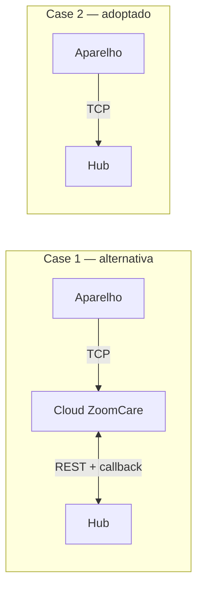

# 19 — Dispensador de comprimidos

## Âmbito

O Zayata/ZoomCare M228 é um dispensador automático de comprimidos com prato
rotativo e ligação celular. **Os dois caminhos estão implementados**: o hub
descodifica as tramas TCP do aparelho e publica-as como telemetria e eventos, e
escreve-lhe a configuração, o plano de medicação e as ordens de controlo, com a
resposta dele a fechar o ciclo de vida de cada escrita.

Descreve o que está estabelecido sobre o aparelho, o que foi verificado contra a
API e a aplicação do fabricante, e as armadilhas que a integração vai encontrar.
Existe porque parte desta matéria não consta de documento nenhum do fornecedor —
foi obtida do aparelho, da aplicação deles e de chamadas à API — e perder-se-ia.

A decisão de transporte está tomada e registada nas
[notas de arquitetura](99-notas-de-arquitetura.md): o aparelho liga-se por TCP
directamente ao hub. As secções 3 a 5 descrevem esse protocolo e a 6 o que o hub
já faz com ele; as secções 7 e 8 descrevem a alternativa por cloud, que fica
documentada por ter sido a única via disponível durante o levantamento e por ser
o que a aplicação do fabricante usa.

> As tabelas das secções 4 e 5 são as do **tipo de dispositivo `0x02`**. A
> especificação traz também as do tipo `0x01`, com os mesmos números de TAG a
> significarem outra coisa — ler a tabela errada dá um descodificador que compila
> e mente.

## 1. O aparelho

| | |
|---|---|
| Modelo | M228 / M228A |
| Células | 28, em prato rotativo removível |
| Ligação | 4G Cat1 com SIM. Há variantes só-WiFi na mesma família |
| Interface | ecrã, **painel táctil** que bloqueia por inactividade, altifalante |
| Sensores | temperatura e humidade |
| Fecho | chave física no prato |
| Alimentação | bateria com carregador |
| Firmware da unidade de ensaio | 5.2 |
| Número de série | prefixo `89-`, dezoito dígitos |

O prefixo do número de série não corresponde ao dos exemplos da documentação da
API, que usam `5a-` e `d3-`. Se identifica o modelo, ainda não está confirmado.

A aplicação do fabricante reutiliza os ecrãs do modelo M126 para o M228 — todas
as *activities* se chamam `M126*`, e as ilustrações de ajuda mostram botões
físicos A/B/C que **este aparelho não tem**. As instruções da aplicação não
descrevem a unidade que temos; o manual do M228A, sim.

### Modo de dispensa

O aparelho tem dois comportamentos à hora da toma, e a escolha muda o que "toma"
significa:

- **Button** — o comprimido só cai depois de o utente carregar.
- **Auto** — cai sozinho.

A toma antecipada tem quatro modos: desligada, livre, protegida por bloqueio de
criança, ou com dupla confirmação.

## 2. Como fala

O fabricante oferece dois modelos de integração e recomenda o segundo, que é o
adoptado.



No **Case 1** o aparelho fala com a cloud do fabricante e nós falamos com essa
cloud por HTTPS, recebendo eventos num callback nosso. No **Case 2** o aparelho
liga-se por TCP directamente ao hub, como já fazem os relógios descritos na
[ingestão TCP](02-ingestao-tcp-relogios.md).

O Case 2 ganha em todas as dimensões que importam — eventos com instante
absoluto, nove alarmes em vez de seis, telemetria que a API REST não expõe, sem
cloud intermédia e sem dados clínicos a atravessar um servidor na China. O
fabricante reaponta o aparelho para o nosso endereço a pedido, e o próprio
protocolo permite fazê-lo por comando.

O BLE tem um único papel, e não é o nosso: provisionar credenciais de WiFi na
primeira utilização, por **BluFi** (protocolo da Espressif, ESP32, só 2,4 GHz).
Numa unidade que anda por 4G, não se usa.

### O cartão SIM tem de ser Cat1

O modem é **4G Cat1**. Os cartões M2M são **CatM**, uma tecnologia de rádio
diferente, e por isso **não funcionam** — não é questão de configuração.

Na unidade de ensaio, um cartão M2M da MEO nunca anexou e só um cartão de consumo
a pôs online. O APN também vem gravado de fábrica e não é alterável no aparelho,
mas isso é secundário: mesmo com o APN certo, um cartão CatM não ligaria.

Para uma instalação a sério, a escolha de operador tem de recair sobre cartões
compatíveis com Cat1. O fabricante forneceu a lista dos que suporta. É decisão de
contrato, não técnica.

## 3. O protocolo TCP

Especificado em
[`Network_Equipment_Communication_Protocol_V1.0_M2_Series_EN.docx`](fornecedores/Zayata/).
É um protocolo binário maduro, com vinte e seis revisões desde 2017.

Suporta TCP, UDP e HTTP, com TCP preferido. Em HTTP o `content-type` é
`application/octet-stream`.

### Enquadramento

| Campo | Tipo | Bytes | Conteúdo |
|---|---|---|---|
| Header | INT8U | 1 | fixo `0xAA` |
| Length | INT16U | 2 | de `Status` ao fim dos dados |
| Status | INT8U | 1 | resultado do pacote |
| Version | INT8U | 1 | fixo `0x01` |
| Serial number | INT16U | 2 | incrementa por pacote, 0–65535 |
| Subserial / Subpacket total | INT8U | 1+1 | fragmentação |
| Flag | INT8U | 1 | bit1 dispensa resposta, bit2 cifra AES128-CFB |
| Device type | INT8U | 1 | `0x02` para a série M2 |
| Device number | INT64U | 8 | identidade, ver abaixo |
| Packet type | INT8U | 1 | ver tabela |
| Application data | ARRAY | 0–1400 | TFLV |
| Check code | INT16U | 2 | CRC16 |

**A ordem de bytes é a do anfitrião**, não a da rede — o que é invulgar e fácil
de errar.

> **O aparelho chega a cifrar, e a especificação não dá a chave.** O primeiro
> M228 real ligou-se a mandar um heartbeat por minuto com o **bit 2 do `Flag`**
> ligado: cabeçalho legível, identidade correcta, CRC válido — e o corpo em
> AES128-CFB, que o hub não sabe abrir. O resultado é uma dashboard com todos os
> cartões de telemetria vazios, sem um único erro em lado nenhum.
>
> **A chave é o Device Number.** O fornecedor descreveu-a assim: «both the key
> and the random IV are based on the device's Device Number». São a mesma coisa,
> e são o Device Number escrito como **string hexadecimal de dezasseis
> caracteres** — o número de 64 bits `0x4869243062262262` dá a chave
> `4869243062262262`, que são exactamente os 16 bytes de uma chave AES-128. O
> hub decifra sozinho, sem precisar de nada do fornecedor.
>
> A fronteira é nítida: as **respostas aos nossos pedidos** (`0x85`, `0x86`,
> `0x87`, `0x88`) chegam em claro, e só o que o aparelho manda por iniciativa
> própria (`0x02` heartbeat, `0x03` evento, `0x04` notificação) vem cifrado. Era
> por isso que a configuração funcionava enquanto a telemetria não chegava.
>
> Uma decifra que não dê TFVL válido é rejeitada e a trama fica marcada como não
> aberta. Sem isso, ruído passava por TAGs inventadas e o hub publicava
> telemetria fabricada, com identidade correcta e CRC válido — a falha calada que
> este protocolo torna fácil.
>
> O `0x8005` (*Data Encryption*) aparece na tabela dos parâmetros de
> configuração, mas o fornecedor respondeu que «`0x8005` cannot be set»: não há
> como desligar a cifra, e o hub não expõe a acção. Já não é preciso.

O **CRC16** é o de MODBUS: polinómio `0xA001` reflectido, valor inicial `0xFFFF`,
calculado de `Length` ao fim dos dados. O anexo do documento traz a
implementação em C.

### Identidade

O `Device number` de 64 bits codifica **MAC ou IMEI**, e não o número de série
que a aplicação mostra:

- bits 63–62: `00` MAC, `01` IMEI
- bits 61–60: reservados, a zero
- bits 59–0: o identificador. O IMEI vai em BCD 8421

É este valor que a whitelist do hub tem de reconhecer. A relação entre ele e o
`device_sn` com prefixo `89-` que a aplicação mostra ainda não está estabelecida.

### Corpo em TFLV

Os dados de todos os pacotes são uma sequência de estruturas TFLV:

| Campo | Bytes | Conteúdo |
|---|---|---|
| Tag | 2 | o parâmetro |
| Flag | 1 | bits 0–4 tipo de dados, bits 5–7 estado |
| Length | 1 | comprimento do valor |
| Value | 0–255 | o valor |

Sendo auto-descritivo, o descodificador é uma tabela de TAGs e não um analisador
por mensagem.

O campo de estado no `Flag` é o que traz o resultado de uma escrita: `000`
sucesso, `001` TAG inválida, `010` tipo inválido, `011` comprimento não
corresponde, `100` valor ilegal, `101` operação falhou.

> **O tipo de dados não é opcional.** Os bits 0–4 declaram o tipo do valor —
> `00001` INT8S, `00010` INT8U, `00011` INT16S, `00100` INT16U, `00110` INT32U,
> `01011` STRING — e uma TAG que chegue ao aparelho como `00000` (`UNKONW`)
> volta com o estado `010` e não produz nada. O tipo de cada TAG está na tabela
> «TAG Definition - Device Type 02» da especificação, e o hub guarda-a no
> `PillDispenserAdapter::TAGS_BY_TYPE`; é de lá que sai também o comprimento com
> que uma leitura pede o valor.
>
> Isto passou despercebido até o primeiro M228 real se ligar: a suite constrói a
> trama e descodifica-a com o mesmo código, que concordava consigo próprio no
> zero. O aparelho devolveu as vinte e sete TAGs de um plano de medicação
> recusadas, todas com `010`.

### Tipos de pacote

| Tipo | Resposta | Quem envia | O quê |
|---|---|---|---|
| `0x01` | `0x81` | aparelho | registo |
| `0x02` | `0x82` | aparelho | heartbeat, pode levar estado |
| `0x03` | `0x83` | aparelho | **evento** |
| `0x04` | `0x84` | aparelho | notificação de alteração |
| `0x05` | `0x85` | hub | ler configuração |
| `0x06` | `0x86` | hub | escrever configuração |
| `0x07` | `0x87` | hub | consultar estado |
| `0x08` | `0x88` | hub | controlo |
| `0x0A`–`0x0D` | `0x8A`–`0x8D` | hub | descobrir que parâmetros o aparelho suporta |
| `0x0E`, `0x0F` | `0x8E`, `0x8F` | hub | actualização de firmware |

O aparelho regista-se logo após ligar. Se já existir ligação para o mesmo
`Device number`, o servidor **fecha a anterior** e fica com a nova. Na primeira
vez que um aparelho se regista, cabe ao servidor ler-lhe os parâmetros para
sincronizar.

Os pacotes `0x0A` a `0x0D` permitem perguntar ao aparelho que parâmetros de
configuração, estado, controlo e evento ele suporta — o que evita ter de manter
uma tabela por modelo.

## 4. Os eventos de medicação

São o coração da integração e chegam em pacotes `0x03`.

> **O aparelho apaga o evento assim que o confirmamos.** O fornecedor foi
> explícito: «once the server confirms receipt of this data, the device deletes
> the local copy; as a result, this information cannot be retrieved». Não há
> segunda oportunidade nem histórico a pedir — um `0x83` enviado sobre um evento
> que o hub não conseguiu guardar perde a toma para sempre.

| TAG | Campo | Tipo | Valores |
|---|---|---|---|
| `0xC201` | identificador do alarme | INT8U | 0–8, para os alarmes 1 a 9 |
| `0xC202` | hora prevista | STRING | `2001-01-02T20:05:04` |
| `0xC203` | hora da toma | STRING | `2001-01-02T20:05:04` |
| `0xC204` | número da célula | INT8U | 0–28 |
| `0xC205` | método | INT8U | `0` a horas · `1` antecipada · `2` atrasada |
| `0xC206` | resultado | INT8U | ver abaixo |

O resultado tem **quatro** estados, um a mais do que o callback da cloud:

| | |
|---|---|
| `0` | tomada a horas |
| `1` | tomada tarde, depois do aviso |
| `2` | **tomada anormal — depois de já ter sido dada como falhada** |
| `3` | falhada |

**As duas horas são ISO-8601 completas.** É a diferença mais importante face ao
Case 1, onde o callback só traz `HH:MM` sem data nem fuso.

## 5. Parâmetros do tipo de dispositivo `0x02`

O anexo do protocolo define a tabela completa. O que se segue é o que interessa
ao hub.

> **O anexo tem duas tabelas, uma por tipo de dispositivo, e dezassete TAGs
> mudam de significado entre elas.** O M228 é o tipo `0x02`; a tabela do `0x01` é
> de outro aparelho. Ler o M228 pela tabela errada não dá erro nenhum — dá campos
> com nomes plausíveis e conteúdo trocado. Foi o que aconteceu com o `0x8107`,
> que no tipo `0x01` é a tampa e aqui é o trinco do prato, com a polaridade ao
> contrário: a dashboard anunciou «Aberta» enquanto o prato estava trancado. Ao
> acrescentar uma TAG, confirmar sempre em que tabela se está a ler.

### Estado

| TAG | O quê | Notas |
|---|---|---|
| `0x8101` | medicação | `0` normal · `1` a acabar · `2` sem medicação |
| `0x8103` / `0x8104` | bateria | nível, e estado `0` normal · `1` cheia · `2` fraca · `3` a carregar · `4` sem bateria |
| `0x8102` | bloqueio de criança | `0` destrancado · `1` trancado |
| `0x8105` | estado do não incomodar | `0` desligado · `1` ligado · `2` **ligado e a silenciar agora** — descodificado, não publicado (ver secção do contrato) |
| `0x8106` | copo da medicação | `0` retirado · `1` colocado. **Responde sempre `1` no firmware `0x0502`, e por isso não é normalizado.** Testado a 25/09/2026 com o copo fora do aparelho, e com pedidos de actualização repetidos pela dashboard. É o mesmo caso do `0x8107`: os dois sensores de estado físico desta unidade estão presos, cada um no seu extremo |
| `0x8107` | tranca do prato | `0` destrancado · `1` trancado. **Responde sempre `0` no firmware `0x0502`, e por isso não é normalizado.** Testado a 25/09/2026 com o prato trancado à mão, com a fechadura de chave lateral trancada, e com o prato removido do aparelho: as três leituras deram `0`. Uma telemetria que só sabe dizer um valor não é telemetria, e num ecrã em que tudo o resto é verdade, um campo que nunca muda ensina a não confiar nos outros. Fica por saber que mecanismo a TAG reflecte e em que firmware passa a reportar `1` — é pergunta para o fornecedor |
| `0x8109` | alimentação DC | `0` desligada da corrente · `1` ligada |
| `0x810A` / `0x810B` | sinal WiFi e GSM | INT16S, −300 a 300 — **dBm**, e o aparelho manda a magnitude: o sinal negativo é posto pelo hub |
| `0x810C` / `0x810D` | nível de sinal | a escala grosseira |
| `0x810E` / `0x810F` | **temperatura e humidade** | INT8S de −40 a 120 °C, INT8U de 0 a 100 %RH — **um byte cada**, ao contrário do sinal, que é INT16S |
| `0x8111` | alarme de temperatura/humidade | `0` normal · `1` em alarme — é o juízo que o aparelho faz sobre os dois anteriores |
| `0x8112` | chamada de emergência | `0` normal · `1` em curso |
| `0x811A` / `0x811B` / `0x811D` | célula actual, total e restantes | o `0x811B` é a **capacidade do prato**, não quantas vão carregadas — essas são a configuração `0x101C`. Conta **posições**, e o aparelho responde 29: a zero é a de repouso e não leva medicação, por isso o contrato publica 28. O `0x811D` desce a partir do `0x101C`: o aparelho não vê lá dentro, e o que lhe dissermos é o ponto de partida que ele acredita |
| `0x8121`–`0x8125` | falhas | rotação, reset do prato, empurrador, porta da célula, teclas |
| `0x8131`–`0x8139` | **estado de toma de cada um dos nove alarmes** | São **oito** e são **duas fases**: `0` nada · `1` a preparar · `2` à espera de sair · `3` **saiu, à espera de ser levantada** · `4` não chegou a sair · `5` **saiu e não foi levantada** · `6` falhada · `7` tomada. O aparelho primeiro empurra a dose para fora e só depois espera que alguém a levante, e cada fase tem o seu tempo esgotado |

### O que este firmware anuncia saber dizer

A descoberta de parâmetros (`0x0B`) devolveu **43 TAGs de estado**, e são estas:

```
0x8002 0x8003 0x8004 0x8005 0x8006 0x8007 0x8008 0x8009 0x800A 0x800B
0x8081 0x8082
0x8101 0x8102 0x8103 0x8104 0x8105 0x8106 0x8107 0x8109 0x810B 0x810D
0x810E 0x810F 0x8111 0x8112
0x811A 0x811B 0x811D
0x8121 0x8122 0x8123 0x8124 0x8125
0x8131 0x8132 0x8133 0x8134 0x8135 0x8136 0x8137 0x8138 0x8139
```

Duas coisas que só a lista responde.

**Não há compartimento de destino.** As únicas TAGs de célula são as três acima —
actual, capacidade e restantes. O aparelho não diz para onde o prato vai a
seguir, e quem quiser sabê-lo tem de o deduzir do próximo alarme marcado. O hub
não o publica: seria um campo calculado por nós com cara de leitura dele.

**O `0x810A` não está na lista**, nem o `0x810C`. É a confirmação, vinda do
próprio aparelho, de que esta unidade é 4G e não tem rádio WiFi nenhum — só o
`0x810B` e o `0x810D` respondem.

> **O `0x8105` e o `0x8106` não estão *deprecated*.** Uma versão anterior deste
> capítulo dizia que sim, e estava a ler a tabela do **tipo 01** — onde são «Pill
> Tray ID» e «Low battery voltage», essas sim retiradas. No tipo 02 são o «não
> incomodar» e o copo da medicação, ambos correntes. É a quarta vez que a troca
> das duas tabelas nos morde, e é a razão do aviso da secção 5.

#### O bloco de sistema, que vem no registo

O bloco `0x8002`–`0x800B` mais o `0x8081`/`0x8082` é identidade e transporte, e
**o aparelho manda-o inteiro em cada pacote de registo `0x01`** — as doze TAGs,
sem ninguém pedir. É por isso que o registo tem 112 bytes e o heartbeat 53. Os
valores desta unidade, em 2026-09-23:

| TAG | O quê | Valor |
|---|---|---|
| `0x8002` | versão | `1282` (`0x0502`); a especificação não diz como se lê o número |
| `0x8003` | tamanho máximo do pacote | 300 bytes, dos 1400 que a especificação permite |
| `0x8004` | intervalo de heartbeat | 60 s, que é o que se observa no fio |
| `0x8006` | tempo de espera pela resposta | 60 s, a meio da gama 10–120 |
| `0x8007` | retransmissões depois do tempo esgotado | 2 |
| `0x8008` | sincronização de parâmetros | `0`, não forçada |
| `0x800A` | ligação a utilizador | `0`, não obrigatória |
| `0x800B` | tempo online antes de dormir | `0`, que na especificação quer dizer **nunca dorme** |
| `0x8081` | funções extra | `4`, o bit 2 — a especificação só documenta o bit 0 (troca de servidor) e o bit 1 (OTA por Bluetooth) |
| `0x8082` | número personalizado | `0` |

Onze das doze ficam por publicar: são parâmetros do transporte e ninguém age
sobre eles. A que sai é a **versão**, pela capacidade `firmware_version` que os
relógios e as pulseiras já usam — é a única que muda ao longo da vida do
aparelho, e é o que se quer saber quando um lote vem com firmware mau. Vai em
hexadecimal, `0x0502`, porque a especificação não diz como se lê o número e o
decimal `1282` esconderia a única estrutura visível nele.

Não é pedível, e nem sequer pelo «Atualizar»: só o registo a traz, e o registo
é do aparelho. Um firmware novo chega sempre depois de um religar, e o religar
traz um registo.

**Estas TAGs lêem-se com o `0x07` e não com o `0x05`.** As `0x8xxx` são todas
estado, mesmo as que parecem definições: um `0x05` com as dez voltou com as dez
recusadas, todas com o estado `001`, «TAG inválida». É a mesma linha que a
descoberta já dizia — o `0x0A` devolve 54 TAGs de configuração e nenhuma delas é
do bloco de sistema.

> **«Tomada» não quer sempre dizer «tomada à hora».** Uma dispensa manual — o
> comando `0xA123` ou o botão verde do aparelho — consome a dose do **próximo
> alarme marcado** e dá-o como tomado, mesmo que a hora dele ainda esteja longe.
> Observou-se com o aparelho na mesa: um «Dispensar agora» às 13:10:50 marcou como
> tomado o alarme das 20:00, e dezasseis segundos depois chegou uma notificação
> `0x04` a dizê-lo. O compartimento actual avançou e os restantes desceram um.
>
> **E não dispensa se não houver alarme nenhum à frente.** Sem um alarme marcado
> por vir ainda nesse dia, o aparelho responde `0xA123 = 01` — «consegui» — e não
> faz absolutamente nada: não roda, não muda estado, não manda notificação. Medido
> a 24/09/2026: três ordens seguidas com o único alarme já passado, todas aceites e
> ignoradas; a seguir marcou-se um alarme para as 22:00 e a ordem seguinte rodou. É
> uma recusa silenciosa, e não há forma de a distinguir de um sucesso pela resposta.
>
> **Um slot só dá a dose dele uma vez por dia, e mudar-lhe a hora não a devolve.**
> É a segunda metade da regra de cima, e sozinha explica quase todas as recusas.
> Medido a 24/09/2026: cinco voltas a reescrever o **slot 1** com horas diferentes
> — 18:00, 19:00, 20:00, 21:00, 22:00, todas à frente da hora do aparelho — não
> moveram o contador um único passo. Marcados os **nove slots** em horas distintas,
> as ordens seguintes andaram `+1` cada uma, seis vezes seguidas, de 24 a 1. O que
> tem de variar é o slot, não a hora. São por isso nove dispensas manuais por dia,
> no máximo, e o contador delas é do dia do **relógio do aparelho**: adiantá-lo um
> dia com o `0xA101` devolve os nove — foi assim que se deu a volta completa ao
> prato para desencravar um objecto lá dentro.
>
> **Uma dose é um compartimento, e é sempre um passo.** Medido três vezes com
> configurações diferentes — dois alarmes marcados, nove, e dois outra vez — o
> `0x811A` andou `+1` em todas. O número de alarmes decide **quantas vezes por dia**
> a dose sai, nunca o tamanho do salto. E o prato mexe-se mesmo: confirmado à vista
> na terceira medição, de 22 para 23.
>
> **A avaria do prato não bloqueia a dispensa.** O `0x8122` esteve em `01` durante
> as três medições e nenhuma delas falhou por causa dele.
>
> **A volta fecha em `0`, e aí o `0x811D` fica preso a zero.** O `0x811A` conta
> `…27`, `28`, `0` — a posição de repouso — e depois `1`. Enquanto está em `0` os
> restantes ficam a zero e a dispensa seguinte é recusada; reescrever os
> «compartimentos carregados» repõe a contagem e desbloqueia.
>
> **Nada denuncia uma dose que não caiu.** A dispensa é por gravidade e o aparelho
> não tem sensor de queda: os contadores andam, o alarme fica «tomado» e a
> notificação `0x04` sai na mesma, com a dose ainda no compartimento. Medido a
> 24/09/2026 com uma chiclete, que passou pelo furo nove vezes sem cair por estar
> colada. Só serve medicação solta e seca.
>
> **O que bloqueia é uma dose por concluir.** Enquanto um alarme estiver em `2` ou
> `3`, as ordens seguintes são aceites e ignoradas. Reescrever o plano de medicação
> limpa os nove estados e desbloqueia — foi a única coisa que o desfez, entre o
> reinício do aparelho, o `0xA103` e o `RestartCycle` do menu.
>
> As notificações `0x04` trazem **só o que mudou** — um alarme, não os nove. É por
> isso que uma leitura vinda de uma notificação traz a lista incompleta, e só um
> `0x07` dá o estado dos nove de uma vez, e só nessa leitura é que as contagens de
> tomadas e falhadas são totais.

A temperatura e a humidade **não existem na API REST**. As falhas, que na API
REST eram um único `rotate`, aqui vêm discriminadas em cinco.

### Configuração

| TAG | O quê |
|---|---|
| `0x1001`–`0x1003` | idioma, formato de data, formato de hora |
| `0x1004`–`0x100A` | período de validade dos alarmes e respectivo interruptor |
| `0x100B`–`0x100E` | som das teclas, bloqueio de criança, toma antecipada, **chamada de emergência** |
| `0x1012` / `0x1013` | tipo de toque e volume |
| `0x1014` / `0x1015` | calibração automática de relógio, fuso horário |
| `0x1017` / `0x1018` / `0x1019` | aviso de atraso, tempo até falha, e o interruptor que decide se uma dose já dada como falhada continua acessível — é ele que faz existir o desfecho `abnormal` do evento de toma |
| `0x101C` | **até que compartimento o prato está cheio** — um índice, e não uma contagem |
| `0x1021`–`0x1029` | **hora de cada um dos nove alarmes** |
| `0x1031`–`0x1039` | minuto de cada alarme |
| `0x1041`–`0x1049` | interruptor de cada alarme — **inerte neste firmware**, ver abaixo |
| `0x1051`–`0x1055` | não incomodar: interruptor e janela |
| `0x8004` / `0x800B` | intervalo de heartbeat, tempo de permanência online — a especificação põe-nos aqui, mas o aparelho só os serve como estado |

**São nove alarmes, não seis.** A API REST só expõe seis.

### Um alarme desliga-se esvaziando-o, e não pelo interruptor

O `0x1041`–`0x1049` não faz nada neste firmware. Um alarme sai como uma hora
preenchida ou como o par `24:60`, que é o «sem alarme» do próprio aparelho.

Medido a 25/09/2026, com o interruptor como única variável:

| | |
|---|---|
| `0x1049 = 0`, alarme às 16:12 | **tocou e dispensou** |
| `0x1049 = 1`, alarme às 16:10 | tocou e dispensou |
| o ecrã do aparelho | desenha os dois casos **iguais** — não há lá nada para desligar |
| leitura de volta | devolve o que se escreveu, `0` ou `1`, com estado `0` |

Aceita, guarda, devolve, e ignora. É uma gaveta.

**`00:00` não serve de vazio: é meia-noite a sério.** Com os nove slots a zero e
o relógio do aparelho posto às 23:57, à meia-noite o alarme 1 percorreu
`1 → 2 → 3 → 7` e o carrossel andou de 7 para 8. Um slot deixado por preencher
custa uma dose por dia.

**`24:60` é o vazio, e o aparelho aceita-o de volta.** Escrito à mão nos oito
slots não usados, voltou como `0x18`/`0x3C` com estado `0`, o ecrã passou a
mostrar um só alarme, e a meia-noite seguinte passou sem tocar e sem mexer o
carrossel — compartimento 10, restantes 18, antes e depois. É o que o hub
escreve hoje, e é por isso que o cartão da dashboard não tem interruptores.

> O sentinela já era conhecido na dashboard — ela desenha vazio acima de 24 —,
> mas o construtor limitava a hora a 23 e esmagava-o contra o tecto. Era essa a
> raiz de o «desligar» escrever meia-noite.

**O `0x100A` é honrado**, e é outra coisa: liga a validade por datas. Com um
intervalo já terminado, o plano inteiro desaparece do ecrã e não toca, mesmo com
o interruptor do alarme ligado. Serve o intervalo de datas, não o desligar de um
alarme sozinho.

**Alarmes à mesma hora fundem-se num só.** Nove slots marcados para as 16:34
deram uma dose: compartimento 8 → 9, restantes 20 → 19, e os alarmes 2 a 9 nunca
saíram do estado `0`. Deixou de ser preciso desde que o `24:60` funciona, mas
explica porque é que os nove slots a `00:00` davam uma dose à meia-noite e não
nove.

### O que este firmware anuncia aceitar

A descoberta de parâmetros (`0x0A`) devolveu **54 TAGs de configuração**, que são
as da tabela acima menos o bloco de sistema `0x8004`/`0x800B`:

```
0x1001 0x1002 0x1003 0x1004 0x1005 0x1006 0x1007 0x1008 0x1009 0x100A
0x100B 0x100C 0x100D 0x100E
0x1012 0x1013 0x1014 0x1015 0x1017 0x1018 0x1019 0x101C
0x1021 0x1022 0x1023 0x1024 0x1025 0x1026 0x1027 0x1028 0x1029
0x1031 0x1032 0x1033 0x1034 0x1035 0x1036 0x1037 0x1038 0x1039
0x1041 0x1042 0x1043 0x1044 0x1045 0x1046 0x1047 0x1048 0x1049
0x1051 0x1052 0x1053 0x1054 0x1055
```

**Três TAGs da especificação não estão na lista** e uma versão anterior deste
capítulo dava-as como aceites: o `0x101A` (célula actual), que neste firmware é
só estado — `0x811A` —, o `0x101D` (**limiar de aviso de medicação a acabar**) e
o `0x1063` (pausa do toque). Nenhuma configuração exposta assenta nelas:
aparecem apenas na tabela de tipos do adaptador, e o `DeviceCommandCatalog`
nunca as emite.

> O `0x101D` foi perguntado ao aparelho a 24/09/2026 e voltou com **«TAG
> inválida»**. Quer dizer que **o limiar do aviso não é configurável** neste
> firmware: o aparelho decide sozinho a partir de que ponto diz que a medicação
> está a acabar. Uma versão anterior deste capítulo chamava-lhe «células
> restantes», que é o nome dele na tabela do **tipo 01** — mais um caso da
> confusão que o aviso da secção 5 descreve.

Também não estão anunciados o `0x1011` (duração do toque) nem o `0x1061` (tempo
de pressão para a chamada de emergência), pela mesma razão que o `0xA124` e o
`0xA125`: existem na especificação da série, não no firmware deste aparelho.

### Controlo

`0xA001` reiniciar · `0xA002` reposição de fábrica · `0xA003` cancelar
sincronização forçada · `0xA004` novo registo · `0xA101` calibrar relógio ·
`0xA102` silenciar · `0xA103` repor o prato · `0xA123` toma antecipada.

A lista acaba aqui. O `0xA124` (rodar para uma célula indicada) e o `0xA125`
(pausa da medicação) **não existem neste firmware**: a descoberta de parâmetros
não os anuncia, e um `0xA124` mandado à mão é acusado com o valor ecoado — `0E`,
`05`, `19` — sem que o prato mexa e sem que o `0x811A` mude. Medido a 24/09/2026
três vezes, com a avaria `0x8122` activa e depois com ela limpa, para excluir que
fosse o índice do prato a ser recusado.

A razão é a idade do firmware e não o tipo de dispositivo: a revisão **1.25** da
especificação, de 2024-05-06, é que acrescentou o `0xA124`, o `0xA125`, o `0x1063`
e as TAGs de estado `0x8140` e `0x8141`. Este aparelho é anterior a ela. Uma
versão anterior deste capítulo dizia que eram do tipo `0x01`, o que não é verdade
— estão na tabela de controlo da série M2, ao lado do `0xA123`.

Não há por isso forma remota de rodar o prato sem consumir uma dose: o `0xA103`
reassenta-o sem mexer no contador, e o `0xA123` anda um compartimento mas gasta a
dose de um slot. Quem precisar de dar a volta ao prato — para desencravar alguma
coisa — faz nove passos por dia com o `0xA123`, ou adianta o relógio do aparelho
para ter outros nove.

E, com relevo para a operação: `0xA011` intervalo de heartbeat, **`0xA021` IP do
servidor, `0xA022` domínio e `0xA023` porta**. O aparelho pode ser reapontado
para outro servidor pelo próprio protocolo.

### Como se carrega o prato, e porque é que a dashboard sozinha não chega

O prato tem 28 compartimentos e **nenhum número impresso**. O que traz é um
**autocolante de esquema**, removível, com grupos de doses — `1 2 3` repetidos
para «3x por dia, 9 dias» — e uma **marca cor-de-rosa** que é o ponto de partida.

O aparelho, por dentro, conta de 1 a 28 e é esse número que o `0x811A` reporta.
**Esse número não existe em lado nenhum no prato.** Dizer a alguém «está no
compartimento 21» não o ajuda: não há 21 para encontrar. Por isso o cartão
traduz a posição para a linguagem do autocolante — com três doses por dia, a
posição 21 é «dia 7, 3ª dose», e sete grupos contam-se a partir da marca sem
hesitar. O número cru fica na gaveta do cartão, porque o autocolante e o plano
configurado podem não corresponder.

O procedimento, e a ordem importa:

1. **Reiniciar o ciclo no aparelho**, pelo menu — é o `RestartCycle` do manual.
   Não há comando para isto no protocolo: os treze controlos do tipo `0x02` só
   têm o `0xA103`, que reassenta o prato mecanicamente e **não mexe no
   contador**. Observado a 24/09/2026: o prato rodou e o `0x811A` ficou em 20
   antes e depois.
2. **Carregar a partir da marca cor-de-rosa**, seguindo os grupos do autocolante.
3. **Só então dizer ao hub até que compartimento o prato ficou cheio**, na
   configuração «Carregado até ao compartimento». É o número do último que se
   encheu, e não quantos se encheram: o `0x811D` é este menos a posição actual.
   Depois de reiniciar o ciclo a posição é zero e os dois números coincidem, mas
   ao recarregar a meio não coincidem — parado no 10 e cheio até ao 28,
   escreve-se 28.

### Como se limpa uma avaria de reposição do prato

O `0x8122` — *Pill Tray Reset Fault*, que o aparelho mostra no ecrã como
«Restart cycle failure» — **não sai com nenhuma ordem remota**. Medido a
24/09/2026, e por esta ordem, sem efeito nenhum:

- o `0xA103` (**«Repor o prato»**) quatro vezes, todas confirmadas com
  `0xA123 = 01`;
- um reinício do aparelho com a avaria ainda por resolver;
- o `RestartCycle` do menu, duas vezes — a segunda já com o prato vazio;
- o `Recycle Test` do menu de fábrica;
- desmontar e reencaixar o prato à mão, duas vezes.

**O que a limpa é uma sequência, e a ordem é tudo:**

1. **Tirar o que estiver preso** ao prato.
2. **Desmontar e reencaixar** o prato.
3. **Só então reiniciar o aparelho.**

A razão é que **o aparelho não deteta o prato a ser reencaixado**: não existe
TAG de presença do prato na tabela do tipo `0x02`, e um desmonte não produz
notificação nenhuma. Ele só reavalia o estado do mecanismo **ao arrancar** — e
por isso o reinício tem de vir depois de o problema estar fisicamente resolvido,
não antes. Um reinício sozinho, com o prato ainda mal posto, não adianta nada: foi
o que se tentou primeiro.

> **Sem nada preso, o reinício remoto sozinho chega.** Os dois primeiros passos
> existem por causa da obstrução, e não do reinício. Medido a 25/09/2026: a avaria
> voltou com o prato já vazio, e saiu com um `0xA001` mandado pela dashboard, sem
> ninguém tocar no aparelho. Vale a pena tentar isso primeiro — é o único remédio
> remoto que existe para esta avaria, e poupa uma deslocação a casa do utente.
>
> **O que a fez voltar foi o prato ser mandado rodar para lá do carregamento.** O
> `0x811A` estava em 22 com os compartimentos carregados em 14, e o `0x811D` a
> zero; o alarme das 09:30 disparou, o aparelho tentou rodar para uma posição que
> se dava por esgotada, e falhou. Manter o «carregado até ao compartimento» a
> dizer a verdade não é cosmético: é o que impede esta avaria — e a ajuda antiga,
> que pedia **quantos** compartimentos se tinham carregado, levava direita a um
> número abaixo da posição sempre que o prato se recarregava a meio.

> Enquanto a avaria está activa, **o aparelho continua a dispensar normalmente**.
> As três dispensas medidas nesse dia foram todas com o `0x8122` em `01`. É uma
> bandeira, não um bloqueio — o que bloqueia é outra coisa, descrita na secção 5.

Saltar o primeiro passo deixa o contador do aparelho a meio da volta anterior, e
a partir daí tudo o que a dashboard mostra sobre posições está deslocado.

### Duas definições que só existem no aparelho

O manual do M228A descreve definições que **o protocolo TCP não expõe**. Quem
instalar isto tem de as configurar no próprio aparelho ou na aplicação do
fabricante, porque pela dashboard não se lá chega — e a primeira decide se a
medicação chega sequer ao utente.

**O modo de dispensa.** O manual dá-lhe dois valores:

> **Button:** *When the medication time arrives, users need to press [tecla] for
> the medicine to fall into the medicine cup.*
> **Auto:** *When the medication time arrives, the medicine will automatically
> fall into the medicine cup.*

Em **Button**, a dose só cai se alguém carregar no botão do aparelho. Não há
TAG nenhuma para isto na tabela do tipo `0x02`: o hub não o lê nem o escreve, e
uma instalação feita toda pela dashboard pode ficar com um aparelho que nunca
dispensa sozinho.

**A toma antecipada tem quatro modos, e nós vemos dois.** O `0x100D` é `0: Off`
e `1: On`, mas o manual descreve *Disable*, *Enable*, *Lock* (exige destrancar
o bloqueio de criança antes) e *Double Check* (carregar duas vezes). O protocolo
dá-nos uma vista reduzida do que o aparelho sabe fazer.

## 6. O que o hub já faz com isto

O aparelho entra pela mesma porta TCP dos relógios. O protocolo chama-se
`zayata-m228` e o tipo de dispositivo é `pill_dispenser`.

**Identidade.** O `Device number` de 64 bits é descodificado para um MAC (doze
hexadecimais) ou um IMEI (quinze dígitos), e é esse valor que a whitelist tem de
ter. O número de série `89-` da aplicação não entra em lado nenhum.

**Enquadramento.** O `HubTcpIngress` reconhece a trama pelo `0xAA` e mede-a pelo
campo `Length`; um pacote binário não é aparado, ao contrário dos protocolos de
texto. O adaptador valida o CRC antes de aceitar o que quer que seja, o que é o
que impede um `0xAA` perdido numa dessincronização de passar por trama.

**O que sai.** Cada TAG vira uma capacidade genérica:

| TAG | Capacidade | Campos |
|---|---|---|
| `0xC201`–`0xC206` | `medication_intake` | `alarmSlot`, `scheduledAt`, `takenAt`, `cellNumber`, `method`, `result` |
| `0x8103` / `0x8104` / `0x8109` | `battery` | `percent`, `chargingState`, `mainsPowered` — a corrente vai com a bateria porque «ligado à corrente» e «a carregar» são a mesma pergunta |
| `0x811A` / `0x811B` / `0x811D` / `0x8101` | `cells_remaining` | `current`, `total`, `remaining`, `level` (`ok` · `low` · `empty`). **O `remaining` é `carregados − posição`**, com corte a zero — quantas doses faltam sair a partir de onde o carrossel está, e **não** quantos compartimentos ainda têm comprimidos. Confirmado no aparelho: 28 carregados na posição 20 deram 8, e a posição 21 deu 7. Por isso o cartão não os põe lado a lado: diz «8 por dispensar» e manda a posição para os detalhes, que é o que se precisa para saber onde carregar o prato |
| `0x810E` | `temperature` | `environmentCelsius` |
| `0x810F` | `humidity` | `humidityPercent` |
| `0x810A` / `0x810B` | `connectivity` | `interface` (`cellular` · `wifi`), `signalStrengthDbm` — a mesma capacidade que os gateways publicam. O `0x810D` é uma contagem de barras de 0 a 3 e fica de fora: o `signalQuality` do contrato é o CSQ de 0 a 31, e as barras são um arredondamento do dBm |
| `0x8102` | `device_config` | `settings.child_lock.enabled` — não é telemetria: o que ele diz é o que nós lá pusemos, e por isso viaja como configuração reportada |
| `0x8105` | — | Nada. Sabe o ligado/desligado do «não incomodar» mas não a janela, e as duas escreviam na mesma chave: como o `saveReported` substitui o payload inteiro, meia configuração apagava a outra metade. A janela completa — interruptor incluído — vem só na resposta ao `0x05` |
| `0x8111` | `storage_environment` | `outOfRange` — o juízo do aparelho sobre a temperatura e a humidade que ele mede. **Só é publicado quando dispara**: como leitura, enchia o histórico com linhas a dizer que estava tudo bem |
| `0x8131`–`0x8139` **num `0x87`** | `medication_alarm_status` | `takenCount`, `missedCount`, `alarms[{alarm, state}]` — a leitura dos nove, que só a resposta ao `0x07` traz |
| `0x8131`–`0x8139` **num `0x04`/`0x02`** | `medication_alarm_change` | `alarm`, `state` — o alarme que mudou, um evento por alarme |
| `0x8121`–`0x8125` | `device_fault` | `fault`: `rotation` · `tray_reset` · `pusher` · `cell_door` · `keys` |
| `0x8112` | `help_call` | `state` |
| `0x8002` **num `0x01`** | `firmware_version` | `version` — em hexadecimal, `0x0502`. Só o registo a traz, e por isso não é pedível |

**Por que canal sai cada coisa.** O que o `CapabilityCatalog` declara com
`isEvent` sai por `events`, a QoS 1; o resto sai por `telemetry`, a QoS 0. A
decisão vinha de uma lista escrita à mão dentro do `DeviceHubServer`, e as duas
fontes de verdade discordavam.

> **O que isso custava.** Uma dose falhada não gera `medication_intake` nenhum —
> não houve toma a registar — e o único sinal dela é o alarme a passar a `missed`
> numa notificação `0x04`. Enquanto isso viajava dentro do
> `medication_alarm_status`, saía por telemetria: o acontecimento mais importante
> que este aparelho produz era o único dos três que se podia perder.

Daí a separação entre `medication_alarm_status` — a leitura dos nove, que se pede
— e `medication_alarm_change`, o que aconteceu entre duas leituras.

O sinal sai como `connectivity`, que é a capacidade genérica que os gateways já
usam. A `help_call` é a mesma chave do NCS e da pulseira.

**As respostas.** Registo, heartbeat, evento e notificação são confirmados com o
mesmo tipo mais o bit alto (`0x81`–`0x84`), corpo vazio e estado `0x00`, ecoando
o número de série e a identidade. O **bit 1** do `Flag` dispensa a resposta.

**O que se configura.** A escrita de configuração sai num pacote `0x06` e o
controlo num `0x08`, ambos com o corpo em TFLV. O que os distingue não é o
conteúdo mas o tipo de pacote: escrever uma TAG de controlo num pacote de
configuração não faz nada.

| Capacidade | TAGs | Notas |
|---|---|---|
| `medication_reminders` | `0x1021`–`0x1049` | **os nove alarmes de cada vez.** Os slots que o plano não usa saem a `24:60` de propósito — o aparelho tem nove fixos, e um que sobrasse de um plano anterior continuava a tocar. O interruptor vai a `1` onde há hora e a `0` onde não há, mas quem decide é a hora: o `0x1041`–`0x1049` é inerte |
| `dispense_mode` | `0x100C` / `0x100D` | bloqueio de criança e toma antecipada |
| `sound_profile` | `0x1012` / `0x1013` | tipo de toque e volume |
| `do_not_disturb` | `0x1051`–`0x1055` | interruptor e janela |
| `language_timezone` | `0x1001` / `0x1015` | o fuso é INT16S: a oeste é negativo |

E as acções, em pacote `0x08`: `dispense_now` (`0xA123`), `calibrate_clock`
(`0xA101`), `mute_alarm` (`0xA102`), `reset_tray` (`0xA103`) e `restart_device`
(`0xA001`).

> **A reposição de fábrica (`0xA002`) existe no protocolo e o hub não a expõe.**
> O aparelho só aponta para o hub porque o fornecedor lhe mandou essa
> configuração; uma reposição devolve-o ao servidor dele, e recuperá-lo obriga a
> pedir a outra pessoa que a volte a empurrar. Não há do nosso lado nada que ela
> resolva, e um clique enganado custava o aparelho. Nos relógios a mesma acção
> continua a existir, porque lá é recuperável.

**Perguntar em vez de assumir.** O `0x05` lê a configuração e o `0x07` o estado.
Nos dois, o corpo leva as TAGs pedidas com o **valor a zeros no comprimento da
TAG** — é esse espaço que o aparelho preenche —, e a resposta devolve o mesmo
corpo com os valores e com o resultado de cada TAG nos bits de estado do `Flag`.

A resposta ao `0x05` sai como `device_config`, que é o que os relógios já usam
para a confirmação de uma configuração. A resposta ao `0x07` passa pelo mesmo
caminho do heartbeat: traz as mesmas TAGs de estado, e ter dois caminhos era ter
duas verdades.

Nenhuma das duas corre sozinha, e há **um botão por trama**. O `0x05` enche os
campos do modal de configurações, e por isso é ali que está — «Sincronizar
configuração». O `0x07` é o botão **«Atualizar»**, à cabeça dos mosaicos, e a
resposta dele enche de uma vez as leituras que traz: bateria, temperatura,
humidade, ligação à rede, compartimentos, trinco, copo, não incomodar e o estado
dos nove alarmes. Essas mostram o valor, mas não se pedem sozinhas.

> **O «Atualizar» não é uma capacidade.** Foi-o, com o nome `device_status`, e
> era uma capacidade declarada como telemetria que nunca publicava nada — quem
> lesse o catálogo pela API via um tipo anunciado que o MQTT nunca carrega.
> Recarregar a telemetria é uma função do ecrã: o comando tem `kind` `refresh` no
> catálogo, não tem capacidade por trás, e o painel oferece-o como botão à cabeça
> dos mosaicos que ele actualiza. O preço é não se poder desligar por modelo,
> como se desliga uma capacidade.

A regra para as que **são** capacidades é a mesma que os relógios seguem: **uma
capacidade é pedível quando carregar nela faz acontecer alguma coisa distinta no
aparelho.** A bateria de um relógio não tem botão, porque chega sozinha; a
frequência cardíaca tem, porque o pedido manda o relógio medir.

> Os sete cartões já tiveram botão, cada um com o seu, partindo do princípio de
> que o `0x07` permitia pedir TAG a TAG. O protocolo permite, mas a construção da
> trama nunca o fez: manda sempre as 31 TAGs do `STATUS_TAGS`, e os sete pedidos
> saíam com corpo idêntico ao byte. Dois cartões carregados de seguida davam dois
> registos do mesmo comando, com o primeiro marcado `superseded`, e o histórico de
> pedidos ficava com linhas repetidas indistinguíveis.

**A descoberta de parâmetros foi andaime da integração, e não ficou.** A
especificação sugere-a — *«If this is the Client's first registration, the Server
should query the Client's parameter information for synchronization»* — e ela foi
mesmo usada: é dela que saem as listas de 54, 43 e 12 TAGs escritas neste
capítulo, e foi ela que provou que esta unidade é 4G sem rádio WiFi.

Feito esse trabalho, a pergunta deixou de ter público. Nada no hub lia a
resposta: nenhuma decisão, nenhum aviso, nenhuma tabela mudava com ela. O que
restava eram três cartões a devolver `0x1001 · 0x1002 · …` a um administrador que
não tem nenhuma decisão a tomar com aquilo. Saíram, e com eles saiu a pergunta
automática no primeiro registo.

> O que **não** saiu é o adaptador reconhecer os `0x8A`–`0x8C`. O corpo deles é
> uma lista de TAGs coladas e não TFLV; lido como TFLV, dá telemetria fabricada
> com identidade correcta e CRC válido, e nada a jusante a distingue de uma
> leitura verdadeira. Isso é uma propriedade de segurança e fica, pedida ou não.

No dia em que entrar um firmware novo, a pergunta volta a fazer-se com um script:
o protocolo está descrito aqui e as três listas de referência também.

A resposta `0x86` fecha o ciclo de vida de uma escrita: uma configuração escrita
fica em `confirmed` com `applied_at` quando o aparelho a reconhece.

**Onde está.** `src/Protocol/Adapter/PillDispenserAdapter.php` (a trama),
`src/Device/DeviceEventDecoder.php` (as TAGs), o protocolo de sessão em
`src/Device/Tcp/Supplier/Zayata/`, e as capacidades em
`src/Domain/Capability/Definition/PillDispenserCapabilityDefinitions.php`.

## 7. A API de parceiro (Case 1)

Fica documentada por ser o que a aplicação do fabricante usa e por ter sido a
única via disponível durante o levantamento.

Base de teste: `https://api-en-test.zoomcare.tech/index.php?s=/Company/CommonApi`
Base de produção: `https://api-en.zoomcare.tech/…`

Os dois nomes resolvem para o mesmo endereço mas **são bases de dados
separadas**: um aparelho registado em produção devolve `604` no ambiente de
teste.

Tudo é POST com JSON em UTF-8, e a resposta tem sempre a forma
`{"code":…,"message":…,"data":…}`. As credenciais de teste estão no PDF do
fornecedor e funcionam.

### Autenticação e identidade

O `company_code` e o `company_secret` identificam a empresa integradora e obtêm
um `token` válido por **7200 segundos**. O token viaja no **corpo** de cada
pedido, não em cabeçalho, e renova-se quando surgir o erro `701`.

A identidade de um aparelho é sempre o par `user_id` + `device_sn`. O `user_id` é
de um utilizador que **nós** registamos; um aparelho associado na aplicação de
consumidor não é visível à empresa integradora.

```
POST /get_token      → data.token, data.expire
POST /user_register  → data.user_id
POST /bind_device    → data.patient_id
POST /unbind_device
```

O `bind_device` devolve um `patient_id` que a documentação não menciona — a
secção de resposta está elidida no PDF.

### Leitura

| Endpoint | Devolve | Funciona offline |
|---|---|---|
| `get_status` | `status`: `1` ligado, `0` desligado | sim |
| `get_plan` | plano, alarmes e medicamentos | **sim** — é dado da cloud |
| `get_information` | toda a telemetria e configuração | **não** — erro `611` |
| `get_medication_record` | histórico, `{count, list}` | sim |

O `get_medication_record` **não consta da documentação** e foi encontrado por
sondagem. Aceita `start_date`, `end_date`, `page` e `limit`.

### Escrita

Comandos: `take_drug` (toma antecipada), `mute_alarm`, `reboot`, `reset` (repõe o
prato).

Plano: `set_alarm` (um alarme de cada vez), `set_plan` (células cheias e período
de validade).

Configuração: `set_time_format`, `set_date_format`, `set_voice`, `unfazed`,
`set_omitting`, `set_time_out`, `set_language`, `set_timezone`.

**As escritas falham com `611` quando o aparelho está desligado, e não ficam em
fila.** Qualquer configuração precisa de reconciliação, à maneira do que está
descrito na [configuração de dispositivos](10-configuracao-de-dispositivos.md).

### Códigos

`200` sucesso · `602` início e fim do não-incomodar iguais · `604` aparelho
inexistente · `606` hora inválida · `608` sem associação · `610` utilizador já
associado · `611` **aparelho desligado** · `612` falha ao configurar · `701`
**token inválido** · `708` utilizador inexistente · `804` plano inexistente ·
`901` alarme inexistente · `902` hora de alarme repetida.

Um endpoint desconhecido responde `{"code":-1,"msg":"API does not exist"}`.

## 8. O callback (Case 1)

Fornecemos um URL; a cloud deles faz POST. Respondemos `{"code":200}`.

| `type` | Conteúdo | Estados |
|---|---|---|
| `1` estado | `device_sn`, `status` | `1` desligado, `2` avaria, `3` tampa aberta |
| `2` medicação | `device_sn`, `alarm_id`, `status`, `take_time` | `0` a tocar, `1` a horas, `2` em atraso, `3` esquecida |

Três lacunas, e são parte da razão para preferir o Case 2:

- **Não há autenticação definida.** A documentação diz apenas que o parceiro
  fornece o endereço. Quem souber o URL injecta tomas falsas.
- **Não traz instante absoluto.** O `take_time` é `"12:00"` — sem data e sem
  fuso.
- **Não traz o medicamento**, só o `alarm_id`, que obriga a cruzar com o
  `get_plan` — e esse pode ter mudado entretanto.

Não existe evento de emergência: o callback só tem os tipos 1 e 2.

## 9. Capacidades do aparelho

**Medicação.** Nove alarmes por dia pelo protocolo TCP, seis pela API REST. Em
ambos os casos são slots fixos: não se criam nem se apagam, activam-se e
desactivam-se.

Pela API REST, cada alarme leva uma lista de medicamentos com nome e quantidade,
em texto livre, sem catálogo nem dosagem estruturada. O protocolo TCP não carrega
nomes de medicamentos — trata de horas, células e resultados.

**Dispensa.** O prato avança uma célula por toma, em sequência. O número de
células carregadas é o que o aparelho usa para saber quando parar.

**Registo.** Cada toma fica como a horas, tardia, anormal ou falhada.

**Estado.** O que a secção 5 enumera.

### O que não faz

- **A medicação é igual todos os dias.** Os alarmes repetem-se dentro do período
  de validade; não há forma de dizer que numa terça-feira leva outra coisa.
- **Não sabe quem tomou**, nem se a pessoa ingeriu — apenas que a célula foi
  dispensada, e em modo *Button* que alguém carregou.
- **Não fala português** de origem. O fabricante instala firmware com voz e texto
  em português, mas **só de fábrica**.

### SOS

O aparelho tem botão de emergência e anuncia "Emergency call" ao ser premido. No
protocolo existe como configuração (`0x100E`) e estado (`0x8112`).

Está desligado na unidade de ensaio, e o manual explica porquê:

> *"The [Emergency Call] function is supported in some versions... requires the
> payment of a certain service fee."*

**É um serviço pago.** Activá-lo é conversa comercial com o fabricante, não de
configuração.

## 10. Armadilhas confirmadas

**A telemetria não se lê com o aparelho desligado.** Pela API REST, o
`get_information` devolve `611` em vez de valores em cache. O hub tem de guardar
o último valor conhecido, ou a dashboard perde bateria e sinal sempre que a caixa
adormecer.

**O relógio do aparelho não é de confiar.** Num ensaio, um alarme marcado para as
12:55 ficou registado como cumprido "a horas" às **11:45**. A discrepância não foi
explicada. O protocolo tem calibração automática (`0x1014`) e manual (`0xA101`),
que existem precisamente porque o relógio deriva — e o hub deve usá-las.

No Case 1, como o callback só traz `HH:MM`, a ingestão teria de carimbar o
instante na recepção. No Case 2 o problema não se põe: os eventos trazem
`0xC202` e `0xC203` em ISO-8601.

**A ordem de bytes do protocolo é a do anfitrião**, não a da rede. É o contrário
do habitual e é fácil de errar num descodificador.

**Gravar um alarme reescreve o plano inteiro.** Num ensaio, configurar um único
alarme pela aplicação do fabricante baixou o número de células cheias de 28 para
2, sem que nada o pedisse. O `set_alarm` e o `set_plan` são endpoints distintos,
mas o que os une é o `plan_id`: quem grava um alarme está a gravar o plano a que
ele pertence.

Uma edição de alarme feita pelo hub tem de reenviar o `ceil_used` corrente, lido
antes pelo `get_plan`. Enviar só o alarme apaga a contagem de células — e a
contagem de células é o que o aparelho usa para saber quando parar de dispensar.

**As datas vazias vêm a `0000-00-00`** na API REST. É a data-zero do MySQL,
devolvida quando o plano é sempre válido, e parte qualquer conversão ingénua.

**A dispensação suspende-se sem rede.** A aplicação do fabricante contém a
mensagem *"Network disconnected, medication dispensing has been paused"*. Se se
confirmar no M228, a disponibilidade do servidor passa a ser crítica para a
função clínica, e não apenas para a telemetria — o que, no Case 2, passa a
depender de nós.

## 11. O que a aplicação expõe e a API de parceiro não

A aplicação usa uma API própria, em `/Home/Device/*` e `/Home/User/*`, com cerca
de cinquenta rotas contra as vinte e uma da API de parceiro. Alguns campos só lá
existem:

| | |
|---|---|
| `Remarks` | texto livre por alarme |
| Fotografia | imagem por medicamento |
| Supervisor | terceiro papel, além de administrador e convidado |

A associação de um aparelho a contas de consumidor vive nessa API, e é
independente da associação feita pela API de parceiro. Um aparelho comprado e
configurado na aplicação tem de ser libertado antes de poder ser gerido por nós.

## 12. Em aberto

O que continua a depender do fabricante está nas
[notas de arquitetura](99-notas-de-arquitetura.md).
