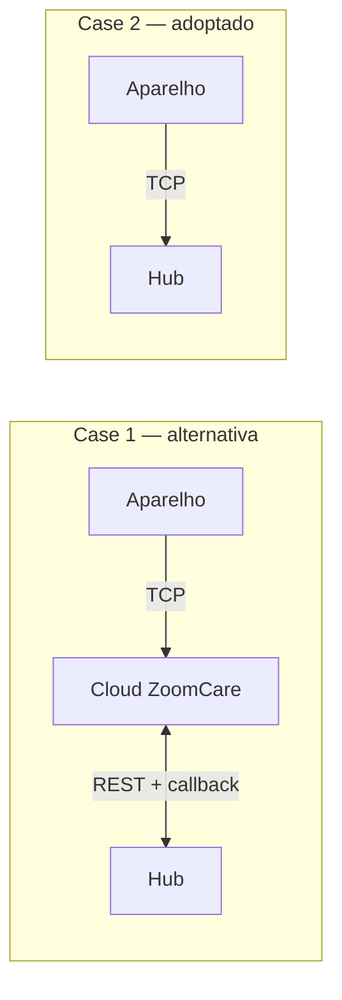

# 19 — Dispensador de comprimidos

## Âmbito

O Zayata/ZoomCare M228 é um dispensador automático de comprimidos com prato
rotativo e ligação celular. **Os dois caminhos estão implementados**: o hub
descodifica as tramas TCP do aparelho e publica-as como telemetria e eventos, e
escreve-lhe a configuração, o plano de medicação e as ordens de controlo, com a
resposta dele a fechar o ciclo de vida de cada escrita.

Descreve o que está estabelecido sobre o aparelho, o que foi verificado contra a
API e a aplicação do fabricante, e as armadilhas que a integração vai encontrar.
Existe porque parte desta matéria não consta de documento nenhum do fornecedor —
foi obtida do aparelho, da aplicação deles e de chamadas à API — e perder-se-ia.

A decisão de transporte está tomada e registada nas
[notas de arquitetura](99-notas-de-arquitetura.md): o aparelho liga-se por TCP
directamente ao hub. As secções 3 a 5 descrevem esse protocolo e a 6 o que o hub
já faz com ele; as secções 7 e 8 descrevem a alternativa por cloud, que fica
documentada por ter sido a única via disponível durante o levantamento e por ser
o que a aplicação do fabricante usa.

> As tabelas das secções 4 e 5 são as do **tipo de dispositivo `0x02`**. A
> especificação traz também as do tipo `0x01`, com os mesmos números de TAG a
> significarem outra coisa — ler a tabela errada dá um descodificador que compila
> e mente.

## 1. O aparelho

| | |
|---|---|
| Modelo | M228 / M228A |
| Células | 28, em prato rotativo removível |
| Ligação | 4G Cat1 com SIM. Há variantes só-WiFi na mesma família |
| Interface | ecrã, **painel táctil** que bloqueia por inactividade, altifalante |
| Sensores | temperatura e humidade |
| Fecho | chave física no prato |
| Alimentação | bateria com carregador |
| Firmware da unidade de ensaio | 5.2 |
| Número de série | prefixo `89-`, dezoito dígitos |

O prefixo do número de série não corresponde ao dos exemplos da documentação da
API, que usam `5a-` e `d3-`. Se identifica o modelo, ainda não está confirmado.

A aplicação do fabricante reutiliza os ecrãs do modelo M126 para o M228 — todas
as *activities* se chamam `M126*`, e as ilustrações de ajuda mostram botões
físicos A/B/C que **este aparelho não tem**. As instruções da aplicação não
descrevem a unidade que temos; o manual do M228A, sim.

### Modo de dispensa

O aparelho tem dois comportamentos à hora da toma, e a escolha muda o que "toma"
significa:

- **Button** — o comprimido só cai depois de o utente carregar.
- **Auto** — cai sozinho.

A toma antecipada tem quatro modos: desligada, livre, protegida por bloqueio de
criança, ou com dupla confirmação.

## 2. Como fala

O fabricante oferece dois modelos de integração e recomenda o segundo, que é o
adoptado.


```mermaid
flowchart LR
  subgraph c1["Case 1 — alternativa"]
    D1["Aparelho"] -->|TCP| Z1["Cloud ZoomCare"]
    Z1 <-->|"REST + callback"| H1["Hub"]
  end
  subgraph c2["Case 2 — adoptado"]
    D2["Aparelho"] -->|TCP| H2["Hub"]
  end
```

No **Case 1** o aparelho fala com a cloud do fabricante e nós falamos com essa
cloud por HTTPS, recebendo eventos num callback nosso. No **Case 2** o aparelho
liga-se por TCP directamente ao hub, como já fazem os relógios descritos na
[ingestão TCP](02-ingestao-tcp-relogios.md).

O Case 2 ganha em todas as dimensões que importam — eventos com instante
absoluto, nove alarmes em vez de seis, telemetria que a API REST não expõe, sem
cloud intermédia e sem dados clínicos a atravessar um servidor na China. O
fabricante reaponta o aparelho para o nosso endereço a pedido, e o próprio
protocolo permite fazê-lo por comando.

O BLE tem um único papel, e não é o nosso: provisionar credenciais de WiFi na
primeira utilização, por **BluFi** (protocolo da Espressif, ESP32, só 2,4 GHz).
Numa unidade que anda por 4G, não se usa.

### O cartão SIM tem de ser Cat1

O modem é **4G Cat1**. Os cartões M2M são **CatM**, uma tecnologia de rádio
diferente, e por isso **não funcionam** — não é questão de configuração.

Na unidade de ensaio, um cartão M2M da MEO nunca anexou e só um cartão de consumo
a pôs online. O APN também vem gravado de fábrica e não é alterável no aparelho,
mas isso é secundário: mesmo com o APN certo, um cartão CatM não ligaria.

Para uma instalação a sério, a escolha de operador tem de recair sobre cartões
compatíveis com Cat1. O fabricante forneceu a lista dos que suporta. É decisão de
contrato, não técnica.

## 3. O protocolo TCP

Especificado em
[`Network_Equipment_Communication_Protocol_V1.0_M2_Series_EN.docx`](fornecedores/Zayata/).
É um protocolo binário maduro, com vinte e seis revisões desde 2017.

Suporta TCP, UDP e HTTP, com TCP preferido. Em HTTP o `content-type` é
`application/octet-stream`.

### Enquadramento

| Campo | Tipo | Bytes | Conteúdo |
|---|---|---|---|
| Header | INT8U | 1 | fixo `0xAA` |
| Length | INT16U | 2 | de `Status` ao fim dos dados |
| Status | INT8U | 1 | resultado do pacote |
| Version | INT8U | 1 | fixo `0x01` |
| Serial number | INT16U | 2 | incrementa por pacote, 0–65535 |
| Subserial / Subpacket total | INT8U | 1+1 | fragmentação |
| Flag | INT8U | 1 | bit1 dispensa resposta, bit2 cifra AES128-CFB |
| Device type | INT8U | 1 | `0x02` para a série M2 |
| Device number | INT64U | 8 | identidade, ver abaixo |
| Packet type | INT8U | 1 | ver tabela |
| Application data | ARRAY | 0–1400 | TFLV |
| Check code | INT16U | 2 | CRC16 |

**A ordem de bytes é a do anfitrião**, não a da rede — o que é invulgar e fácil
de errar.

> **O aparelho chega a cifrar, e a especificação não dá a chave.** O primeiro
> M228 real ligou-se a mandar um heartbeat por minuto com o **bit 2 do `Flag`**
> ligado: cabeçalho legível, identidade correcta, CRC válido — e o corpo em
> AES128-CFB, que o hub não sabe abrir. O resultado é uma dashboard com todos os
> cartões de telemetria vazios, sem um único erro em lado nenhum.
>
> **A chave é o Device Number.** O fornecedor descreveu-a assim: «both the key
> and the random IV are based on the device's Device Number». São a mesma coisa,
> e são o Device Number escrito como **string hexadecimal de dezasseis
> caracteres** — o número de 64 bits `0x4869243062262262` dá a chave
> `4869243062262262`, que são exactamente os 16 bytes de uma chave AES-128. O
> hub decifra sozinho, sem precisar de nada do fornecedor.
>
> A fronteira é nítida: as **respostas aos nossos pedidos** (`0x85`, `0x86`,
> `0x87`, `0x88`) chegam em claro, e só o que o aparelho manda por iniciativa
> própria (`0x02` heartbeat, `0x03` evento, `0x04` notificação) vem cifrado. Era
> por isso que a configuração funcionava enquanto a telemetria não chegava.
>
> Uma decifra que não dê TFVL válido é rejeitada e a trama fica marcada como não
> aberta. Sem isso, ruído passava por TAGs inventadas e o hub publicava
> telemetria fabricada, com identidade correcta e CRC válido — a falha calada que
> este protocolo torna fácil.
>
> O `0x8005` (*Data Encryption*) aparece na tabela dos parâmetros de
> configuração, mas o fornecedor respondeu que «`0x8005` cannot be set»: não há
> como desligar a cifra, e o hub não expõe a acção. Já não é preciso.

O **CRC16** é o de MODBUS: polinómio `0xA001` reflectido, valor inicial `0xFFFF`,
calculado de `Length` ao fim dos dados. O anexo do documento traz a
implementação em C.

### Identidade

O `Device number` de 64 bits codifica **MAC ou IMEI**, e não o número de série
que a aplicação mostra:

- bits 63–62: `00` MAC, `01` IMEI
- bits 61–60: reservados, a zero
- bits 59–0: o identificador. O IMEI vai em BCD 8421

É este valor que a whitelist do hub tem de reconhecer. A relação entre ele e o
`device_sn` com prefixo `89-` que a aplicação mostra ainda não está estabelecida.

### Corpo em TFLV

Os dados de todos os pacotes são uma sequência de estruturas TFLV:

| Campo | Bytes | Conteúdo |
|---|---|---|
| Tag | 2 | o parâmetro |
| Flag | 1 | bits 0–4 tipo de dados, bits 5–7 estado |
| Length | 1 | comprimento do valor |
| Value | 0–255 | o valor |

Sendo auto-descritivo, o descodificador é uma tabela de TAGs e não um analisador
por mensagem.

O campo de estado no `Flag` é o que traz o resultado de uma escrita: `000`
sucesso, `001` TAG inválida, `010` tipo inválido, `011` comprimento não
corresponde, `100` valor ilegal, `101` operação falhou.

> **O tipo de dados não é opcional.** Os bits 0–4 declaram o tipo do valor —
> `00001` INT8S, `00010` INT8U, `00011` INT16S, `00100` INT16U, `00110` INT32U,
> `01011` STRING — e uma TAG que chegue ao aparelho como `00000` (`UNKONW`)
> volta com o estado `010` e não produz nada. O tipo de cada TAG está na tabela
> «TAG Definition - Device Type 02» da especificação, e o hub guarda-a no
> `PillDispenserAdapter::TAGS_BY_TYPE`; é de lá que sai também o comprimento com
> que uma leitura pede o valor.
>
> Isto passou despercebido até o primeiro M228 real se ligar: a suite constrói a
> trama e descodifica-a com o mesmo código, que concordava consigo próprio no
> zero. O aparelho devolveu as vinte e sete TAGs de um plano de medicação
> recusadas, todas com `010`.

### Tipos de pacote

| Tipo | Resposta | Quem envia | O quê |
|---|---|---|---|
| `0x01` | `0x81` | aparelho | registo |
| `0x02` | `0x82` | aparelho | heartbeat, pode levar estado |
| `0x03` | `0x83` | aparelho | **evento** |
| `0x04` | `0x84` | aparelho | notificação de alteração |
| `0x05` | `0x85` | hub | ler configuração |
| `0x06` | `0x86` | hub | escrever configuração |
| `0x07` | `0x87` | hub | consultar estado |
| `0x08` | `0x88` | hub | controlo |
| `0x0A`–`0x0D` | `0x8A`–`0x8D` | hub | descobrir que parâmetros o aparelho suporta |
| `0x0E`, `0x0F` | `0x8E`, `0x8F` | hub | actualização de firmware |

O aparelho regista-se logo após ligar. Se já existir ligação para o mesmo
`Device number`, o servidor **fecha a anterior** e fica com a nova. Na primeira
vez que um aparelho se regista, cabe ao servidor ler-lhe os parâmetros para
sincronizar.

Os pacotes `0x0A` a `0x0D` permitem perguntar ao aparelho que parâmetros de
configuração, estado, controlo e evento ele suporta — o que evita ter de manter
uma tabela por modelo.

## 4. Os eventos de medicação

São o coração da integração e chegam em pacotes `0x03`.

> **O aparelho apaga o evento assim que o confirmamos.** O fornecedor foi
> explícito: «once the server confirms receipt of this data, the device deletes
> the local copy; as a result, this information cannot be retrieved». Não há
> segunda oportunidade nem histórico a pedir — um `0x83` enviado sobre um evento
> que o hub não conseguiu guardar perde a toma para sempre.

| TAG | Campo | Tipo | Valores |
|---|---|---|---|
| `0xC201` | identificador do alarme | INT8U | 0–8, para os alarmes 1 a 9 |
| `0xC202` | hora prevista | STRING | `2001-01-02T20:05:04` |
| `0xC203` | hora da toma | STRING | `2001-01-02T20:05:04` |
| `0xC204` | número da célula | INT8U | 0–28 |
| `0xC205` | método | INT8U | `0` a horas · `1` antecipada · `2` atrasada |
| `0xC206` | resultado | INT8U | ver abaixo |

O resultado tem **quatro** estados, um a mais do que o callback da cloud:

| | |
|---|---|
| `0` | tomada a horas |
| `1` | tomada tarde, depois do aviso |
| `2` | **tomada anormal — depois de já ter sido dada como falhada** |
| `3` | falhada |

**As duas horas são ISO-8601 completas.** É a diferença mais importante face ao
Case 1, onde o callback só traz `HH:MM` sem data nem fuso.

## 5. Parâmetros do tipo de dispositivo `0x02`

O anexo do protocolo define a tabela completa, e o que interessa ao hub está no
[anexo de parâmetros](19a-dispensador-parametros.md) — estado, o que o firmware anuncia
saber dizer e aceitar, configuração e controlo, TAG a TAG.

> **O anexo do fabricante tem duas tabelas, uma por tipo de dispositivo, e dezassete TAGs
> mudam de significado entre elas.** O M228 é o tipo `0x02`; a tabela do `0x01` é de outro
> aparelho. Ler o M228 pela tabela errada não dá erro nenhum — dá campos com nomes
> plausíveis e conteúdo trocado.

## 6. O que o hub já faz com isto

O aparelho entra pela mesma porta TCP dos relógios. O protocolo chama-se
`zayata-m228` e o tipo de dispositivo é `pill_dispenser`.

**Identidade.** O `Device number` de 64 bits é descodificado para um MAC (doze
hexadecimais) ou um IMEI (quinze dígitos), e é esse valor que a whitelist tem de
ter. O número de série `89-` da aplicação não entra em lado nenhum.

**Enquadramento.** O `HubTcpIngress` reconhece a trama pelo `0xAA` e mede-a pelo
campo `Length`; um pacote binário não é aparado, ao contrário dos protocolos de
texto. O adaptador valida o CRC antes de aceitar o que quer que seja, o que é o
que impede um `0xAA` perdido numa dessincronização de passar por trama.

**O que sai.** Cada TAG vira uma capacidade genérica:

| TAG | Capacidade | Campos |
|---|---|---|
| `0xC201`–`0xC206` | `medication_intake` | `alarmSlot`, `scheduledAt`, `takenAt`, `cellNumber`, `method`, `result` |
| `0x8103` / `0x8104` / `0x8109` | `battery` | `percent`, `chargingState`, `mainsPowered`, `lowBattery` — a corrente vai com a bateria porque «ligado à corrente» e «a carregar» são a mesma pergunta. O `lowBattery` é o `0x8104` a `2`, e quando acende sai também o evento `low_battery`, uma vez. Sem bateria (`4`) não é bateria fraca |
| `0x811A` / `0x811B` / `0x811D` / `0x8101` | `cells_remaining` | `current`, `total`, `remaining`, `level` (`ok` · `low` · `empty`). **O `remaining` é `carregados − posição`**, com corte a zero — quantas doses faltam sair a partir de onde o carrossel está, e **não** quantos compartimentos ainda têm comprimidos. Confirmado no aparelho: 28 carregados na posição 20 deram 8, e a posição 21 deu 7. Por isso o cartão não os põe lado a lado: diz «8 por dispensar» e manda a posição para os detalhes, que é o que se precisa para saber onde carregar o prato |
| `0x810E` | `ambient_temperature` | `environmentCelsius` — o ar onde o aparelho está, e não uma pessoa. A spec dá-o como INT8S de −40 a 120 **graus inteiros**, que não é gama nem resolução de sensor corporal; por isso não partilha a chave `temperature` dos relógios |
| `0x810F` | `ambient_humidity` | `humidityPercent` |
| `0x810A` / `0x810B` | `connectivity` | `interface` (`cellular` · `wifi`), `signalStrengthDbm` — a mesma capacidade que os gateways publicam, sempre em dBm, com o CSQ do 4G convertido na fronteira. O `0x810D` é uma contagem de barras de 0 a 3 e fica de fora: o `signalQuality` do contrato é o CSQ de 0 a 31, e as barras são um arredondamento do dBm |
| `0x8102` | `device_config` | `settings.child_lock.enabled` — não é telemetria: o que ele diz é o que nós lá pusemos, e por isso viaja como configuração reportada |
| `0x8105` | — | Nada. Sabe o ligado/desligado do «não incomodar» mas não a janela, e as duas escreviam na mesma chave: como o `saveReported` substitui o payload inteiro, meia configuração apagava a outra metade. A janela completa — interruptor incluído — vem só na resposta ao `0x05` |
| `0x8111` | `storage_environment` | `outOfRange` — o juízo do aparelho sobre a temperatura e a humidade que ele mede. **Só é publicado quando dispara**: como leitura, enchia o histórico com linhas a dizer que estava tudo bem |
| `0x8131`–`0x8139` **num `0x87`** | `medication_alarm_status` | `takenCount`, `missedCount`, `alarms[{alarm, state}]` — a leitura dos nove, que só a resposta ao `0x07` traz |
| `0x8131`–`0x8139` **num `0x04`/`0x02`** | `medication_alarm_change` | `alarm`, `state` — o alarme que mudou, um evento por alarme |
| `0x8121`–`0x8125` | `device_fault` | `fault`: `rotation` · `tray_reset` · `pusher` · `cell_door` · `keys` |
| `0x8112` | `help_call` | `state` |
| `0x8002` **num `0x01`** | `firmware_version` | `version` — em hexadecimal, `0x0502`. Só o registo a traz, e por isso não é pedível |

**Por que canal sai cada coisa.** O que o `CapabilityCatalog` declara com
`isEvent` sai por `events`, a QoS 1; o resto sai por `telemetry`, a QoS 0. A
decisão vinha de uma lista escrita à mão dentro do `DeviceHubServer`, e as duas
fontes de verdade discordavam.

> **O que isso custava.** Uma dose falhada não gera `medication_intake` nenhum —
> não houve toma a registar — e o único sinal dela é o alarme a passar a `missed`
> numa notificação `0x04`. Enquanto isso viajava dentro do
> `medication_alarm_status`, saía por telemetria: o acontecimento mais importante
> que este aparelho produz era o único dos três que se podia perder.

Daí a separação entre `medication_alarm_status` — a leitura dos nove, que se pede
— e `medication_alarm_change`, o que aconteceu entre duas leituras.

O sinal sai como `connectivity`, que é a capacidade genérica que os gateways já
usam. A `help_call` é a mesma chave do NCS e da pulseira.

**O que dura sai uma vez.** O heartbeat repete as TAGs de estado a cada minuto, e
uma avaria do prato chegou a ficar acesa dias. A avaria, a chamada de ajuda e o
ambiente fora da gama saem quando acendem, e só voltam a sair depois de o
aparelho os dar por apagados — com a TAG a zero. Um pacote que não traz a TAG
não diz nada, e não a apaga.

**As respostas.** Registo, heartbeat, evento e notificação são confirmados com o
mesmo tipo mais o bit alto (`0x81`–`0x84`), corpo vazio e estado `0x00`, ecoando
o número de série e a identidade. O **bit 1** do `Flag` dispensa a resposta.

**O que se configura.** A escrita de configuração sai num pacote `0x06` e o
controlo num `0x08`, ambos com o corpo em TFLV. O que os distingue não é o
conteúdo mas o tipo de pacote: escrever uma TAG de controlo num pacote de
configuração não faz nada.

| Capacidade | TAGs | Notas |
|---|---|---|
| `medication_reminders` | `0x1021`–`0x1049` | **os nove alarmes de cada vez.** A forma pública é a partilhada com os relógios — um plano por compartimento, com o número dele no `slot` da hora; ver o [capítulo 10](10-configuracao-de-dispositivos.md#uma-capacidade-partilhada-por-três-protocolos-medication_reminders). Os slots que o plano não usa saem a `24:60` de propósito — o aparelho tem nove fixos, e um que sobrasse de um plano anterior continuava a tocar. O interruptor vai a `1` onde há hora e a `0` onde não há, mas quem decide é a hora: o `0x1041`–`0x1049` é inerte |
| `medication_period` | `0x1004`–`0x100A` | a janela de datas do plano, e o interruptor dela |
| `loaded_cells` | `0x101C` | até que compartimento o prato está cheio, 0 a 28 — um índice, e não uma contagem; ver o [19a](19a-dispensador-parametros.md#a-data-em-que-a-medicação-acaba) |
| `dispense_now` | `0xA123` | dispensa já, fora do plano |
| `child_lock` | `0x100C` | bloqueio de criança |
| `early_dispense` | `0x100D` | toma antecipada |
| `missed_dispense` | `0x1019` | aviso de toma falhada |
| `retrieval_warning` | `0x1017` | quanto tempo até avisar que não se retirou, em minutos |
| `retrieval_timeout` | `0x1018` | quanto tempo até desistir, em minutos |
| `alarm_ringtone` | `0x1012` | tipo de toque, 0 a 3 |
| `alarm_volume` | `0x1013` | volume, 0 a 3 |
| `key_tone` | `0x100B` | som das teclas |
| `mute_alarm` | `0xA102` | silencia o alarme que está a tocar |
| `do_not_disturb` | `0x1051`–`0x1055` | interruptor e janela |
| `emergency_call` | `0x100E` | chamada de emergência — existe no protocolo e é serviço pago |
| `device_language` | `0x1001` | 0 ou 1 |
| `date_format` | `0x1002` | três ordens possíveis |
| `time_format` | `0x1003` | 12 ou 24 horas |
| `time_zone` | `0x1015` | INT16S em HHMM: a oeste é negativo |
| `auto_clock` | `0x1014` | acertar a hora sozinho |
| `calibrate_clock` | `0xA101` | manda a hora local — a única TAG de controlo que é STRING |
| `reset_tray` | `0xA103` | repõe o prato |
| `restart_device` | `0xA001` | reinicia. A reposição de fábrica, `0xA002`, **não está declarada de propósito** |
| `sync_configuration` | — | relê a configuração ao aparelho, em dois blocos |

> **O bloqueio de criança funciona**, e é o único dos interruptores de saída sobre
> o qual não havia nada escrito.
>
> **O «não incomodar» silencia sem deixar de dispensar, e o ecrã di-lo.** Medido a
> 29/09/2026 com a janela das 23:00 às 23:59 e um alarme às 23:30, com o volume em
> Médio: o prato andou de 0 para 1, os restantes desceram, e não houve som nenhum.
> O aparelho mostra **um ícone de lua** enquanto a janela está activa — quem está à
> frente dele distingue assim «calado por escolha» de «avariado», coisa que pelo
> protocolo só se sabe lendo o `0x1051`.

E as acções, em pacote `0x08`: `dispense_now` (`0xA123`), `calibrate_clock`
(`0xA101`), `mute_alarm` (`0xA102`), `reset_tray` (`0xA103`) e `restart_device`
(`0xA001`).

> **A reposição de fábrica (`0xA002`) existe no protocolo e o hub não a expõe.**
> O aparelho só aponta para o hub porque o fornecedor lhe mandou essa
> configuração; uma reposição devolve-o ao servidor dele, e recuperá-lo obriga a
> pedir a outra pessoa que a volte a empurrar. Não há do nosso lado nada que ela
> resolva, e um clique enganado custava o aparelho. Nos relógios a mesma acção
> continua a existir, porque lá é recuperável.

**Perguntar em vez de assumir.** O `0x05` lê a configuração e o `0x07` o estado.
Nos dois, o corpo leva as TAGs pedidas com o **valor a zeros no comprimento da
TAG** — é esse espaço que o aparelho preenche —, e a resposta devolve o mesmo
corpo com os valores e com o resultado de cada TAG nos bits de estado do `Flag`.

A resposta ao `0x05` sai como `device_config`, que é o que os relógios já usam
para a confirmação de uma configuração. A resposta ao `0x07` passa pelo mesmo
caminho do heartbeat: traz as mesmas TAGs de estado, e ter dois caminhos era ter
duas verdades.

Nenhuma das duas corre sozinha, e há **um botão por trama**. O `0x05` enche os
campos do modal de configurações, e por isso é ali que está — «Sincronizar
configuração». O `0x07` é o botão **«Atualizar»**, à cabeça dos mosaicos, e a
resposta dele enche de uma vez as leituras que traz: bateria, temperatura,
humidade, ligação à rede, compartimentos, trinco, copo, não incomodar e o estado
dos nove alarmes. Essas mostram o valor, mas não se pedem sozinhas.

> **O «Atualizar» não é uma capacidade.** Foi-o, com o nome `device_status`, e
> era uma capacidade declarada como telemetria que nunca publicava nada — quem
> lesse o catálogo pela API via um tipo anunciado que o MQTT nunca carrega.
> Recarregar a telemetria é uma função do ecrã: o comando tem `kind` `refresh` no
> catálogo, não tem capacidade por trás, e o painel oferece-o como botão à cabeça
> dos mosaicos que ele actualiza. O preço é não se poder desligar por modelo,
> como se desliga uma capacidade.

A regra para as que **são** capacidades é a mesma que os relógios seguem: **uma
capacidade é pedível quando carregar nela faz acontecer alguma coisa distinta no
aparelho.** A bateria de um relógio não tem botão, porque chega sozinha; a
frequência cardíaca tem, porque o pedido manda o relógio medir.

> Os sete cartões já tiveram botão, cada um com o seu, partindo do princípio de
> que o `0x07` permitia pedir TAG a TAG. O protocolo permite, mas a construção da
> trama nunca o fez: manda sempre as 31 TAGs do `STATUS_TAGS`, e os sete pedidos
> saíam com corpo idêntico ao byte. Dois cartões carregados de seguida davam dois
> registos do mesmo comando, com o primeiro marcado `superseded`, e o histórico de
> pedidos ficava com linhas repetidas indistinguíveis.

**A descoberta de parâmetros foi andaime da integração, e não ficou.** A
especificação sugere-a — *«If this is the Client's first registration, the Server
should query the Client's parameter information for synchronization»* — e ela foi
mesmo usada: é dela que saem as listas de 54, 43 e 12 TAGs escritas neste
capítulo, e foi ela que provou que esta unidade é 4G sem rádio WiFi.

Feito esse trabalho, a pergunta deixou de ter público. Nada no hub lia a
resposta: nenhuma decisão, nenhum aviso, nenhuma tabela mudava com ela. O que
restava eram três cartões a devolver `0x1001 · 0x1002 · …` a um administrador que
não tem nenhuma decisão a tomar com aquilo. Saíram, e com eles saiu a pergunta
automática no primeiro registo.

> O que **não** saiu é o adaptador reconhecer os `0x8A`–`0x8C`. O corpo deles é
> uma lista de TAGs coladas e não TFLV; lido como TFLV, dá telemetria fabricada
> com identidade correcta e CRC válido, e nada a jusante a distingue de uma
> leitura verdadeira. Isso é uma propriedade de segurança e fica, pedida ou não.

No dia em que entrar um firmware novo, a pergunta volta a fazer-se com um script:
o protocolo está descrito aqui e as três listas de referência também.

A resposta `0x86` fecha o ciclo de vida de uma escrita: uma configuração escrita
fica em `confirmed` com `applied_at` quando o aparelho a reconhece.

**Onde está.** `src/Protocol/Adapter/PillDispenserAdapter.php` (a trama),
`src/Device/DeviceEventDecoder.php` (as TAGs), o protocolo de sessão em
`src/Device/Tcp/Supplier/Zayata/`, e as capacidades em
`src/Domain/Capability/Definition/PillDispenserCapabilityDefinitions.php`.

## 7. A API de parceiro (Case 1)

Fica documentada por ser o que a aplicação do fabricante usa e por ter sido a
única via disponível durante o levantamento.

Base de teste: `https://api-en-test.zoomcare.tech/index.php?s=/Company/CommonApi`
Base de produção: `https://api-en.zoomcare.tech/…`

Os dois nomes resolvem para o mesmo endereço mas **são bases de dados
separadas**: um aparelho registado em produção devolve `604` no ambiente de
teste.

Tudo é POST com JSON em UTF-8, e a resposta tem sempre a forma
`{"code":…,"message":…,"data":…}`. As credenciais de teste estão no PDF do
fornecedor e funcionam.

### Autenticação e identidade

O `company_code` e o `company_secret` identificam a empresa integradora e obtêm
um `token` válido por **7200 segundos**. O token viaja no **corpo** de cada
pedido, não em cabeçalho, e renova-se quando surgir o erro `701`.

A identidade de um aparelho é sempre o par `user_id` + `device_sn`. O `user_id` é
de um utilizador que **nós** registamos; um aparelho associado na aplicação de
consumidor não é visível à empresa integradora.

```
POST /get_token      → data.token, data.expire
POST /user_register  → data.user_id
POST /bind_device    → data.patient_id
POST /unbind_device
```

O `bind_device` devolve um `patient_id` que a documentação não menciona — a
secção de resposta está elidida no PDF.

### Leitura

| Endpoint | Devolve | Funciona offline |
|---|---|---|
| `get_status` | `status`: `1` ligado, `0` desligado | sim |
| `get_plan` | plano, alarmes e medicamentos | **sim** — é dado da cloud |
| `get_information` | toda a telemetria e configuração | **não** — erro `611` |
| `get_medication_record` | histórico, `{count, list}` | sim |

O `get_medication_record` **não consta da documentação** e foi encontrado por
sondagem. Aceita `start_date`, `end_date`, `page` e `limit`.

### Escrita

Comandos: `take_drug` (toma antecipada), `mute_alarm`, `reboot`, `reset` (repõe o
prato).

Plano: `set_alarm` (um alarme de cada vez), `set_plan` (células cheias e período
de validade).

Configuração: `set_time_format`, `set_date_format`, `set_voice`, `unfazed`,
`set_omitting`, `set_time_out`, `set_language`, `set_timezone`.

**As escritas falham com `611` quando o aparelho está desligado, e não ficam em
fila.** Qualquer configuração precisa de reconciliação, à maneira do que está
descrito na [configuração de dispositivos](10-configuracao-de-dispositivos.md).

### Códigos

`200` sucesso · `602` início e fim do não-incomodar iguais · `604` aparelho
inexistente · `606` hora inválida · `608` sem associação · `610` utilizador já
associado · `611` **aparelho desligado** · `612` falha ao configurar · `701`
**token inválido** · `708` utilizador inexistente · `804` plano inexistente ·
`901` alarme inexistente · `902` hora de alarme repetida.

Um endpoint desconhecido responde `{"code":-1,"msg":"API does not exist"}`.

## 8. O callback (Case 1)

Fornecemos um URL; a cloud deles faz POST. Respondemos `{"code":200}`.

| `type` | Conteúdo | Estados |
|---|---|---|
| `1` estado | `device_sn`, `status` | `1` desligado, `2` avaria, `3` tampa aberta |
| `2` medicação | `device_sn`, `alarm_id`, `status`, `take_time` | `0` a tocar, `1` a horas, `2` em atraso, `3` esquecida |

Três lacunas, e são parte da razão para preferir o Case 2:

- **Não há autenticação definida.** A documentação diz apenas que o parceiro
  fornece o endereço. Quem souber o URL injecta tomas falsas.
- **Não traz instante absoluto.** O `take_time` é `"12:00"` — sem data e sem
  fuso.
- **Não traz o medicamento**, só o `alarm_id`, que obriga a cruzar com o
  `get_plan` — e esse pode ter mudado entretanto.

Não existe evento de emergência: o callback só tem os tipos 1 e 2.

## 9. Capacidades do aparelho

**Medicação.** Nove alarmes por dia pelo protocolo TCP, seis pela API REST. Em
ambos os casos são slots fixos: não se criam nem se apagam, activam-se e
desactivam-se.

Pela API REST, cada alarme leva uma lista de medicamentos com nome e quantidade,
em texto livre, sem catálogo nem dosagem estruturada. O protocolo TCP não carrega
nomes de medicamentos — trata de horas, células e resultados.

**Dispensa.** O prato avança uma célula por toma, em sequência. O «carregado
até» não o faz parar: esgotados os compartimentos cheios, continua a rodar e a
dispensar os vazios — ver o [19a](19a-dispensador-parametros.md#o-prato-acabar-não-pára-nada).

**Registo.** Cada toma fica como a horas, tardia, anormal ou falhada.

**Estado.** O que a secção 5 enumera.

### O que não faz

- **A medicação é igual todos os dias.** Os alarmes repetem-se dentro do período
  de validade; não há forma de dizer que numa terça-feira leva outra coisa.
- **Não sabe quem tomou**, nem se a pessoa ingeriu — apenas que a célula foi
  dispensada, e em modo *Button* que alguém carregou.
- **Não fala português** de origem. O fabricante instala firmware com voz e texto
  em português, mas **só de fábrica**.

### SOS

O aparelho tem botão de emergência e anuncia "Emergency call" ao ser premido. No
protocolo existe como configuração (`0x100E`) e estado (`0x8112`).

Na unidade de ensaio o `0x100E` lê `1`, ligado. O manual diz de que depende a
chamada:

> *"The [Emergency Call] function is supported in some versions... requires the
> payment of a certain service fee."*

**É um serviço pago.** Activá-lo é conversa comercial com o fabricante, não de
configuração.

**O que é pago é a chamada, não o aviso.** O botão reporta-nos na mesma: medido a
29/09/2026, uma pressão fez chegar o `0x8112` e o hub publicou `help_call` com
`state: in_progress` — a mesma capacidade do NCS e da pulseira. É a primeira vez
que este evento saiu deste aparelho, e não precisou de serviço nenhum contratado.

Fica por ver o fim: só se observou o `in_progress`, e não se sabe se há transição
quando a chamada termina ou é cancelada.

**Quem decide para quem se liga somos nós.** A tabela do tipo `0x02` tem seis
TAGs de texto e nenhuma é um número de telefone: o CCID do SIM (`0x8009`), o IP e
o domínio do servidor (`0xA021`/`0xA022`), o acerto do relógio (`0xA101`) e as
duas horas de medicação (`0xC202`/`0xC203`). O `0x100E` é só um interruptor.

O fornecedor confirmou a 2026-09-30 que é assim por desenho:

> *"Our devices only trigger the call function. Which numbers to dial during an
> emergency requires server-side development and configuration."*

Ou seja, o aparelho levanta a mão e mais nada. O encaminhamento — a quem se
telefona, por que ordem, com que escalonamento — é trabalho do lado de cá, e não
existe número nenhum a gravar no aparelho. O hub já tem a metade que falta: o
`help_call` chega e é publicado como o do NCS e o da pulseira.

### Actualização de firmware

O ficheiro sai do servidor para o aparelho em pacotes `0x0F`, depois de um `0x0E`
que anuncia o que vem. **É o único caminho em que o servidor inicia a conversa** —
e mesmo assim depende de o aparelho falar primeiro, porque a ligação TCP é dele.

O corpo destes quatro pacotes **não é TFLV**:

| | |
|---|---|
| `0x0E` | tamanho [4] · checksum [4] · tempo limite [2] · reservado [10] |
| `0x0F` | offset [4] · dados [n] |
| `0x8E` / `0x8F` | corpo vazio — **o resultado vem no `Status` do cabeçalho** |

O checksum é a **soma acumulada dos bytes** do ficheiro. O fim marca-se com um
`0x0F` cujo offset é o tamanho do ficheiro e que não leva dados nenhuns.

**Os números vêm do aparelho, e não se supõem.** O `0x8003` diz o tamanho de
pacote que ele aceita — 300 bytes nesta unidade —, o `0x8006` quanto tempo espera
por uma resposta (60 s) e o `0x8007` quantas vezes retransmite (2).

**São 256 bytes de ficheiro por pacote**, e não de corpo de aplicação: o corpo
fica em 260 com o offset à frente, e a trama em 282, abaixo dos 300 que ele
declara. O fornecedor escreveu «256» e a frase aguenta as duas leituras; é esta
que o aparelho aceita.

> **Foi esta ambiguidade que travou a actualização durante dois dias.** Com 252
> bytes de ficheiro — a outra leitura, em que os 256 são o corpo inteiro — o
> aparelho aceita o `0x0E` e recusa o **primeiro** `0x0F` com `0x08`. Com 256
> passa o ficheiro todo: medido a 01/10/2026, 824 pacotes, pouco mais de dois
> minutos, sem uma retransmissão, e o `0x8002` passou de `0x0502` a `0x0503`.
>
> O `0x08` não ajudava a distinguir. A tabela de estados tem códigos próprios
> para comprimento (`0x07`) e para sequência (`0x03`), mas esses são do **quadro**;
> um bloco de firmware que o escritor de flash recuse volta como `0x08` na mesma.

**A sequência é a do modo 2 da secção 4**, no caso «um pedido, n pacotes, uma
resposta por pacote»: cada `0x0F` é tratado como pedido independente, e por isso
os campos de subpacote do cabeçalho ficam **a zero**. Quem sequencia é o offset.

> **A tabela da secção 6 dá `0x8D` como resposta ao `0x0E`, e a secção 26 dá
> `0x8E`.** O `0x8D` já é a resposta ao `0x0D`. O fornecedor confirmou o erro e
> disse que corrige o documento; até lá o hub aceita as duas.

**Uma transferência interrompida não grava nada.** O fornecedor foi explícito:
*«If the transmission is interrupted, no upgrade will occur here»*, e o aparelho
continua a correr o firmware que tem — é também o que acontece quando o tempo
limite do `0x0E` expira. **Não há gravação parcial nem risco de perder a
unidade**, e foi esta a resposta que destravou o ensaio.

**E não há retoma:** *«After an interruption, the next upgrade will restart from
the beginning»*. O offset guardado deixa de valer assim que a ligação cai, e por
isso um registo novo a meio da transferência repõe o pedido no princípio.

No hub, a transferência vive em três peças e num comando de linha:

| Ficheiro | Responsabilidade |
|---|---|
| `src/Device/Firmware/FirmwareUpgrade.php` | O ficheiro, o checksum e o pacote seguinte a partir de um offset |
| `src/Device/Firmware/FirmwareUpgradeStore.php` | O contrato de onde a transferência em curso é guardada |
| `src/Device/Firmware/RedisFirmwareUpgradeStore.php` | A implementação em Redis, que sobrevive a um reinício do hub |
| `bin/upgrade-firmware.php` | Põe um ficheiro em fila para um aparelho |

**Como se sabe que correu bem:** o `0x8002` é a versão, e passa a valer a nova
depois de o aparelho reiniciar e voltar a registar-se. Aparece sozinha no cartão
«Versão do firmware».

## 10. Armadilhas confirmadas

**A telemetria não se lê com o aparelho desligado.** Pela API REST, o
`get_information` devolve `611` em vez de valores em cache. O hub tem de guardar
o último valor conhecido, ou a dashboard perde bateria e sinal sempre que a caixa
adormecer.

**O relógio do aparelho não é de confiar.** Num ensaio, um alarme marcado para as
12:55 ficou registado como cumprido "a horas" às **11:45**. A discrepância não foi
explicada. O protocolo tem calibração automática (`0x1014`) e manual (`0xA101`),
que existem precisamente porque o relógio deriva — e o hub deve usá-las.

No Case 1, como o callback só traz `HH:MM`, a ingestão teria de carimbar o
instante na recepção. No Case 2 o problema não se põe: os eventos trazem
`0xC202` e `0xC203` em ISO-8601.

**A ordem de bytes do protocolo é a do anfitrião**, não a da rede. É o contrário
do habitual e é fácil de errar num descodificador.

**Gravar um alarme reescreve o plano inteiro.** Num ensaio, configurar um único
alarme pela aplicação do fabricante baixou o número de células cheias de 28 para
2, sem que nada o pedisse. O `set_alarm` e o `set_plan` são endpoints distintos,
mas o que os une é o `plan_id`: quem grava um alarme está a gravar o plano a que
ele pertence.

Uma edição de alarme feita pelo hub tem de reenviar o `ceil_used` corrente, lido
antes pelo `get_plan`. Enviar só o alarme apaga a contagem de células — e a
contagem de células é o ponto de partida dos compartimentos restantes que o aparelho reporta.

**As datas vazias vêm a `0000-00-00`** na API REST. É a data-zero do MySQL,
devolvida quando o plano é sempre válido, e parte qualquer conversão ingénua.

**A dispensação suspende-se sem rede.** A aplicação do fabricante contém a
mensagem *"Network disconnected, medication dispensing has been paused"*. Se se
confirmar no M228, a disponibilidade do servidor passa a ser crítica para a
função clínica, e não apenas para a telemetria — o que, no Case 2, passa a
depender de nós.

## 11. O que a aplicação expõe e a API de parceiro não

A aplicação usa uma API própria, em `/Home/Device/*` e `/Home/User/*`, com cerca
de cinquenta rotas contra as vinte e uma da API de parceiro. Alguns campos só lá
existem:

| | |
|---|---|
| `Remarks` | texto livre por alarme |
| Fotografia | imagem por medicamento |
| Supervisor | terceiro papel, além de administrador e convidado |

A associação de um aparelho a contas de consumidor vive nessa API, e é
independente da associação feita pela API de parceiro. Um aparelho comprado e
configurado na aplicação tem de ser libertado antes de poder ser gerido por nós.

## 12. Em aberto

O que continua a depender do fabricante está nas
[notas de arquitetura](99-notas-de-arquitetura.md).
